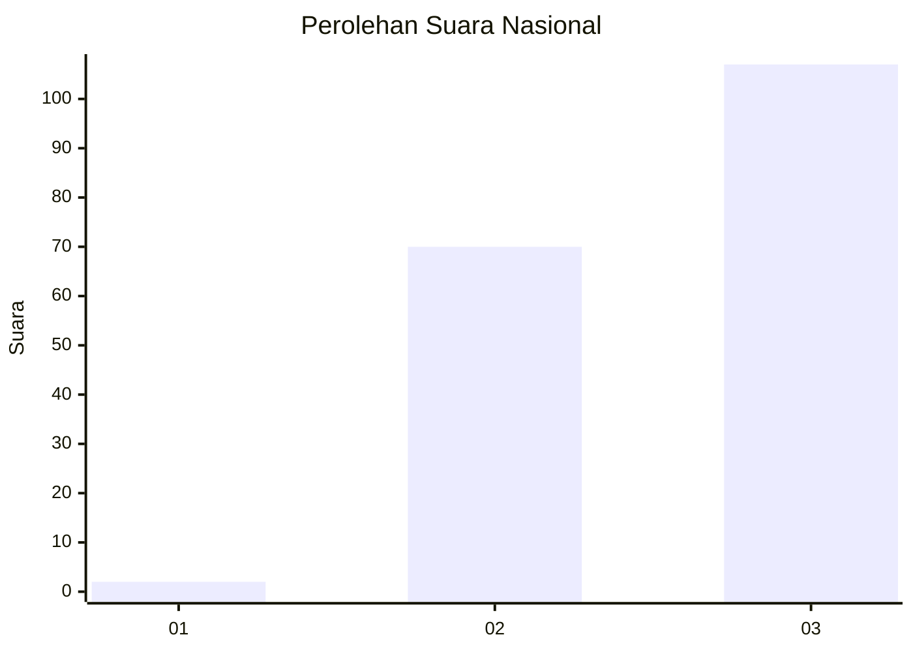
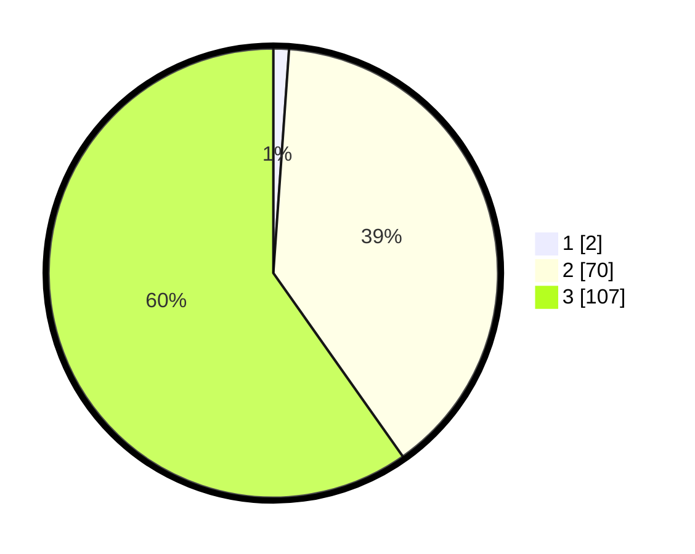

# Hasil

## Grafik

## Tabel

| No. | Nama Paslon    | Suara | Suara (raw) | Persentase |
|:--- |:-------------- | -----:| -----------:| ----------:|
| 1   | ANIES MUHAIMIN | 2     | [2][p-1]    | 1,12       |
| 2   | PRABOWO GIBRAN | 70    | [70][p-2]   | 39,11      |
| 3   | GANJAR MAHFUD  | 107   | [107][p-3]  | 59,78      |

[p-1]: https://github.com/gigit-pemilu/pemilu-2024/blob/main/pilpres/hitung-suara/sub/51-bali/sub/02-tabanan/sub/10-pupuan/sub/2005-munduktemu/sub/002-tps/sub/paslon-1.txt
[p-2]: https://github.com/gigit-pemilu/pemilu-2024/blob/main/pilpres/hitung-suara/sub/51-bali/sub/02-tabanan/sub/10-pupuan/sub/2005-munduktemu/sub/002-tps/sub/paslon-2.txt
[p-3]: https://github.com/gigit-pemilu/pemilu-2024/blob/main/pilpres/hitung-suara/sub/51-bali/sub/02-tabanan/sub/10-pupuan/sub/2005-munduktemu/sub/002-tps/sub/paslon-3.txt

## Foto C Plano

https://sirekap-obj-formc.kpu.go.id/23b3/pemilu/ppwp/51/02/10/20/05/5102102005002-20240214-213106--473ac41c-015b-40eb-ace0-35e096ae26ce.jpg

https://sirekap-obj-formc.kpu.go.id/23b3/pemilu/ppwp/51/02/10/20/05/5102102005002-20240214-213120--164e8118-98ba-479b-a560-6cf7353f6fd6.jpg

https://sirekap-obj-formc.kpu.go.id/23b3/pemilu/ppwp/51/02/10/20/05/5102102005002-20240216-173253--84aacad2-5217-405e-a6c9-364a845f38dc.jpg

## Metadata

| Key        | Value               |
| ---------- | ------------------- |
| Time Stamp | 2024-02-16 21:01:00 |

## DATA PEMILIH TETAP

Jumlah pemilih dalam DPT: **234**.
 * L: **118**.
 * P: **116**.

## DATA PENGGUNA HAK PILIH

Jumlah pengguna hak pilih dalam DPT: **133**.
 * L: **98**.
 * P: **85**.

Jumlah pengguna hak pilih dalam DPTb: **0**.
 * L: **0**.
 * P: **0**.

Jumlah pengguna hak pilih dalam DPK: **0**.
 * L: **0**.
 * P: **0**.

Jumlah pengguna hak pilih: **183**.
 * L: **98**.
 * P: **85**.

## JUMLAH SUARA SAH DAN TIDAK SAH

JUMLAH SELURUH SUARA SAH: **179**.

JUMLAH SUARA TIDAK SAH: **4**.

JUMLAH SELURUH SUARA SAH DAN SUARA TIDAK SAH: **183**.

