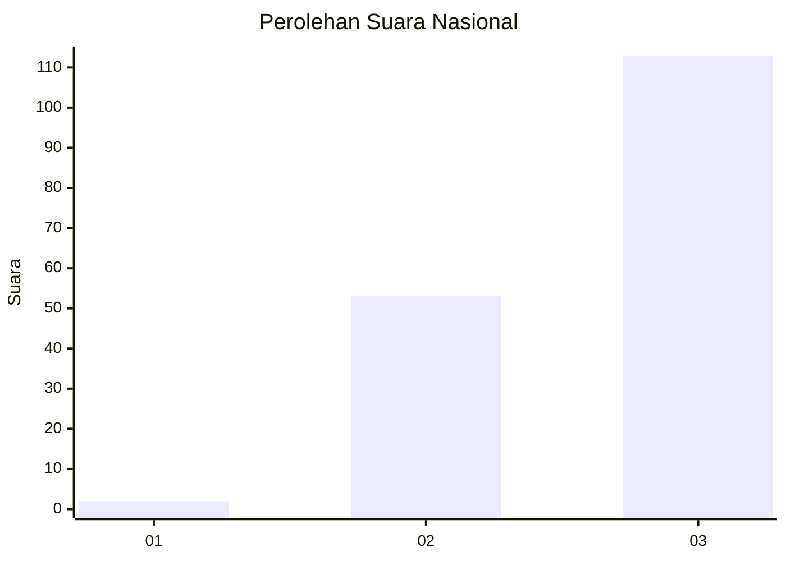
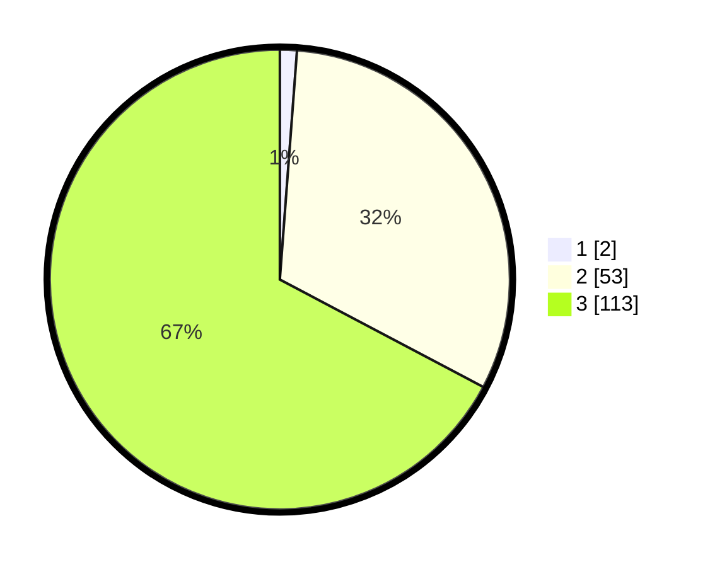

# Hasil

## Grafik

## Tabel

| No. | Nama Paslon    | Suara | Suara (raw) | Persentase |
|:--- |:-------------- | -----:| -----------:| ----------:|
| 1   | ANIES MUHAIMIN | 2     | [2][p-1]    | 1,19       |
| 2   | PRABOWO GIBRAN | 53    | [53][p-2]   | 31,55      |
| 3   | GANJAR MAHFUD  | 113   | [113][p-3]  | 67,26      |

[p-1]: https://github.com/gigit-pemilu/pemilu-2024/blob/main/pilpres/hitung-suara/sub/51-bali/sub/02-tabanan/sub/10-pupuan/sub/2005-munduktemu/sub/004-tps/sub/paslon-1.txt
[p-2]: https://github.com/gigit-pemilu/pemilu-2024/blob/main/pilpres/hitung-suara/sub/51-bali/sub/02-tabanan/sub/10-pupuan/sub/2005-munduktemu/sub/004-tps/sub/paslon-2.txt
[p-3]: https://github.com/gigit-pemilu/pemilu-2024/blob/main/pilpres/hitung-suara/sub/51-bali/sub/02-tabanan/sub/10-pupuan/sub/2005-munduktemu/sub/004-tps/sub/paslon-3.txt

## Foto C Plano

https://sirekap-obj-formc.kpu.go.id/eaeb/pemilu/ppwp/51/02/10/20/05/5102102005004-20240214-214456--bec568af-6502-4bd2-a629-b3a417421ad2.jpg

https://sirekap-obj-formc.kpu.go.id/eaeb/pemilu/ppwp/51/02/10/20/05/5102102005004-20240214-214521--219a17a6-0a56-49e4-8b0a-368f2015019b.jpg

https://sirekap-obj-formc.kpu.go.id/eaeb/pemilu/ppwp/51/02/10/20/05/5102102005004-20240216-144249--1956c3e9-d264-491e-865c-3287fb8c80e0.jpg

## Metadata

| Key        | Value               |
| ---------- | ------------------- |
| Time Stamp | 2024-02-16 16:25:10 |

## DATA PEMILIH TETAP

Jumlah pemilih dalam DPT: **249**.
 * L: **131**.
 * P: **118**.

## DATA PENGGUNA HAK PILIH

Jumlah pengguna hak pilih dalam DPT: **174**.
 * L: **95**.
 * P: **79**.

Jumlah pengguna hak pilih dalam DPTb: **0**.
 * L: **0**.
 * P: **0**.

Jumlah pengguna hak pilih dalam DPK: **0**.
 * L: **0**.
 * P: **0**.

Jumlah pengguna hak pilih: **174**.
 * L: **95**.
 * P: **79**.

## JUMLAH SUARA SAH DAN TIDAK SAH

JUMLAH SELURUH SUARA SAH: **168**.

JUMLAH SUARA TIDAK SAH: **6**.

JUMLAH SELURUH SUARA SAH DAN SUARA TIDAK SAH: **174**.

