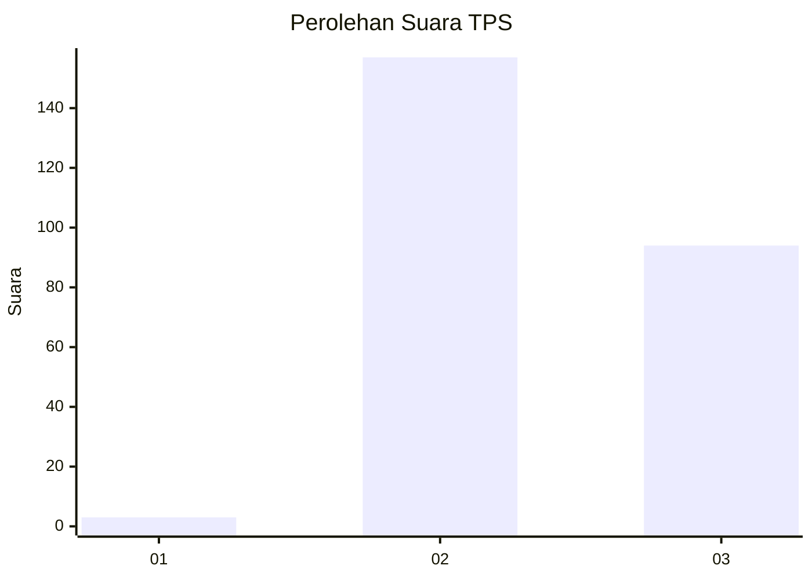
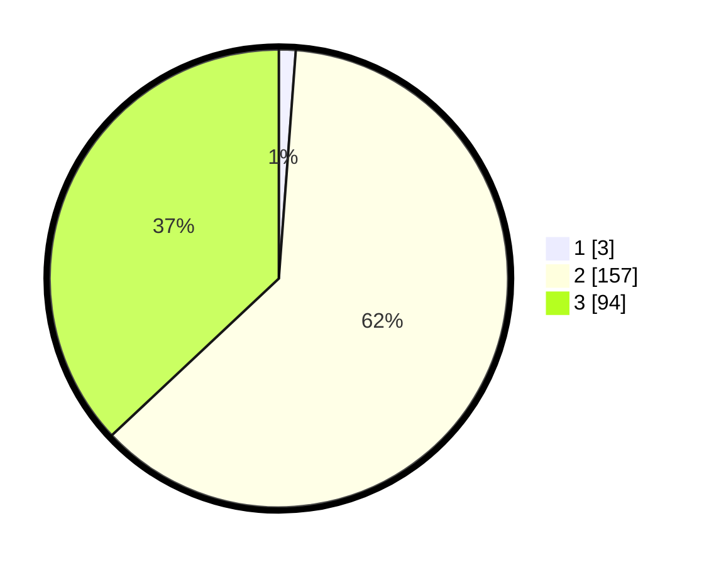

# Hasil

## Grafik

## Tabel

| No. | Nama Paslon    | Suara | Suara (raw) | Persentase |
|:--- |:-------------- | -----:| -----------:| ----------:|
| 1   | ANIES MUHAIMIN | 3     | [3][p-1]    | 1,18       |
| 2   | PRABOWO GIBRAN | 157   | [157][p-2]  | 61,81      |
| 3   | GANJAR MAHFUD  | 94    | [94][p-3]   | 37,01      |

[p-1]: https://github.com/gigit-pemilu/pemilu-2024-51-bali/blob/main/pilpres/hitung-suara/sub/51-bali/sub/02-tabanan/sub/10-pupuan/sub/2005-munduktemu/sub/005-tps/sub/paslon-1.txt
[p-2]: https://github.com/gigit-pemilu/pemilu-2024-51-bali/blob/main/pilpres/hitung-suara/sub/51-bali/sub/02-tabanan/sub/10-pupuan/sub/2005-munduktemu/sub/005-tps/sub/paslon-2.txt
[p-3]: https://github.com/gigit-pemilu/pemilu-2024-51-bali/blob/main/pilpres/hitung-suara/sub/51-bali/sub/02-tabanan/sub/10-pupuan/sub/2005-munduktemu/sub/005-tps/sub/paslon-3.txt

## Foto C Plano

https://sirekap-obj-formc.kpu.go.id/1169/pemilu/ppwp/51/02/10/20/05/5102102005005-20240214-185726--5b39011f-6e33-446c-bf6f-de0e0237a4bc.jpg

https://sirekap-obj-formc.kpu.go.id/1169/pemilu/ppwp/51/02/10/20/05/5102102005005-20240217-064422--196e3592-66db-4b75-8c20-4aa938bf078b.jpg

https://sirekap-obj-formc.kpu.go.id/1169/pemilu/ppwp/51/02/10/20/05/5102102005005-20240214-185742--b58f54dd-b4c0-4c8c-8190-75ea6108bd18.jpg

## Metadata

| Key        | Value               |
| ---------- | ------------------- |
| Time Stamp | 2024-02-17 07:00:02 |

## DATA PEMILIH TETAP

Jumlah pemilih dalam DPT: **297**.
 * L: **152**.
 * P: **145**.

## DATA PENGGUNA HAK PILIH

Jumlah pengguna hak pilih dalam DPT: **261**.
 * L: **137**.
 * P: **124**.

Jumlah pengguna hak pilih dalam DPTb: **0**.
 * L: **0**.
 * P: **0**.

Jumlah pengguna hak pilih dalam DPK: **1**.
 * L: **0**.
 * P: **1**.

Jumlah pengguna hak pilih: **262**.
 * L: **137**.
 * P: **125**.

## JUMLAH SUARA SAH DAN TIDAK SAH

JUMLAH SELURUH SUARA SAH: **254**.

JUMLAH SUARA TIDAK SAH: **8**.

JUMLAH SELURUH SUARA SAH DAN SUARA TIDAK SAH: **262**.

