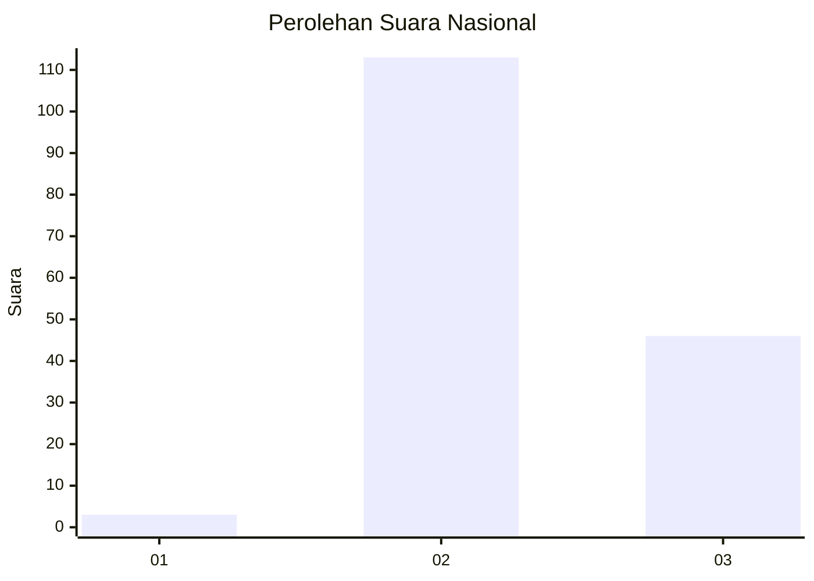
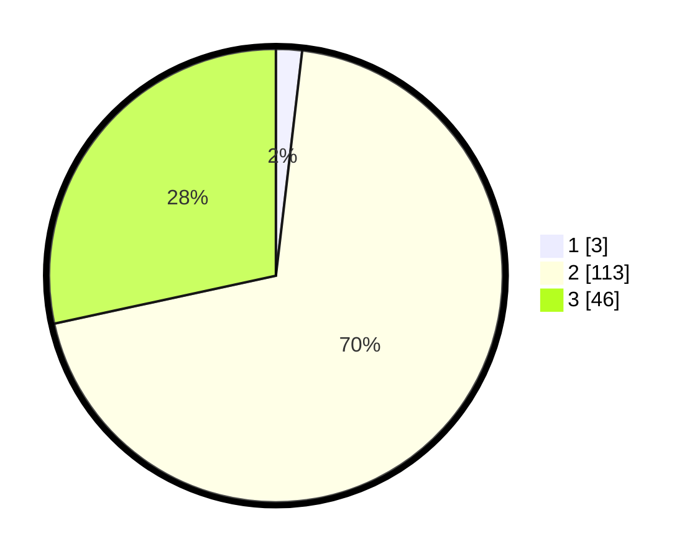

# Hasil

## Grafik

## Tabel

| No. | Nama Paslon    | Suara | Suara (raw) | Persentase |
|:--- |:-------------- | -----:| -----------:| ----------:|
| 1   | ANIES MUHAIMIN | 3     | [3][p-1]    | 1,85       |
| 2   | PRABOWO GIBRAN | 113   | [113][p-2]  | 69,75      |
| 3   | GANJAR MAHFUD  | 46    | [46][p-3]   | 28,40      |

[p-1]: https://github.com/gigit-pemilu/pemilu-2024/blob/main/pilpres/hitung-suara/sub/51-bali/sub/02-tabanan/sub/10-pupuan/sub/2005-munduktemu/sub/009-tps/sub/paslon-1.txt
[p-2]: https://github.com/gigit-pemilu/pemilu-2024/blob/main/pilpres/hitung-suara/sub/51-bali/sub/02-tabanan/sub/10-pupuan/sub/2005-munduktemu/sub/009-tps/sub/paslon-2.txt
[p-3]: https://github.com/gigit-pemilu/pemilu-2024/blob/main/pilpres/hitung-suara/sub/51-bali/sub/02-tabanan/sub/10-pupuan/sub/2005-munduktemu/sub/009-tps/sub/paslon-3.txt

## Foto C Plano

https://sirekap-obj-formc.kpu.go.id/6c67/pemilu/ppwp/51/02/10/20/05/5102102005009-20240214-220810--bdd74fc5-a932-44d6-bc7c-0c5d2c48a2bb.jpg

https://sirekap-obj-formc.kpu.go.id/6c67/pemilu/ppwp/51/02/10/20/05/5102102005009-20240214-205816--79a63ec7-8703-4575-9b93-1aa7c0ec4551.jpg

https://sirekap-obj-formc.kpu.go.id/6c67/pemilu/ppwp/51/02/10/20/05/5102102005009-20240214-205859--42889caa-d060-4cc3-ac3d-ac6b273928f9.jpg

## Metadata

| Key        | Value               |
| ---------- | ------------------- |
| Time Stamp | 2024-02-15 09:00:24 |

## DATA PEMILIH TETAP

Jumlah pemilih dalam DPT: **23**.
 * L: **112**.
 * P: **113**.

## DATA PENGGUNA HAK PILIH

Jumlah pengguna hak pilih dalam DPT: **164**.
 * L: **83**.
 * P: **81**.

Jumlah pengguna hak pilih dalam DPTb: **0**.
 * L: **0**.
 * P: **0**.

Jumlah pengguna hak pilih dalam DPK: **0**.
 * L: **0**.
 * P: **0**.

Jumlah pengguna hak pilih: **164**.
 * L: **83**.
 * P: **81**.

## JUMLAH SUARA SAH DAN TIDAK SAH

JUMLAH SELURUH SUARA SAH: **162**.

JUMLAH SUARA TIDAK SAH: **2**.

JUMLAH SELURUH SUARA SAH DAN SUARA TIDAK SAH: **164**.

