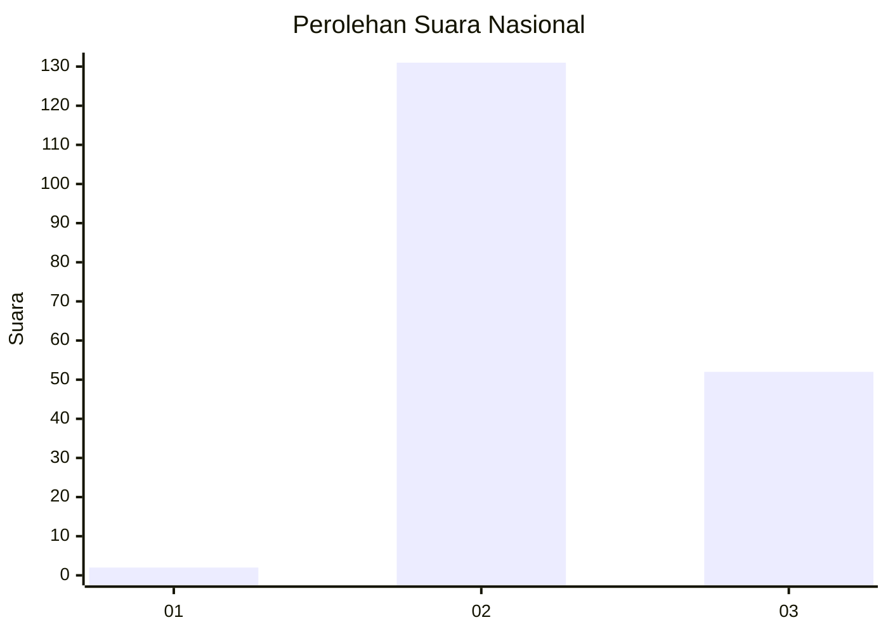
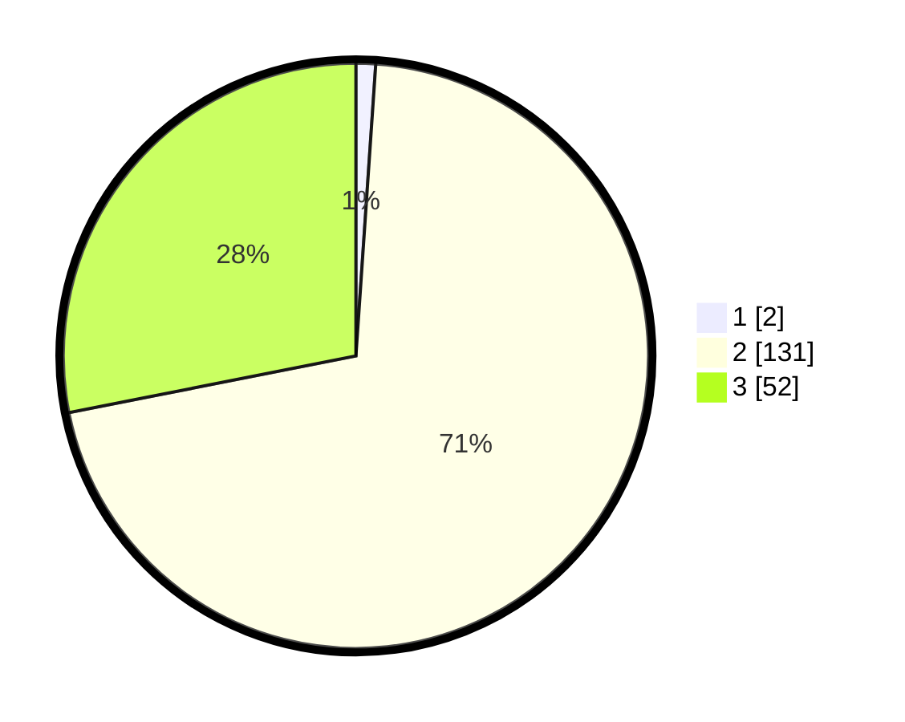

# Hasil

## Grafik

## Tabel

| No. | Nama Paslon    | Suara | Suara (raw) | Persentase |
|:--- |:-------------- | -----:| -----------:| ----------:|
| 1   | ANIES MUHAIMIN | 2     | [2][p-1]    | 1,08       |
| 2   | PRABOWO GIBRAN | 131   | [131][p-2]  | 70,81      |
| 3   | GANJAR MAHFUD  | 52    | [52][p-3]   | 28,11      |

[p-1]: https://github.com/gigit-pemilu/pemilu-2024/blob/main/pilpres/hitung-suara/sub/51-bali/sub/02-tabanan/sub/10-pupuan/sub/2005-munduktemu/sub/010-tps/sub/paslon-1.txt
[p-2]: https://github.com/gigit-pemilu/pemilu-2024/blob/main/pilpres/hitung-suara/sub/51-bali/sub/02-tabanan/sub/10-pupuan/sub/2005-munduktemu/sub/010-tps/sub/paslon-2.txt
[p-3]: https://github.com/gigit-pemilu/pemilu-2024/blob/main/pilpres/hitung-suara/sub/51-bali/sub/02-tabanan/sub/10-pupuan/sub/2005-munduktemu/sub/010-tps/sub/paslon-3.txt

## Foto C Plano

https://sirekap-obj-formc.kpu.go.id/c877/pemilu/ppwp/51/02/10/20/05/5102102005010-20240214-213007--614bf526-8ae3-472a-ab67-381d2f484816.jpg

https://sirekap-obj-formc.kpu.go.id/c877/pemilu/ppwp/51/02/10/20/05/5102102005010-20240214-213016--8c502c3f-faa6-42e6-b795-f0e8931fb817.jpg

https://sirekap-obj-formc.kpu.go.id/c877/pemilu/ppwp/51/02/10/20/05/5102102005010-20240214-213024--3b9ca750-c3f5-48a8-b6f4-cbfcc699dd07.jpg

## Metadata

| Key        | Value               |
| ---------- | ------------------- |
| Time Stamp | 2024-02-15 19:30:26 |

## DATA PEMILIH TETAP

Jumlah pemilih dalam DPT: **233**.
 * L: **111**.
 * P: **122**.

## DATA PENGGUNA HAK PILIH

Jumlah pengguna hak pilih dalam DPT: **186**.
 * L: **91**.
 * P: **95**.

Jumlah pengguna hak pilih dalam DPTb: **0**.
 * L: **0**.
 * P: **0**.

Jumlah pengguna hak pilih dalam DPK: **0**.
 * L: **0**.
 * P: **0**.

Jumlah pengguna hak pilih: **186**.
 * L: **91**.
 * P: **95**.

## JUMLAH SUARA SAH DAN TIDAK SAH

JUMLAH SELURUH SUARA SAH: **185**.

JUMLAH SUARA TIDAK SAH: **1**.

JUMLAH SELURUH SUARA SAH DAN SUARA TIDAK SAH: **186**.

