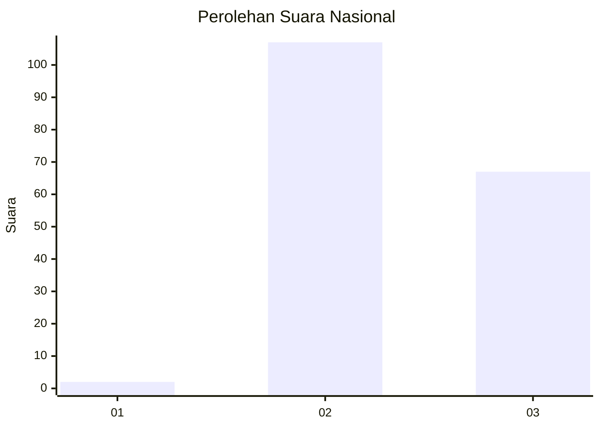
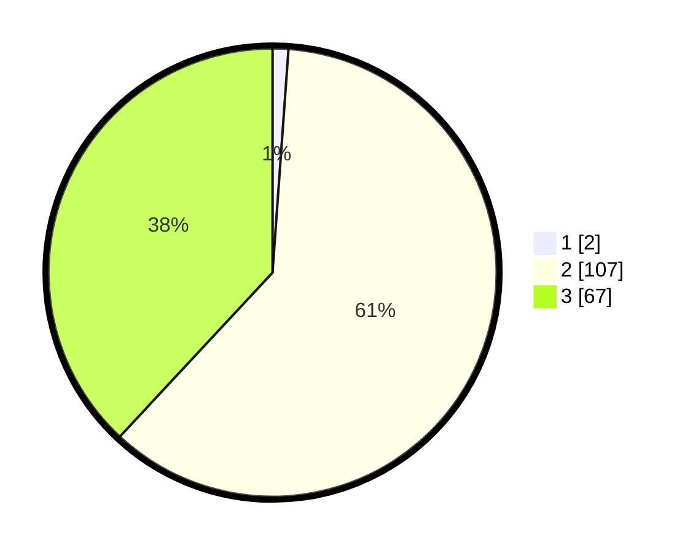

# Hasil

## Grafik

## Tabel

| No. | Nama Paslon    | Suara | Suara (raw) | Persentase |
|:--- |:-------------- | -----:| -----------:| ----------:|
| 1   | ANIES MUHAIMIN | 2     | [2][p-1]    | 1,14       |
| 2   | PRABOWO GIBRAN | 107   | [107][p-2]  | 60,80      |
| 3   | GANJAR MAHFUD  | 67    | [67][p-3]   | 38,07      |

[p-1]: https://github.com/gigit-pemilu/pemilu-2024/blob/main/pilpres/hitung-suara/sub/51-bali/sub/02-tabanan/sub/10-pupuan/sub/2005-munduktemu/sub/012-tps/sub/paslon-1.txt
[p-2]: https://github.com/gigit-pemilu/pemilu-2024/blob/main/pilpres/hitung-suara/sub/51-bali/sub/02-tabanan/sub/10-pupuan/sub/2005-munduktemu/sub/012-tps/sub/paslon-2.txt
[p-3]: https://github.com/gigit-pemilu/pemilu-2024/blob/main/pilpres/hitung-suara/sub/51-bali/sub/02-tabanan/sub/10-pupuan/sub/2005-munduktemu/sub/012-tps/sub/paslon-3.txt

## Foto C Plano

https://sirekap-obj-formc.kpu.go.id/b4cc/pemilu/ppwp/51/02/10/20/05/5102102005012-20240215-062301--027b2725-ac19-4df4-9803-de1e92123ecf.jpg

https://sirekap-obj-formc.kpu.go.id/b4cc/pemilu/ppwp/51/02/10/20/05/5102102005012-20240215-062309--387b6b3a-7391-4132-a715-fe9b4bd9f16a.jpg

https://sirekap-obj-formc.kpu.go.id/b4cc/pemilu/ppwp/51/02/10/20/05/5102102005012-20240215-062317--13b62025-768a-497e-981b-cc08520b7460.jpg

## Metadata

| Key        | Value               |
| ---------- | ------------------- |
| Time Stamp | 2024-02-15 19:00:26 |

## DATA PEMILIH TETAP

Jumlah pemilih dalam DPT: **217**.
 * L: **105**.
 * P: **112**.

## DATA PENGGUNA HAK PILIH

Jumlah pengguna hak pilih dalam DPT: **173**.
 * L: **86**.
 * P: **87**.

Jumlah pengguna hak pilih dalam DPTb: **0**.
 * L: **0**.
 * P: **0**.

Jumlah pengguna hak pilih dalam DPK: **3**.
 * L: **1**.
 * P: **2**.

Jumlah pengguna hak pilih: **176**.
 * L: **87**.
 * P: **89**.

## JUMLAH SUARA SAH DAN TIDAK SAH

JUMLAH SELURUH SUARA SAH: **176**.

JUMLAH SUARA TIDAK SAH: **0**.

JUMLAH SELURUH SUARA SAH DAN SUARA TIDAK SAH: **176**.

