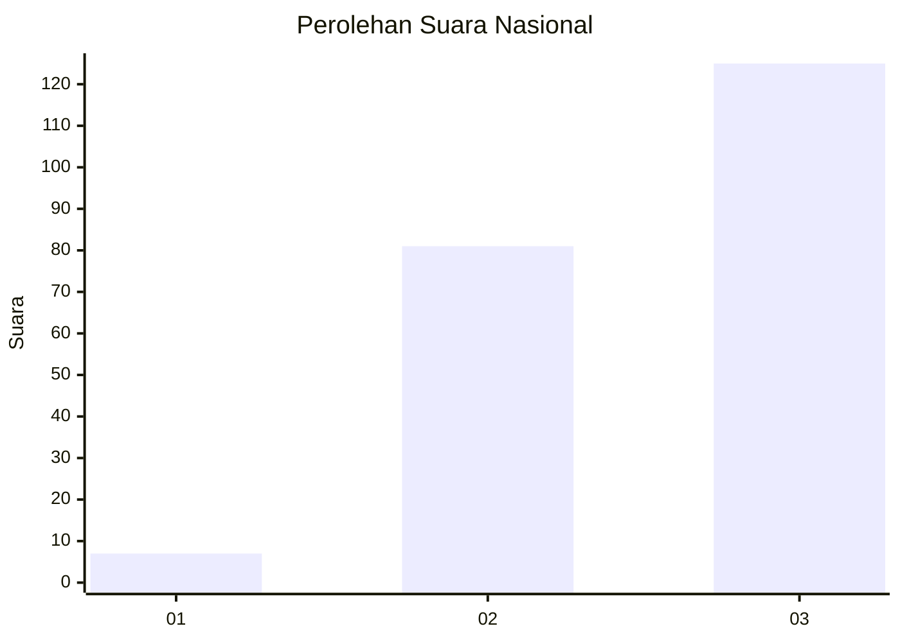
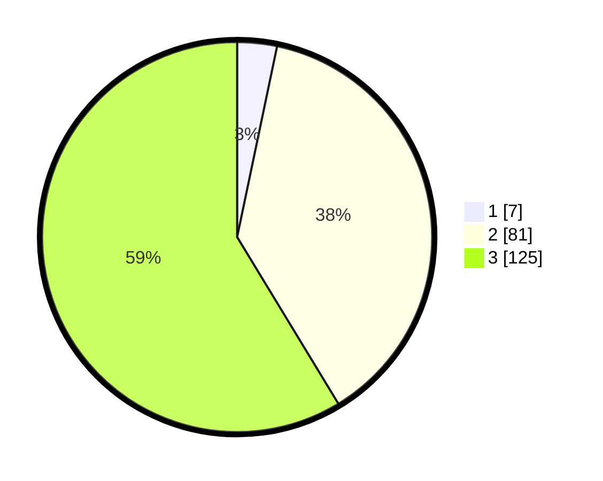

# Hasil

## Grafik

## Tabel

| No. | Nama Paslon    | Suara | Suara (raw) | Persentase |
|:--- |:-------------- | -----:| -----------:| ----------:|
| 1   | ANIES MUHAIMIN | 7     | [7][p-1]    | 3,29       |
| 2   | PRABOWO GIBRAN | 81    | [81][p-2]   | 38,03      |
| 3   | GANJAR MAHFUD  | 125   | [125][p-3]  | 58,69      |

[p-1]: https://github.com/gigit-pemilu/pemilu-2024/blob/main/pilpres/hitung-suara/sub/51-bali/sub/02-tabanan/sub/10-pupuan/sub/2006-pujungan/sub/002-tps/sub/paslon-1.txt
[p-2]: https://github.com/gigit-pemilu/pemilu-2024/blob/main/pilpres/hitung-suara/sub/51-bali/sub/02-tabanan/sub/10-pupuan/sub/2006-pujungan/sub/002-tps/sub/paslon-2.txt
[p-3]: https://github.com/gigit-pemilu/pemilu-2024/blob/main/pilpres/hitung-suara/sub/51-bali/sub/02-tabanan/sub/10-pupuan/sub/2006-pujungan/sub/002-tps/sub/paslon-3.txt

## Foto C Plano

https://sirekap-obj-formc.kpu.go.id/85b2/pemilu/ppwp/51/02/10/20/06/5102102006002-20240214-131616--9583e2ba-bcee-48d4-b8f7-3ca8ab5e184d.jpg

https://sirekap-obj-formc.kpu.go.id/85b2/pemilu/ppwp/51/02/10/20/06/5102102006002-20240214-131715--e41516bc-77e4-4747-ac76-2964b7c4440b.jpg

https://sirekap-obj-formc.kpu.go.id/85b2/pemilu/ppwp/51/02/10/20/06/5102102006002-20240214-131808--02549e83-a2bc-4290-9b37-814e7aae5f48.jpg

## Metadata

| Key        | Value               |
| ---------- | ------------------- |
| Time Stamp | 2024-02-14 21:46:01 |

## DATA PEMILIH TETAP

Jumlah pemilih dalam DPT: **262**.
 * L: **134**.
 * P: **128**.

## DATA PENGGUNA HAK PILIH

Jumlah pengguna hak pilih dalam DPT: **215**.
 * L: **112**.
 * P: **103**.

Jumlah pengguna hak pilih dalam DPTb: **1**.
 * L: **1**.
 * P: **0**.

Jumlah pengguna hak pilih dalam DPK: **0**.
 * L: **0**.
 * P: **0**.

Jumlah pengguna hak pilih: **216**.
 * L: **113**.
 * P: **103**.

## JUMLAH SUARA SAH DAN TIDAK SAH

JUMLAH SELURUH SUARA SAH: **213**.

JUMLAH SUARA TIDAK SAH: **3**.

JUMLAH SELURUH SUARA SAH DAN SUARA TIDAK SAH: **216**.

