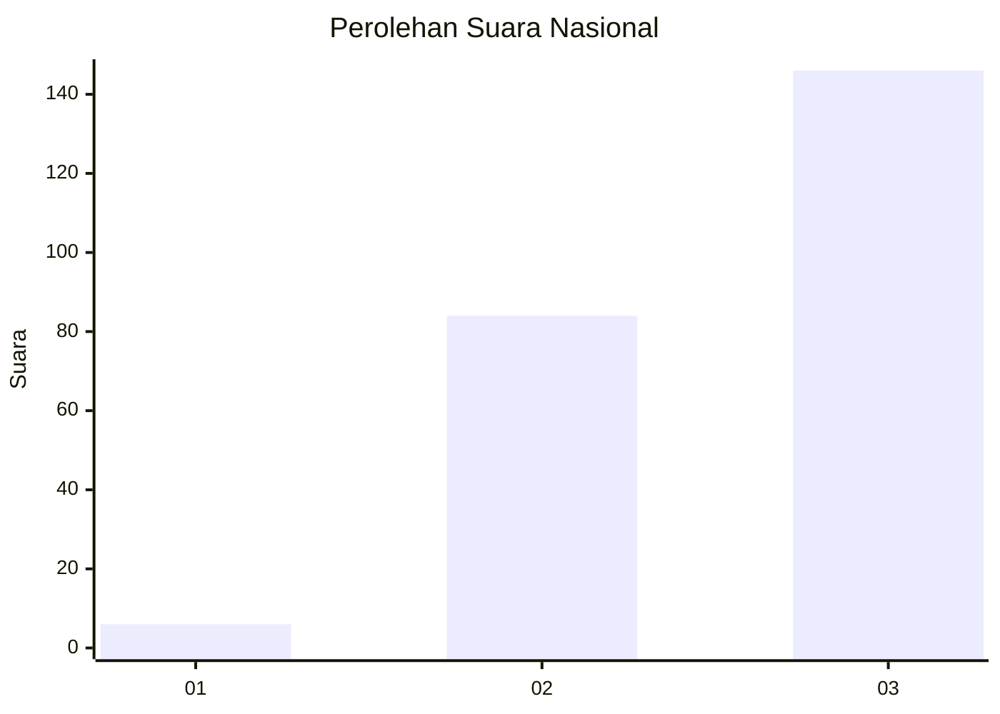
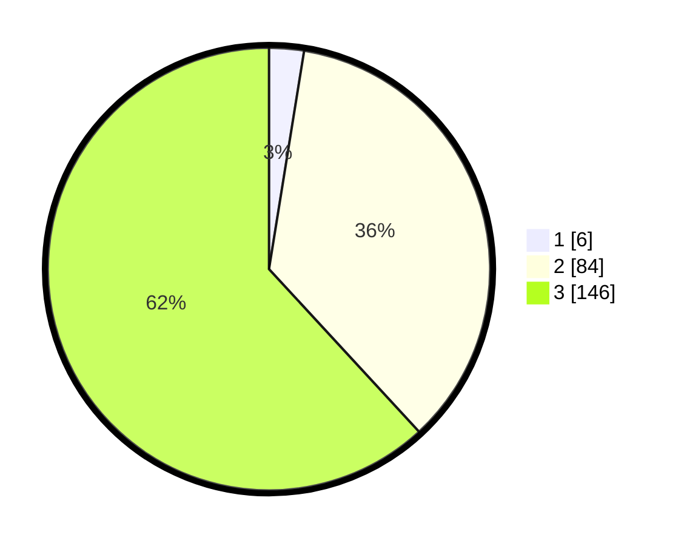

# Hasil

## Grafik

## Tabel

| No. | Nama Paslon    | Suara | Suara (raw) | Persentase |
|:--- |:-------------- | -----:| -----------:| ----------:|
| 1   | ANIES MUHAIMIN | 6     | [6][p-1]    | 2,54       |
| 2   | PRABOWO GIBRAN | 84    | [84][p-2]   | 35,59      |
| 3   | GANJAR MAHFUD  | 146   | [146][p-3]  | 61,86      |

[p-1]: https://github.com/gigit-pemilu/pemilu-2024/blob/main/pilpres/hitung-suara/sub/51-bali/sub/02-tabanan/sub/10-pupuan/sub/2006-pujungan/sub/005-tps/sub/paslon-1.txt
[p-2]: https://github.com/gigit-pemilu/pemilu-2024/blob/main/pilpres/hitung-suara/sub/51-bali/sub/02-tabanan/sub/10-pupuan/sub/2006-pujungan/sub/005-tps/sub/paslon-2.txt
[p-3]: https://github.com/gigit-pemilu/pemilu-2024/blob/main/pilpres/hitung-suara/sub/51-bali/sub/02-tabanan/sub/10-pupuan/sub/2006-pujungan/sub/005-tps/sub/paslon-3.txt

## Foto C Plano

https://sirekap-obj-formc.kpu.go.id/944f/pemilu/ppwp/51/02/10/20/06/5102102006005-20240214-200242--e3760eaa-c672-41cc-afd9-d7bb21b47739.jpg

https://sirekap-obj-formc.kpu.go.id/944f/pemilu/ppwp/51/02/10/20/06/5102102006005-20240218-103422--3cae19d0-247e-4b79-b120-484b26267437.jpg

https://sirekap-obj-formc.kpu.go.id/944f/pemilu/ppwp/51/02/10/20/06/5102102006005-20240218-103617--ff8ea3fd-de5b-4520-9900-1ea27ab0c605.jpg

## Metadata

| Key        | Value               |
| ---------- | ------------------- |
| Time Stamp | 2024-02-21 17:00:00 |

## DATA PEMILIH TETAP

Jumlah pemilih dalam DPT: **284**.
 * L: **135**.
 * P: **149**.

## DATA PENGGUNA HAK PILIH

Jumlah pengguna hak pilih dalam DPT: **239**.
 * L: **114**.
 * P: **125**.

Jumlah pengguna hak pilih dalam DPTb: **1**.
 * L: **1**.
 * P: **0**.

Jumlah pengguna hak pilih dalam DPK: **1**.
 * L: **1**.
 * P: **0**.

Jumlah pengguna hak pilih: **241**.
 * L: **116**.
 * P: **125**.

## JUMLAH SUARA SAH DAN TIDAK SAH

JUMLAH SELURUH SUARA SAH: **236**.

JUMLAH SUARA TIDAK SAH: **5**.

JUMLAH SELURUH SUARA SAH DAN SUARA TIDAK SAH: **241**.

