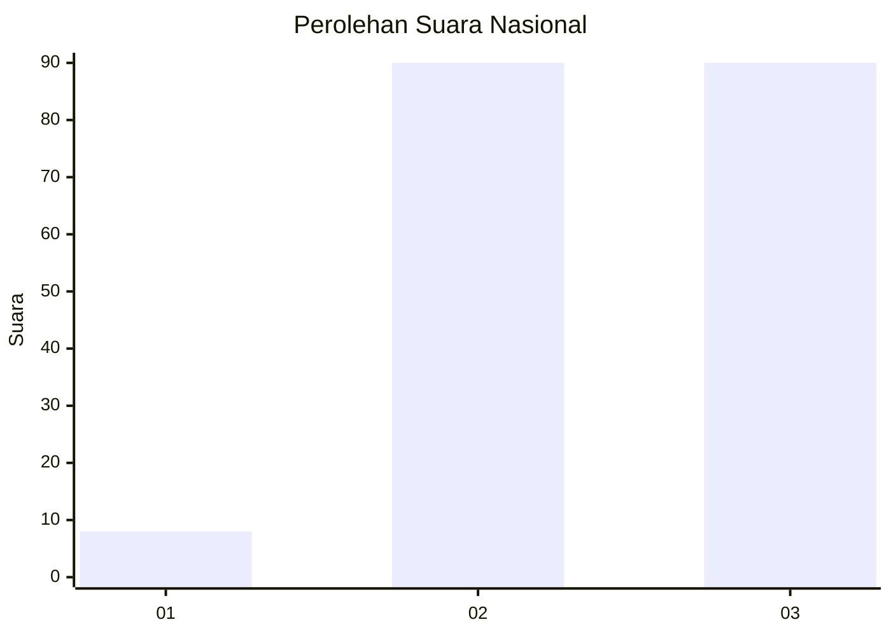
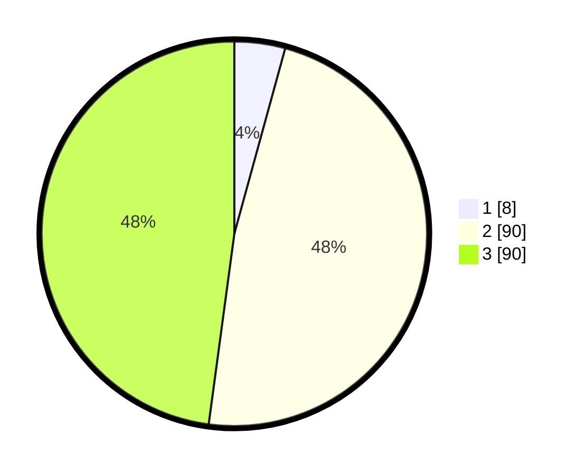

# Hasil

## Grafik

## Tabel

| No. | Nama Paslon    | Suara | Suara (raw) | Persentase |
|:--- |:-------------- | -----:| -----------:| ----------:|
| 1   | ANIES MUHAIMIN | 8     | [8][p-1]    | 4,26       |
| 2   | PRABOWO GIBRAN | 90    | [90][p-2]   | 47,87      |
| 3   | GANJAR MAHFUD  | 90    | [90][p-3]   | 47,87      |

[p-1]: https://github.com/gigit-pemilu/pemilu-2024/blob/main/pilpres/hitung-suara/sub/51-bali/sub/02-tabanan/sub/10-pupuan/sub/2006-pujungan/sub/009-tps/sub/paslon-1.txt
[p-2]: https://github.com/gigit-pemilu/pemilu-2024/blob/main/pilpres/hitung-suara/sub/51-bali/sub/02-tabanan/sub/10-pupuan/sub/2006-pujungan/sub/009-tps/sub/paslon-2.txt
[p-3]: https://github.com/gigit-pemilu/pemilu-2024/blob/main/pilpres/hitung-suara/sub/51-bali/sub/02-tabanan/sub/10-pupuan/sub/2006-pujungan/sub/009-tps/sub/paslon-3.txt

## Foto C Plano

https://sirekap-obj-formc.kpu.go.id/180b/pemilu/ppwp/51/02/10/20/06/5102102006009-20240214-213434--73a54285-e445-454a-910c-51652ed9d6ed.jpg

https://sirekap-obj-formc.kpu.go.id/180b/pemilu/ppwp/51/02/10/20/06/5102102006009-20240214-213517--196a5fd7-da36-434c-aa4b-b1596b206f4f.jpg

https://sirekap-obj-formc.kpu.go.id/180b/pemilu/ppwp/51/02/10/20/06/5102102006009-20240214-213551--3b1c5a4d-361f-4ae3-9755-9c7da4de4703.jpg

## Metadata

| Key        | Value               |
| ---------- | ------------------- |
| Time Stamp | 2024-02-24 22:31:28 |

