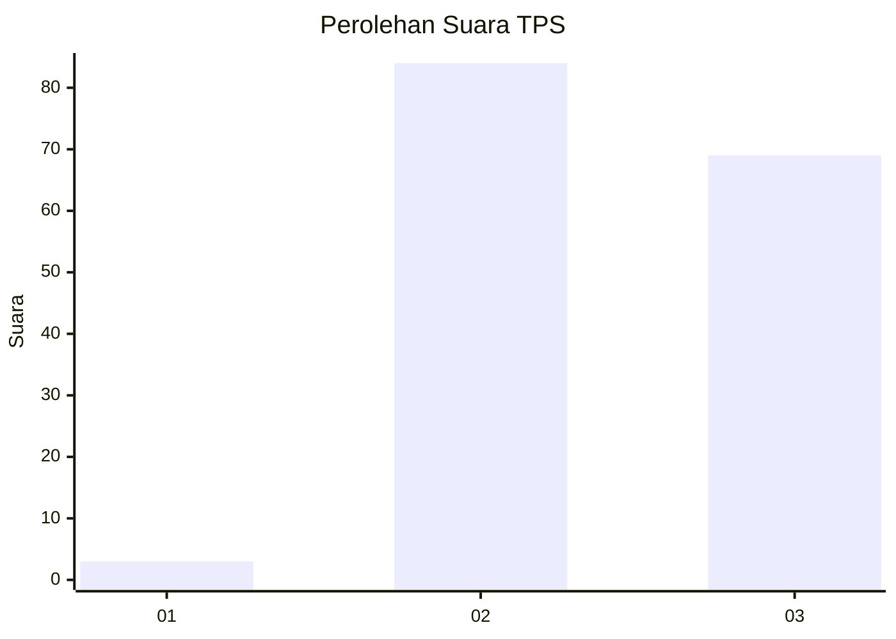
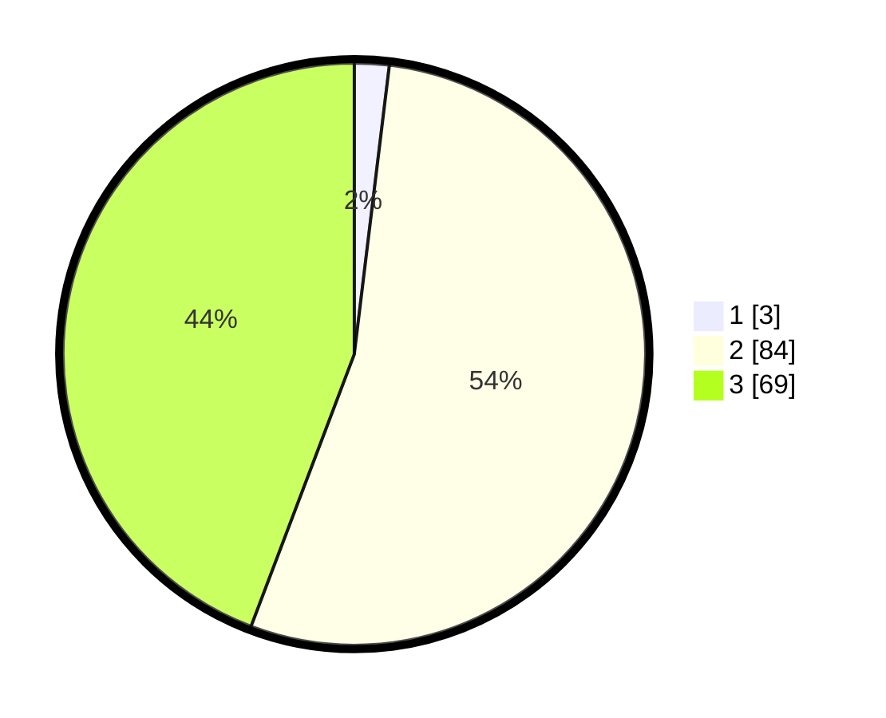

# Hasil

## Grafik

## Tabel

| No. | Nama Paslon    | Suara | Suara (raw) | Persentase |
|:--- |:-------------- | -----:| -----------:| ----------:|
| 1   | ANIES MUHAIMIN | 3     | [3][p-1]    | 1,92       |
| 2   | PRABOWO GIBRAN | 84    | [84][p-2]   | 53,85      |
| 3   | GANJAR MAHFUD  | 69    | [69][p-3]   | 44,23      |

[p-1]: https://github.com/gigit-pemilu/pemilu-2024-51-bali/blob/main/pilpres/hitung-suara/sub/51-bali/sub/02-tabanan/sub/10-pupuan/sub/2006-pujungan/sub/015-tps/sub/paslon-1.txt
[p-2]: https://github.com/gigit-pemilu/pemilu-2024-51-bali/blob/main/pilpres/hitung-suara/sub/51-bali/sub/02-tabanan/sub/10-pupuan/sub/2006-pujungan/sub/015-tps/sub/paslon-2.txt
[p-3]: https://github.com/gigit-pemilu/pemilu-2024-51-bali/blob/main/pilpres/hitung-suara/sub/51-bali/sub/02-tabanan/sub/10-pupuan/sub/2006-pujungan/sub/015-tps/sub/paslon-3.txt

## Foto C Plano

https://sirekap-obj-formc.kpu.go.id/cfb5/pemilu/ppwp/51/02/10/20/06/5102102006015-20240214-155832--236f0e6a-136b-42c8-aca4-77b714672cd5.jpg

https://sirekap-obj-formc.kpu.go.id/cfb5/pemilu/ppwp/51/02/10/20/06/5102102006015-20240215-025949--1e96a21c-9518-4788-8465-ff9f6121d4ff.jpg

https://sirekap-obj-formc.kpu.go.id/cfb5/pemilu/ppwp/51/02/10/20/06/5102102006015-20240215-030125--28a7c8e8-a51c-4d8c-9047-fede8ce5f24d.jpg

## Metadata

| Key        | Value               |
| ---------- | ------------------- |
| Time Stamp | 2024-02-24 22:31:28 |

## DATA PEMILIH TETAP

Jumlah pemilih dalam DPT: **188**.
 * L: **94**.
 * P: **94**.

## DATA PENGGUNA HAK PILIH

Jumlah pengguna hak pilih dalam DPT: **156**.
 * L: **85**.
 * P: **71**.

Jumlah pengguna hak pilih dalam DPTb: **1**.
 * L: **1**.
 * P: **0**.

Jumlah pengguna hak pilih dalam DPK: **0**.
 * L: **0**.
 * P: **0**.

Jumlah pengguna hak pilih: **157**.
 * L: **86**.
 * P: **71**.

## JUMLAH SUARA SAH DAN TIDAK SAH

JUMLAH SELURUH SUARA SAH: **156**.

JUMLAH SUARA TIDAK SAH: **1**.

JUMLAH SELURUH SUARA SAH DAN SUARA TIDAK SAH: **157**.

