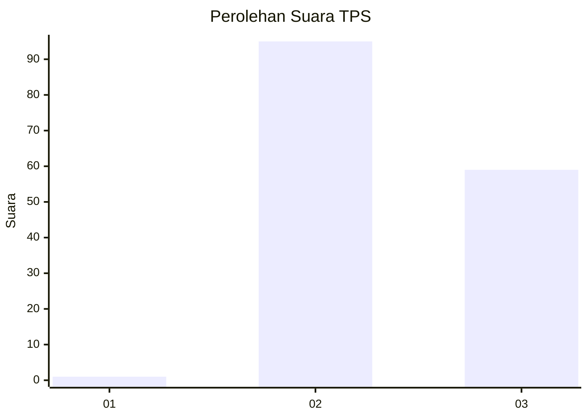
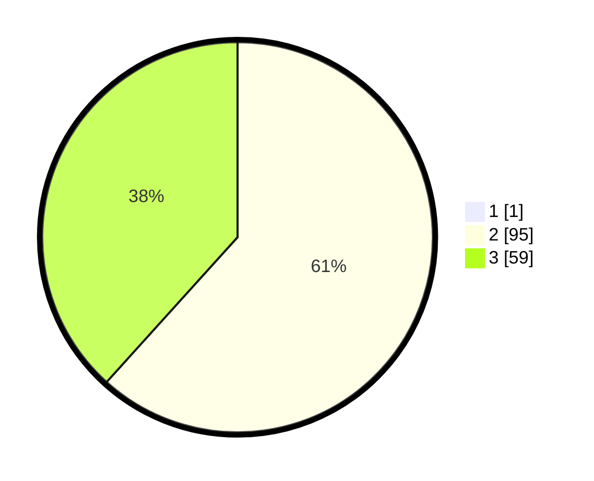

# Hasil

## Grafik

## Tabel

| No. | Nama Paslon    | Suara | Suara (raw) | Persentase |
|:--- |:-------------- | -----:| -----------:| ----------:|
| 1   | ANIES MUHAIMIN | 1     | [1][p-1]    | 0,65       |
| 2   | PRABOWO GIBRAN | 95    | [95][p-2]   | 61,29      |
| 3   | GANJAR MAHFUD  | 59    | [59][p-3]   | 38,06      |

[p-1]: https://github.com/gigit-pemilu/pemilu-2024-51-bali/blob/main/pilpres/hitung-suara/sub/51-bali/sub/02-tabanan/sub/10-pupuan/sub/2006-pujungan/sub/016-tps/sub/paslon-1.txt
[p-2]: https://github.com/gigit-pemilu/pemilu-2024-51-bali/blob/main/pilpres/hitung-suara/sub/51-bali/sub/02-tabanan/sub/10-pupuan/sub/2006-pujungan/sub/016-tps/sub/paslon-2.txt
[p-3]: https://github.com/gigit-pemilu/pemilu-2024-51-bali/blob/main/pilpres/hitung-suara/sub/51-bali/sub/02-tabanan/sub/10-pupuan/sub/2006-pujungan/sub/016-tps/sub/paslon-3.txt

## Foto C Plano

https://sirekap-obj-formc.kpu.go.id/0bc7/pemilu/ppwp/51/02/10/20/06/5102102006016-20240214-211731--b2d1b917-5918-4d6c-b52d-2173c86e1d73.jpg

https://sirekap-obj-formc.kpu.go.id/0bc7/pemilu/ppwp/51/02/10/20/06/5102102006016-20240214-222203--79e81baa-4ebf-4c1f-aa8f-426c4d74985a.jpg

https://sirekap-obj-formc.kpu.go.id/0bc7/pemilu/ppwp/51/02/10/20/06/5102102006016-20240215-185150--3df471cb-629b-4c63-9a9f-a1b0138ca9f3.jpg

## Metadata

| Key        | Value               |
| ---------- | ------------------- |
| Time Stamp | 2024-02-24 22:31:28 |

