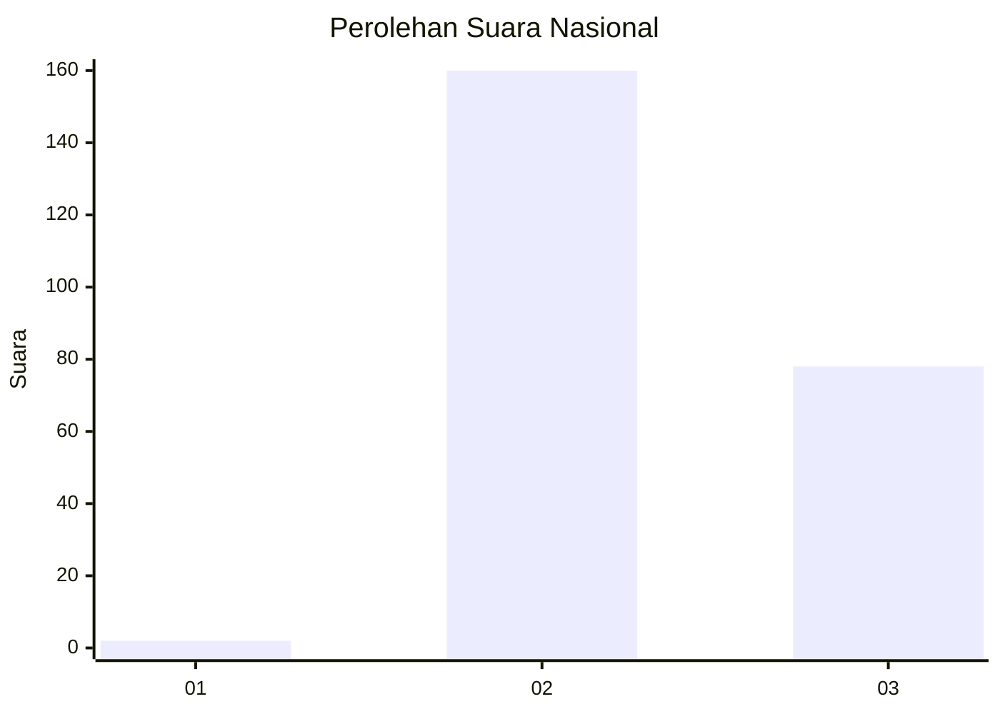
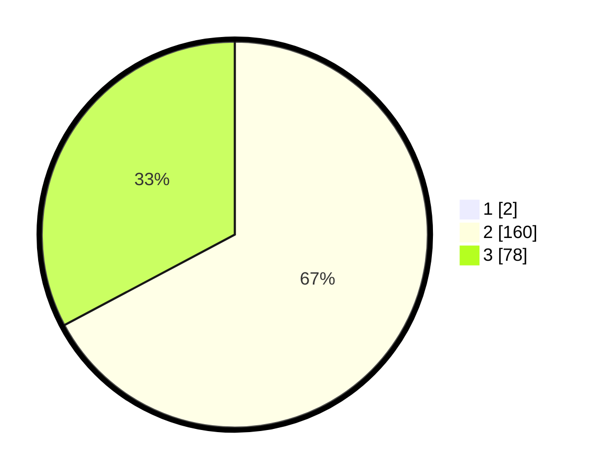

# Hasil

## Grafik

## Tabel

| No. | Nama Paslon    | Suara | Suara (raw) | Persentase |
|:--- |:-------------- | -----:| -----------:| ----------:|
| 1   | ANIES MUHAIMIN | 2     | [2][p-1]    | 0,83       |
| 2   | PRABOWO GIBRAN | 160   | [160][p-2]  | 66,67      |
| 3   | GANJAR MAHFUD  | 78    | [78][p-3]   | 32,50      |

[p-1]: https://github.com/gigit-pemilu/pemilu-2024/blob/main/pilpres/hitung-suara/sub/51-bali/sub/02-tabanan/sub/10-pupuan/sub/2006-pujungan/sub/019-tps/sub/paslon-1.txt
[p-2]: https://github.com/gigit-pemilu/pemilu-2024/blob/main/pilpres/hitung-suara/sub/51-bali/sub/02-tabanan/sub/10-pupuan/sub/2006-pujungan/sub/019-tps/sub/paslon-2.txt
[p-3]: https://github.com/gigit-pemilu/pemilu-2024/blob/main/pilpres/hitung-suara/sub/51-bali/sub/02-tabanan/sub/10-pupuan/sub/2006-pujungan/sub/019-tps/sub/paslon-3.txt

## Foto C Plano

https://sirekap-obj-formc.kpu.go.id/28b7/pemilu/ppwp/51/02/10/20/06/5102102006019-20240214-210727--6224675d-e783-4259-9b00-b7b0c3338c32.jpg

https://sirekap-obj-formc.kpu.go.id/28b7/pemilu/ppwp/51/02/10/20/06/5102102006019-20240214-210856--d7d75abd-6894-4e21-b1de-ae9075ae3763.jpg

## Metadata

| Key        | Value               |
| ---------- | ------------------- |
| Time Stamp | 2024-02-24 22:31:28 |

