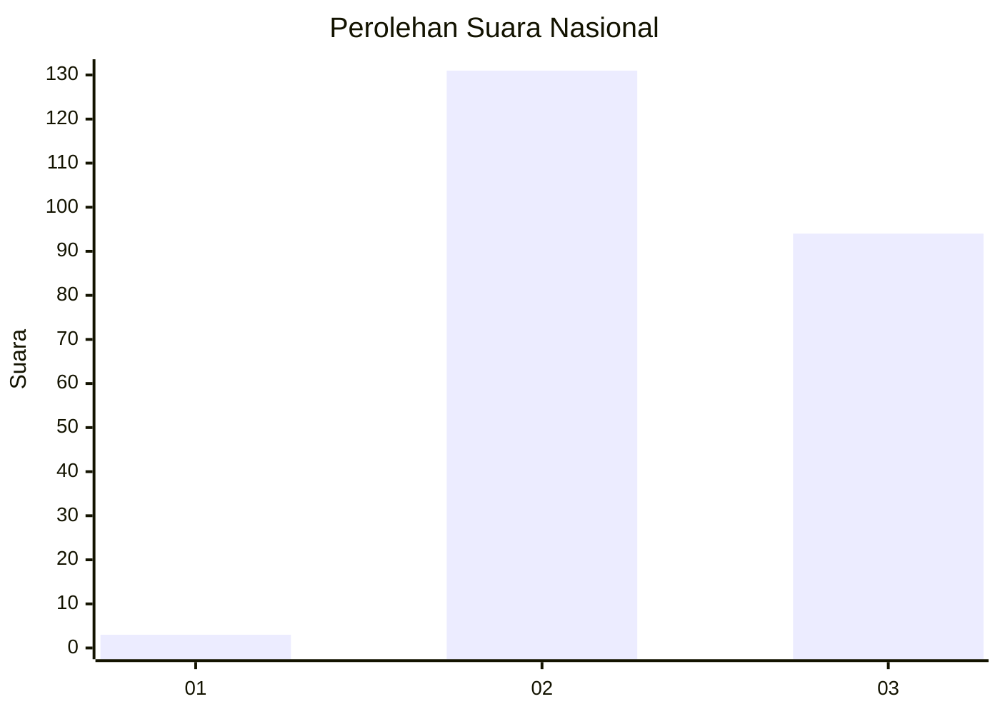
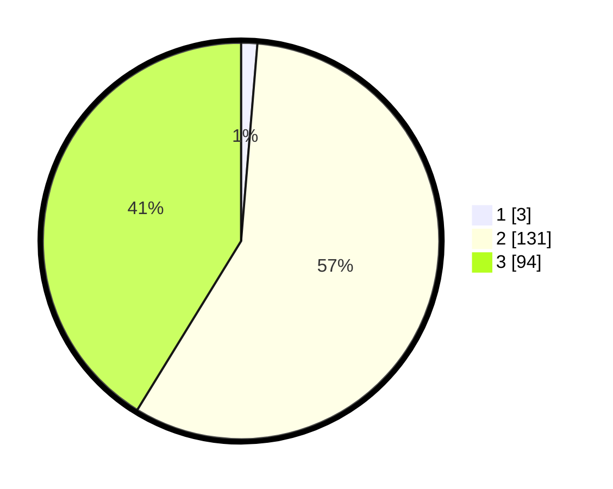

# Hasil

## Grafik

## Tabel

| No. | Nama Paslon    | Suara | Suara (raw) | Persentase |
|:--- |:-------------- | -----:| -----------:| ----------:|
| 1   | ANIES MUHAIMIN | 3     | [3][p-1]    | 1,32       |
| 2   | PRABOWO GIBRAN | 131   | [131][p-2]  | 57,46      |
| 3   | GANJAR MAHFUD  | 94    | [94][p-3]   | 41,23      |

[p-1]: https://github.com/gigit-pemilu/pemilu-2024/blob/main/pilpres/hitung-suara/sub/51-bali/sub/02-tabanan/sub/10-pupuan/sub/2006-pujungan/sub/020-tps/sub/paslon-1.txt
[p-2]: https://github.com/gigit-pemilu/pemilu-2024/blob/main/pilpres/hitung-suara/sub/51-bali/sub/02-tabanan/sub/10-pupuan/sub/2006-pujungan/sub/020-tps/sub/paslon-2.txt
[p-3]: https://github.com/gigit-pemilu/pemilu-2024/blob/main/pilpres/hitung-suara/sub/51-bali/sub/02-tabanan/sub/10-pupuan/sub/2006-pujungan/sub/020-tps/sub/paslon-3.txt

## Foto C Plano

https://sirekap-obj-formc.kpu.go.id/e942/pemilu/ppwp/51/02/10/20/06/5102102006020-20240215-004910--cc9a21c6-2c31-45b7-891d-748134f4ab15.jpg

https://sirekap-obj-formc.kpu.go.id/e942/pemilu/ppwp/51/02/10/20/06/5102102006020-20240218-092201--2c6dbddb-7663-4221-8d50-4f06fc7293cd.jpg

https://sirekap-obj-formc.kpu.go.id/e942/pemilu/ppwp/51/02/10/20/06/5102102006020-20240215-005236--169e408a-0f5f-4a9d-8113-4e9b13a96260.jpg

## Metadata

| Key        | Value               |
| ---------- | ------------------- |
| Time Stamp | 2024-02-21 22:00:00 |

## DATA PEMILIH TETAP

Jumlah pemilih dalam DPT: **266**.
 * L: **136**.
 * P: **130**.

## DATA PENGGUNA HAK PILIH

Jumlah pengguna hak pilih dalam DPT: **236**.
 * L: **126**.
 * P: **110**.

Jumlah pengguna hak pilih dalam DPTb: **0**.
 * L: **0**.
 * P: **0**.

Jumlah pengguna hak pilih dalam DPK: **0**.
 * L: **0**.
 * P: **0**.

Jumlah pengguna hak pilih: **236**.
 * L: **126**.
 * P: **110**.

## JUMLAH SUARA SAH DAN TIDAK SAH

JUMLAH SELURUH SUARA SAH: **228**.

JUMLAH SUARA TIDAK SAH: **8**.

JUMLAH SELURUH SUARA SAH DAN SUARA TIDAK SAH: **236**.

