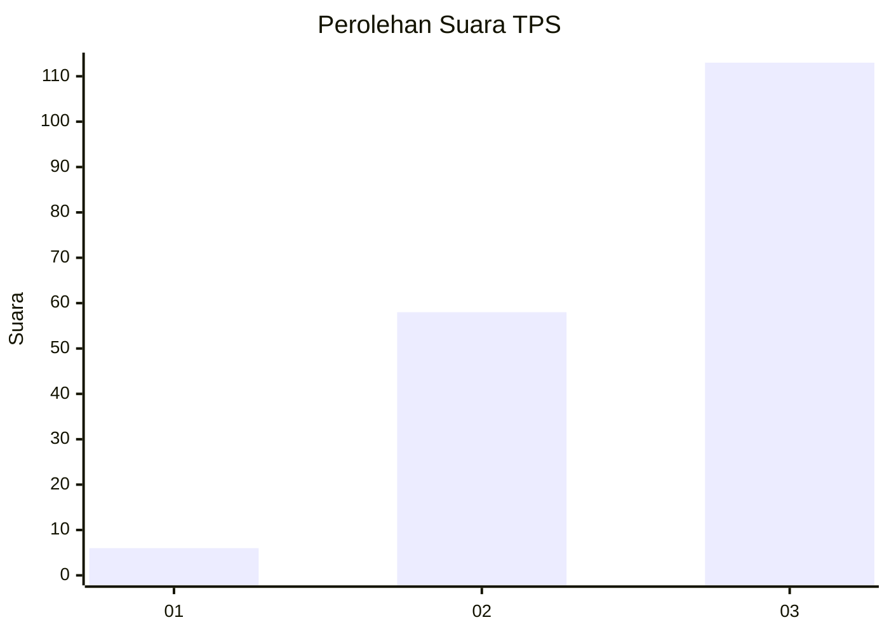
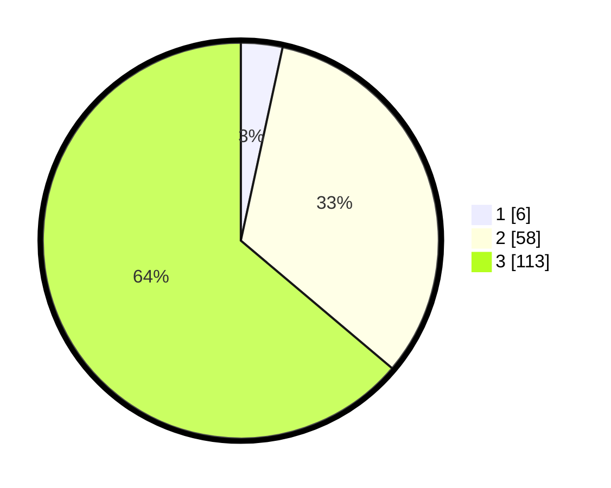

# Hasil

## Grafik

## Tabel

| No. | Nama Paslon    | Suara | Suara (raw) | Persentase |
|:--- |:-------------- | -----:| -----------:| ----------:|
| 1   | ANIES MUHAIMIN | 6     | [6][p-1]    | 3,39       |
| 2   | PRABOWO GIBRAN | 58    | [58][p-2]   | 32,77      |
| 3   | GANJAR MAHFUD  | 113   | [113][p-3]  | 63,84      |

[p-1]: https://github.com/gigit-pemilu/pemilu-2024-51-bali/blob/main/pilpres/hitung-suara/sub/51-bali/sub/02-tabanan/sub/10-pupuan/sub/2006-pujungan/sub/021-tps/sub/paslon-1.txt
[p-2]: https://github.com/gigit-pemilu/pemilu-2024-51-bali/blob/main/pilpres/hitung-suara/sub/51-bali/sub/02-tabanan/sub/10-pupuan/sub/2006-pujungan/sub/021-tps/sub/paslon-2.txt
[p-3]: https://github.com/gigit-pemilu/pemilu-2024-51-bali/blob/main/pilpres/hitung-suara/sub/51-bali/sub/02-tabanan/sub/10-pupuan/sub/2006-pujungan/sub/021-tps/sub/paslon-3.txt

## Foto C Plano

https://sirekap-obj-formc.kpu.go.id/4ddb/pemilu/ppwp/51/02/10/20/06/5102102006021-20240214-160149--44b9154d-996e-4edd-b556-f67b514cf034.jpg

https://sirekap-obj-formc.kpu.go.id/4ddb/pemilu/ppwp/51/02/10/20/06/5102102006021-20240214-214937--95ec9f0d-240c-4587-865d-e499afd9b1f2.jpg

https://sirekap-obj-formc.kpu.go.id/4ddb/pemilu/ppwp/51/02/10/20/06/5102102006021-20240214-214946--ec555f83-4a7b-4654-9069-d3811be88463.jpg

## Metadata

| Key        | Value               |
| ---------- | ------------------- |
| Time Stamp | 2024-02-15 18:00:26 |

## DATA PEMILIH TETAP

Jumlah pemilih dalam DPT: **211**.
 * L: **109**.
 * P: **102**.

## DATA PENGGUNA HAK PILIH

Jumlah pengguna hak pilih dalam DPT: **180**.
 * L: **91**.
 * P: **89**.

Jumlah pengguna hak pilih dalam DPTb: **0**.
 * L: **0**.
 * P: **0**.

Jumlah pengguna hak pilih dalam DPK: **1**.
 * L: **1**.
 * P: **0**.

Jumlah pengguna hak pilih: **181**.
 * L: **92**.
 * P: **89**.

## JUMLAH SUARA SAH DAN TIDAK SAH

JUMLAH SELURUH SUARA SAH: **177**.

JUMLAH SUARA TIDAK SAH: **4**.

JUMLAH SELURUH SUARA SAH DAN SUARA TIDAK SAH: **181**.

