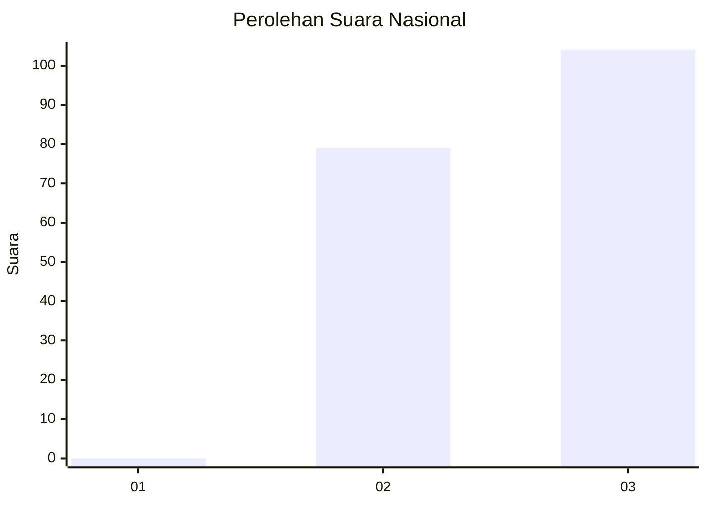
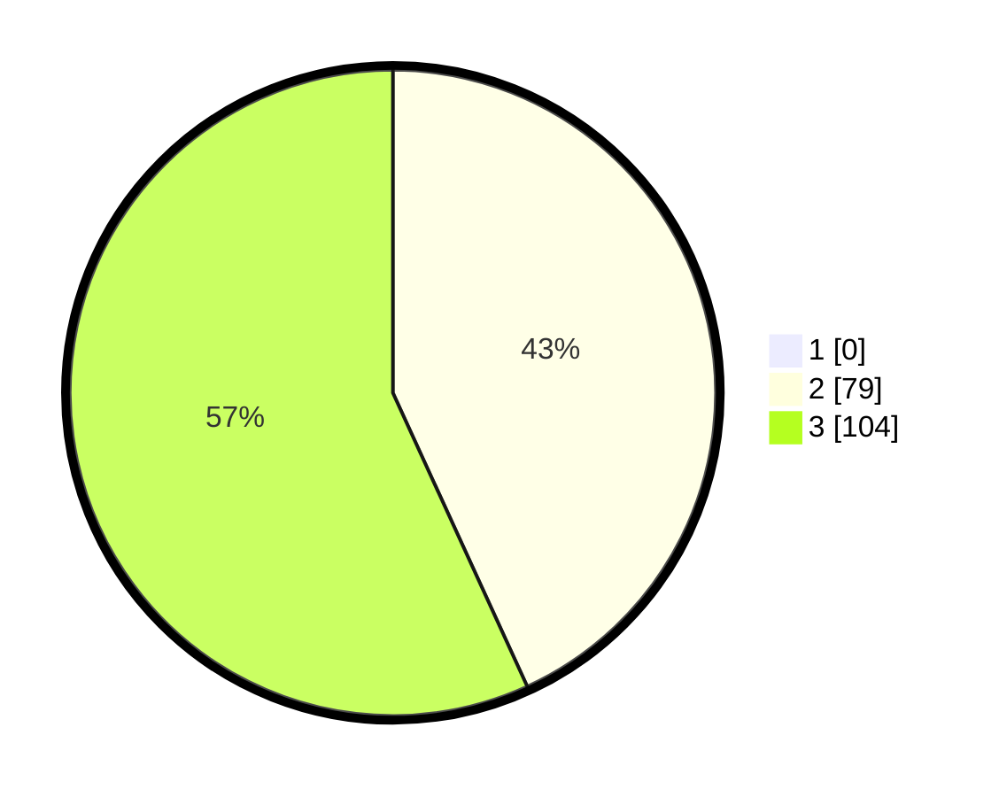

# Hasil

## Grafik

## Tabel

| No. | Nama Paslon    | Suara | Suara (raw) | Persentase |
|:--- |:-------------- | -----:| -----------:| ----------:|
| 1   | ANIES MUHAIMIN | 0     | [0][p-1]    | 0,00       |
| 2   | PRABOWO GIBRAN | 79    | [79][p-2]   | 43,17      |
| 3   | GANJAR MAHFUD  | 104   | [104][p-3]  | 56,83      |

[p-1]: https://github.com/gigit-pemilu/pemilu-2024/blob/main/pilpres/hitung-suara/sub/51-bali/sub/02-tabanan/sub/10-pupuan/sub/2006-pujungan/sub/023-tps/sub/paslon-1.txt
[p-2]: https://github.com/gigit-pemilu/pemilu-2024/blob/main/pilpres/hitung-suara/sub/51-bali/sub/02-tabanan/sub/10-pupuan/sub/2006-pujungan/sub/023-tps/sub/paslon-2.txt
[p-3]: https://github.com/gigit-pemilu/pemilu-2024/blob/main/pilpres/hitung-suara/sub/51-bali/sub/02-tabanan/sub/10-pupuan/sub/2006-pujungan/sub/023-tps/sub/paslon-3.txt

## Foto C Plano

https://sirekap-obj-formc.kpu.go.id/c60d/pemilu/ppwp/51/02/10/20/06/5102102006023-20240214-204135--293b187f-d969-413d-be14-97159ddd7c7a.jpg

https://sirekap-obj-formc.kpu.go.id/c60d/pemilu/ppwp/51/02/10/20/06/5102102006023-20240214-204002--d99dfba2-6294-4e18-8af3-c6a887fcac33.jpg

https://sirekap-obj-formc.kpu.go.id/c60d/pemilu/ppwp/51/02/10/20/06/5102102006023-20240214-204059--247f20af-ceda-43a4-b334-a7e10878cc7b.jpg

## Metadata

| Key        | Value               |
| ---------- | ------------------- |
| Time Stamp | 2024-02-16 10:30:29 |

