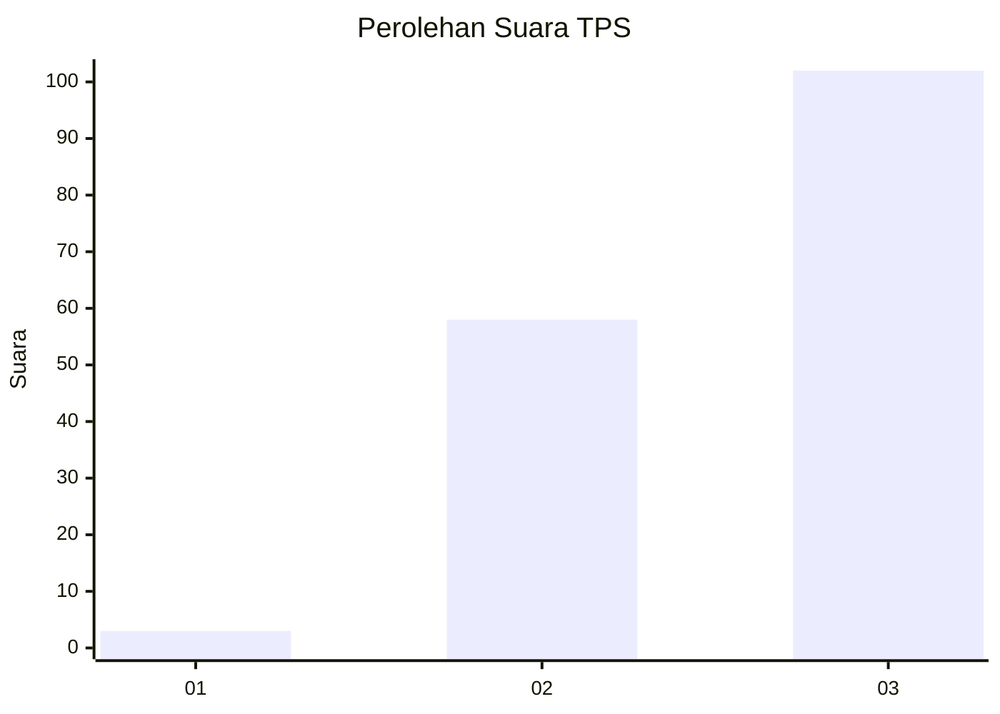
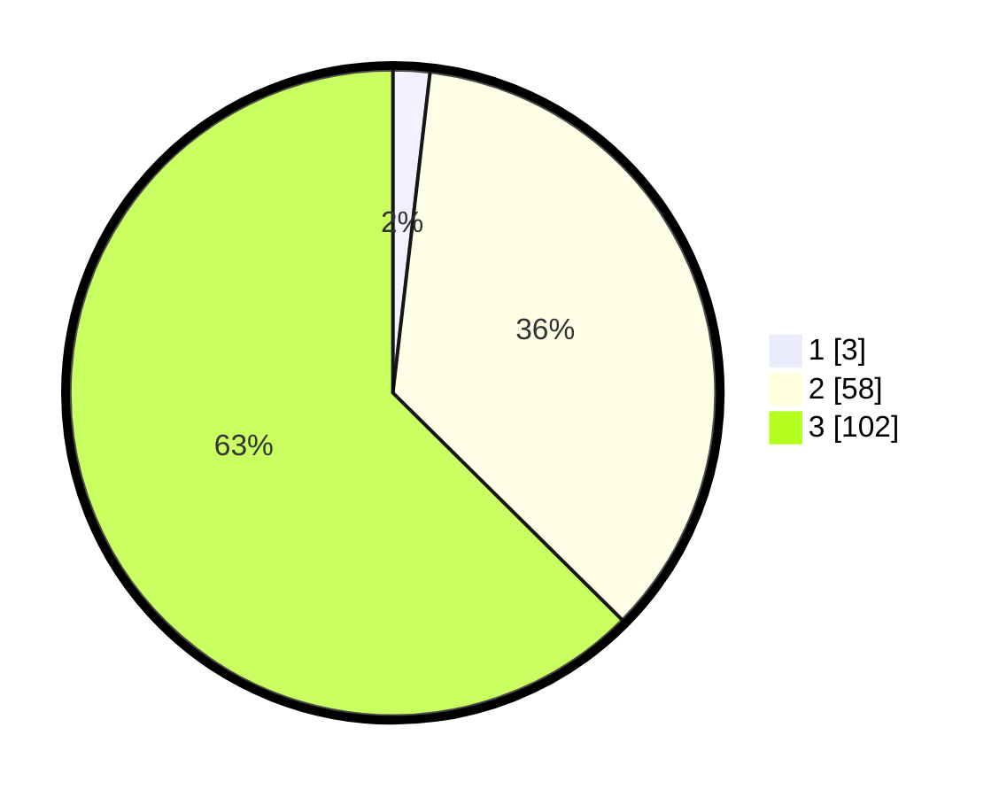

# Hasil

## Grafik

## Tabel

| No. | Nama Paslon    | Suara | Suara (raw) | Persentase |
|:--- |:-------------- | -----:| -----------:| ----------:|
| 1   | ANIES MUHAIMIN | 3     | [3][p-1]    | 1,84       |
| 2   | PRABOWO GIBRAN | 58    | [58][p-2]   | 35,58      |
| 3   | GANJAR MAHFUD  | 102   | [102][p-3]  | 62,58      |

[p-1]: https://github.com/gigit-pemilu/pemilu-2024-51-bali/blob/main/pilpres/hitung-suara/sub/51-bali/sub/02-tabanan/sub/10-pupuan/sub/2007-pupuan/sub/005-tps/sub/paslon-1.txt
[p-2]: https://github.com/gigit-pemilu/pemilu-2024-51-bali/blob/main/pilpres/hitung-suara/sub/51-bali/sub/02-tabanan/sub/10-pupuan/sub/2007-pupuan/sub/005-tps/sub/paslon-2.txt
[p-3]: https://github.com/gigit-pemilu/pemilu-2024-51-bali/blob/main/pilpres/hitung-suara/sub/51-bali/sub/02-tabanan/sub/10-pupuan/sub/2007-pupuan/sub/005-tps/sub/paslon-3.txt

## Foto C Plano

https://sirekap-obj-formc.kpu.go.id/5abe/pemilu/ppwp/51/02/10/20/07/5102102007005-20240214-213258--cf52ed81-77ac-4785-92d4-c0af11713a87.jpg

https://sirekap-obj-formc.kpu.go.id/5abe/pemilu/ppwp/51/02/10/20/07/5102102007005-20240214-213306--cbca6ddb-05d6-45a2-9b59-45a319e626fd.jpg

https://sirekap-obj-formc.kpu.go.id/5abe/pemilu/ppwp/51/02/10/20/07/5102102007005-20240214-213313--db9e23f5-2087-45a3-9ff3-d9193c43bae5.jpg

## Metadata

| Key        | Value               |
| ---------- | ------------------- |
| Time Stamp | 2024-02-24 22:31:28 |

