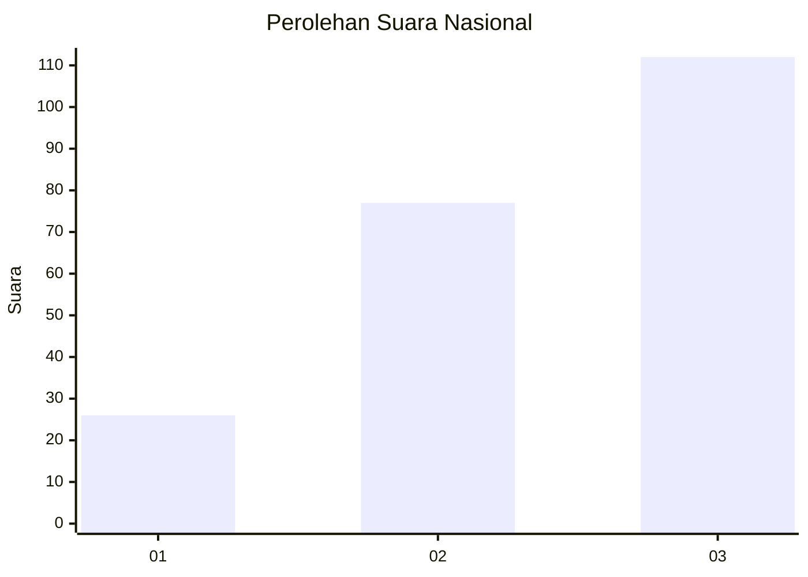
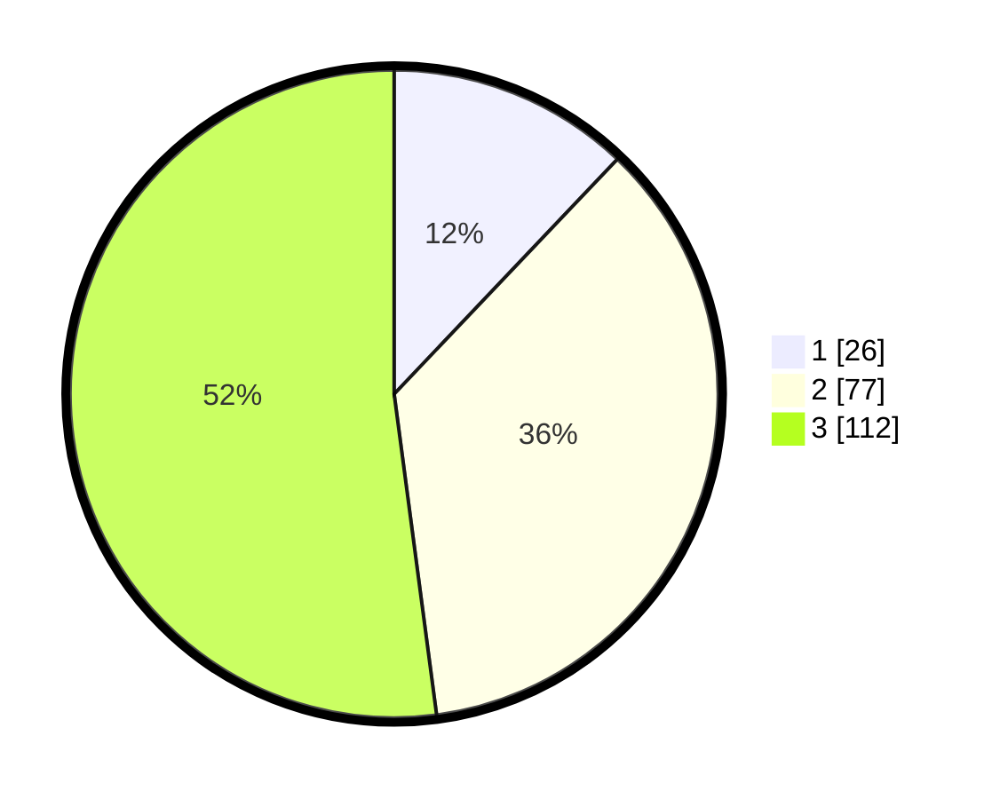

# Hasil

## Grafik

## Tabel

| No. | Nama Paslon    | Suara | Suara (raw) | Persentase |
|:--- |:-------------- | -----:| -----------:| ----------:|
| 1   | ANIES MUHAIMIN | 26    | [26][p-1]   | 12,09      |
| 2   | PRABOWO GIBRAN | 77    | [77][p-2]   | 35,81      |
| 3   | GANJAR MAHFUD  | 112   | [112][p-3]  | 52,09      |

[p-1]: https://github.com/gigit-pemilu/pemilu-2024/blob/main/pilpres/hitung-suara/sub/51-bali/sub/02-tabanan/sub/10-pupuan/sub/2007-pupuan/sub/010-tps/sub/paslon-1.txt
[p-2]: https://github.com/gigit-pemilu/pemilu-2024/blob/main/pilpres/hitung-suara/sub/51-bali/sub/02-tabanan/sub/10-pupuan/sub/2007-pupuan/sub/010-tps/sub/paslon-2.txt
[p-3]: https://github.com/gigit-pemilu/pemilu-2024/blob/main/pilpres/hitung-suara/sub/51-bali/sub/02-tabanan/sub/10-pupuan/sub/2007-pupuan/sub/010-tps/sub/paslon-3.txt

## Foto C Plano

https://sirekap-obj-formc.kpu.go.id/ed37/pemilu/ppwp/51/02/10/20/07/5102102007010-20240216-015148--a7284d37-8115-4924-84bc-119ec551efeb.jpg

https://sirekap-obj-formc.kpu.go.id/ed37/pemilu/ppwp/51/02/10/20/07/5102102007010-20240214-190900--6977714b-87c5-4755-8c4a-defb706de4de.jpg

https://sirekap-obj-formc.kpu.go.id/ed37/pemilu/ppwp/51/02/10/20/07/5102102007010-20240214-191021--023357dc-892f-4e9e-bde2-4d4142fb1d8b.jpg

## Metadata

| Key        | Value               |
| ---------- | ------------------- |
| Time Stamp | 2024-02-16 02:00:27 |

## DATA PEMILIH TETAP

Jumlah pemilih dalam DPT: **295**.
 * L: **150**.
 * P: **145**.

## DATA PENGGUNA HAK PILIH

Jumlah pengguna hak pilih dalam DPT: **225**.
 * L: **116**.
 * P: **109**.

Jumlah pengguna hak pilih dalam DPTb: **1**.
 * L: **0**.
 * P: **1**.

Jumlah pengguna hak pilih dalam DPK: **0**.
 * L: **0**.
 * P: **0**.

Jumlah pengguna hak pilih: **226**.
 * L: **116**.
 * P: **110**.

## JUMLAH SUARA SAH DAN TIDAK SAH

JUMLAH SELURUH SUARA SAH: **215**.

JUMLAH SUARA TIDAK SAH: **11**.

JUMLAH SELURUH SUARA SAH DAN SUARA TIDAK SAH: **226**.

