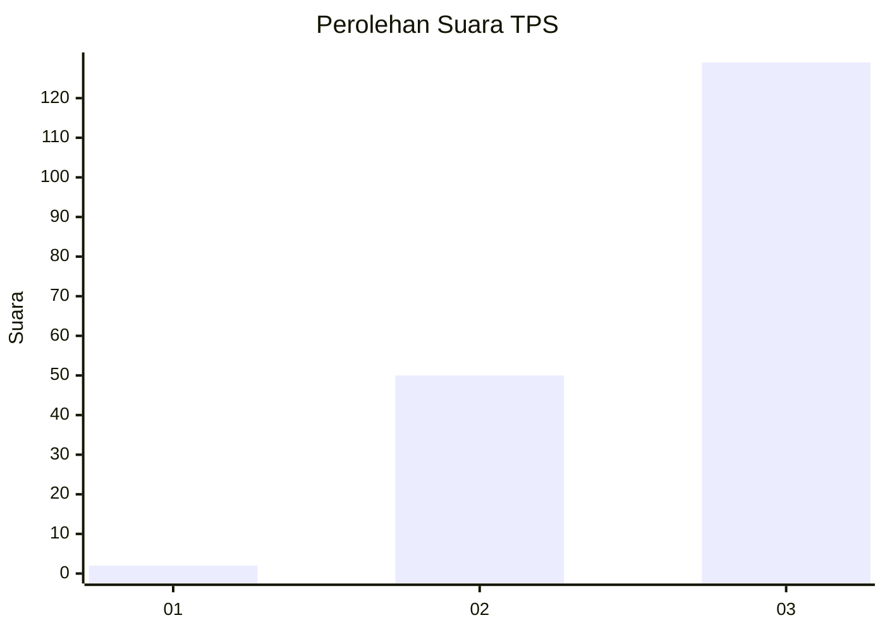
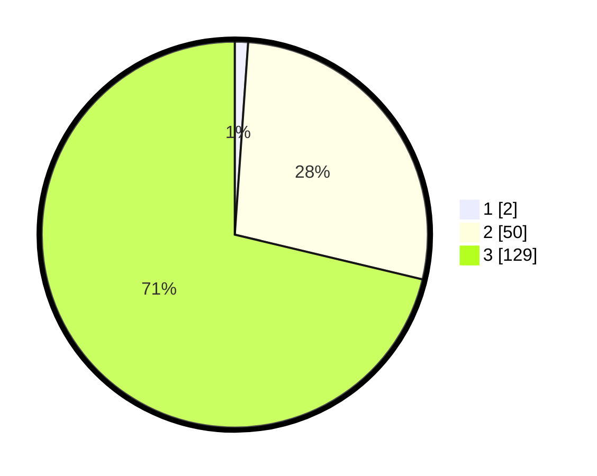

# Hasil

## Grafik

## Tabel

| No. | Nama Paslon    | Suara | Suara (raw) | Persentase |
|:--- |:-------------- | -----:| -----------:| ----------:|
| 1   | ANIES MUHAIMIN | 2     | [2][p-1]    | 1,10       |
| 2   | PRABOWO GIBRAN | 50    | [50][p-2]   | 27,62      |
| 3   | GANJAR MAHFUD  | 129   | [129][p-3]  | 71,27      |

[p-1]: https://github.com/gigit-pemilu/pemilu-2024-51-bali/blob/main/pilpres/hitung-suara/sub/51-bali/sub/02-tabanan/sub/10-pupuan/sub/2008-bantiran/sub/003-tps/sub/paslon-1.txt
[p-2]: https://github.com/gigit-pemilu/pemilu-2024-51-bali/blob/main/pilpres/hitung-suara/sub/51-bali/sub/02-tabanan/sub/10-pupuan/sub/2008-bantiran/sub/003-tps/sub/paslon-2.txt
[p-3]: https://github.com/gigit-pemilu/pemilu-2024-51-bali/blob/main/pilpres/hitung-suara/sub/51-bali/sub/02-tabanan/sub/10-pupuan/sub/2008-bantiran/sub/003-tps/sub/paslon-3.txt

## Foto C Plano

https://sirekap-obj-formc.kpu.go.id/39ed/pemilu/ppwp/51/02/10/20/08/5102102008003-20240215-155031--1c0eb46c-92be-4e9e-9193-e16dad853e8b.jpg

https://sirekap-obj-formc.kpu.go.id/39ed/pemilu/ppwp/51/02/10/20/08/5102102008003-20240215-155040--f150e377-b21b-4362-96ff-e014f5793247.jpg

https://sirekap-obj-formc.kpu.go.id/39ed/pemilu/ppwp/51/02/10/20/08/5102102008003-20240215-155047--5c3f4c71-0c54-4439-a993-4f58cab7acef.jpg

## Metadata

| Key        | Value               |
| ---------- | ------------------- |
| Time Stamp | 2024-02-25 12:00:00 |

