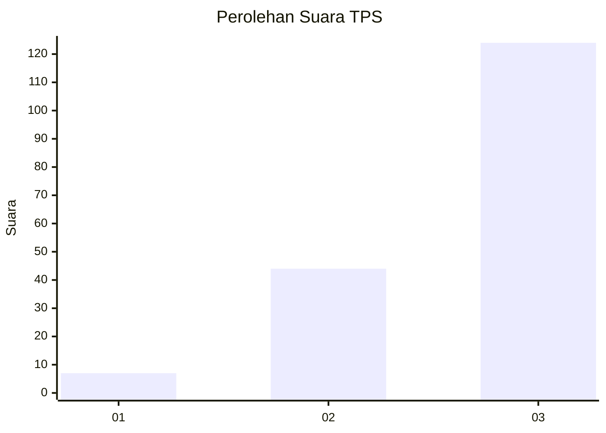
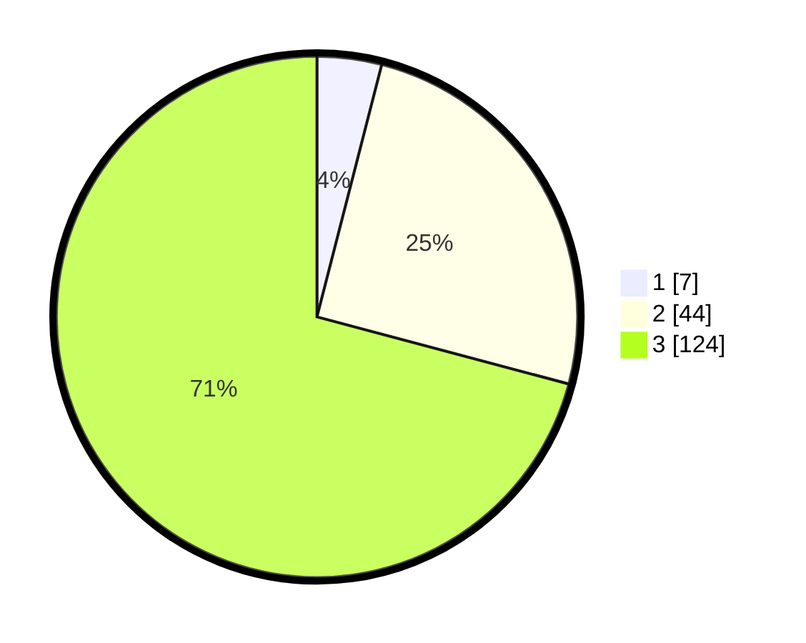

# Hasil

## Grafik

## Tabel

| No. | Nama Paslon    | Suara | Suara (raw) | Persentase |
|:--- |:-------------- | -----:| -----------:| ----------:|
| 1   | ANIES MUHAIMIN | 7     | [7][p-1]    | 4,00       |
| 2   | PRABOWO GIBRAN | 44    | [44][p-2]   | 25,14      |
| 3   | GANJAR MAHFUD  | 124   | [124][p-3]  | 70,86      |

[p-1]: https://github.com/gigit-pemilu/pemilu-2024-51-bali/blob/main/pilpres/hitung-suara/sub/51-bali/sub/02-tabanan/sub/10-pupuan/sub/2008-bantiran/sub/004-tps/sub/paslon-1.txt
[p-2]: https://github.com/gigit-pemilu/pemilu-2024-51-bali/blob/main/pilpres/hitung-suara/sub/51-bali/sub/02-tabanan/sub/10-pupuan/sub/2008-bantiran/sub/004-tps/sub/paslon-2.txt
[p-3]: https://github.com/gigit-pemilu/pemilu-2024-51-bali/blob/main/pilpres/hitung-suara/sub/51-bali/sub/02-tabanan/sub/10-pupuan/sub/2008-bantiran/sub/004-tps/sub/paslon-3.txt

## Foto C Plano

https://sirekap-obj-formc.kpu.go.id/096d/pemilu/ppwp/51/02/10/20/08/5102102008004-20240214-155117--ebd450e7-4077-4e7e-a525-ab3a436b2f01.jpg

https://sirekap-obj-formc.kpu.go.id/096d/pemilu/ppwp/51/02/10/20/08/5102102008004-20240214-225341--9ccb7ef7-882d-4309-a283-60346806dbdb.jpg

https://sirekap-obj-formc.kpu.go.id/096d/pemilu/ppwp/51/02/10/20/08/5102102008004-20240214-155102--b9ca0c2b-176f-4449-9c59-405a185c0566.jpg

## Metadata

| Key        | Value               |
| ---------- | ------------------- |
| Time Stamp | 2024-02-16 10:30:29 |

## DATA PEMILIH TETAP

Jumlah pemilih dalam DPT: **194**.
 * L: **94**.
 * P: **100**.

## DATA PENGGUNA HAK PILIH

Jumlah pengguna hak pilih dalam DPT: **175**.
 * L: **88**.
 * P: **87**.

Jumlah pengguna hak pilih dalam DPTb: **1**.
 * L: **0**.
 * P: **1**.

Jumlah pengguna hak pilih dalam DPK: **0**.
 * L: **0**.
 * P: **0**.

Jumlah pengguna hak pilih: **176**.
 * L: **88**.
 * P: **88**.

## JUMLAH SUARA SAH DAN TIDAK SAH

JUMLAH SELURUH SUARA SAH: **175**.

JUMLAH SUARA TIDAK SAH: **1**.

JUMLAH SELURUH SUARA SAH DAN SUARA TIDAK SAH: **176**.

