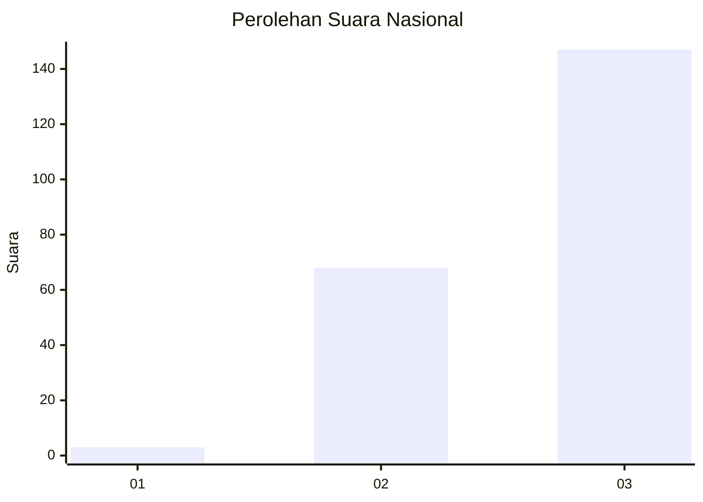
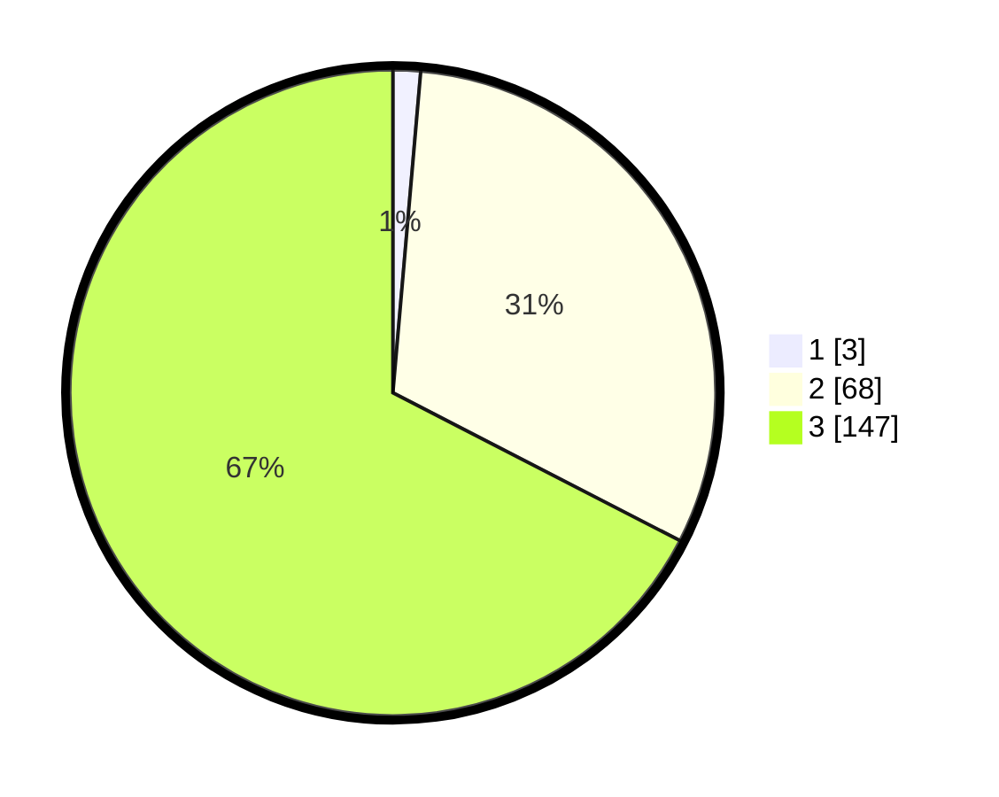

# Hasil

## Grafik

## Tabel

| No. | Nama Paslon    | Suara | Suara (raw) | Persentase |
|:--- |:-------------- | -----:| -----------:| ----------:|
| 1   | ANIES MUHAIMIN | 3     | [3][p-1]    | 1,38       |
| 2   | PRABOWO GIBRAN | 68    | [68][p-2]   | 31,19      |
| 3   | GANJAR MAHFUD  | 147   | [147][p-3]  | 67,43      |

[p-1]: https://github.com/gigit-pemilu/pemilu-2024/blob/main/pilpres/hitung-suara/sub/51-bali/sub/02-tabanan/sub/10-pupuan/sub/2008-bantiran/sub/007-tps/sub/paslon-1.txt
[p-2]: https://github.com/gigit-pemilu/pemilu-2024/blob/main/pilpres/hitung-suara/sub/51-bali/sub/02-tabanan/sub/10-pupuan/sub/2008-bantiran/sub/007-tps/sub/paslon-2.txt
[p-3]: https://github.com/gigit-pemilu/pemilu-2024/blob/main/pilpres/hitung-suara/sub/51-bali/sub/02-tabanan/sub/10-pupuan/sub/2008-bantiran/sub/007-tps/sub/paslon-3.txt

## Foto C Plano

https://sirekap-obj-formc.kpu.go.id/5793/pemilu/ppwp/51/02/10/20/08/5102102008007-20240215-003124--40265fc0-790b-4a96-bd64-fd0f3205a201.jpg

https://sirekap-obj-formc.kpu.go.id/5793/pemilu/ppwp/51/02/10/20/08/5102102008007-20240215-003133--2bc777fb-bfb7-4c32-ad60-4087fde6abab.jpg

https://sirekap-obj-formc.kpu.go.id/5793/pemilu/ppwp/51/02/10/20/08/5102102008007-20240215-003139--4d4c97ae-96b6-483f-915f-a3e52cd51e15.jpg

## Metadata

| Key        | Value               |
| ---------- | ------------------- |
| Time Stamp | 2024-02-16 05:30:26 |

