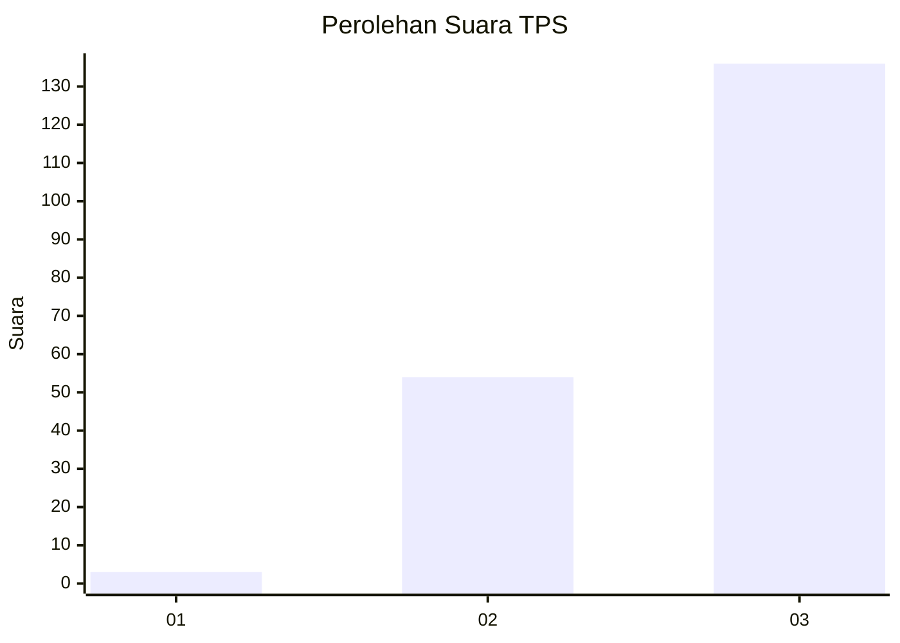
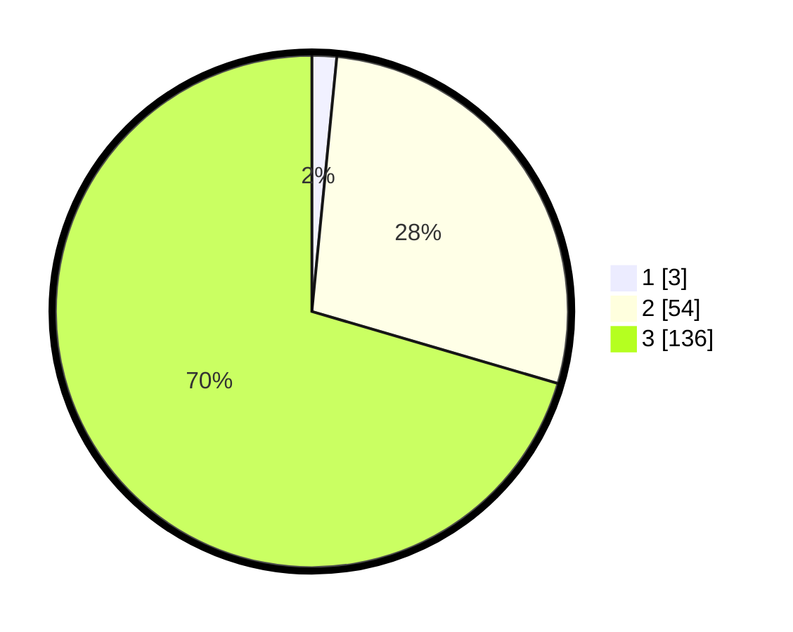

# Hasil

## Grafik

## Tabel

| No. | Nama Paslon    | Suara | Suara (raw) | Persentase |
|:--- |:-------------- | -----:| -----------:| ----------:|
| 1   | ANIES MUHAIMIN | 3     | [3][p-1]    | 1,55       |
| 2   | PRABOWO GIBRAN | 54    | [54][p-2]   | 27,98      |
| 3   | GANJAR MAHFUD  | 136   | [136][p-3]  | 70,47      |

[p-1]: https://github.com/gigit-pemilu/pemilu-2024-51-bali/blob/main/pilpres/hitung-suara/sub/51-bali/sub/02-tabanan/sub/10-pupuan/sub/2008-bantiran/sub/008-tps/sub/paslon-1.txt
[p-2]: https://github.com/gigit-pemilu/pemilu-2024-51-bali/blob/main/pilpres/hitung-suara/sub/51-bali/sub/02-tabanan/sub/10-pupuan/sub/2008-bantiran/sub/008-tps/sub/paslon-2.txt
[p-3]: https://github.com/gigit-pemilu/pemilu-2024-51-bali/blob/main/pilpres/hitung-suara/sub/51-bali/sub/02-tabanan/sub/10-pupuan/sub/2008-bantiran/sub/008-tps/sub/paslon-3.txt

## Foto C Plano

https://sirekap-obj-formc.kpu.go.id/f49c/pemilu/ppwp/51/02/10/20/08/5102102008008-20240215-102853--570b9d8f-8325-4175-b6c5-869c03579fd9.jpg

https://sirekap-obj-formc.kpu.go.id/f49c/pemilu/ppwp/51/02/10/20/08/5102102008008-20240215-102920--cf87699d-b41c-4146-b603-67d0e862b759.jpg

https://sirekap-obj-formc.kpu.go.id/f49c/pemilu/ppwp/51/02/10/20/08/5102102008008-20240215-102929--502984c2-7314-4066-bef2-73e5659c3dd5.jpg

## Metadata

| Key        | Value               |
| ---------- | ------------------- |
| Time Stamp | 2024-02-16 10:30:29 |

