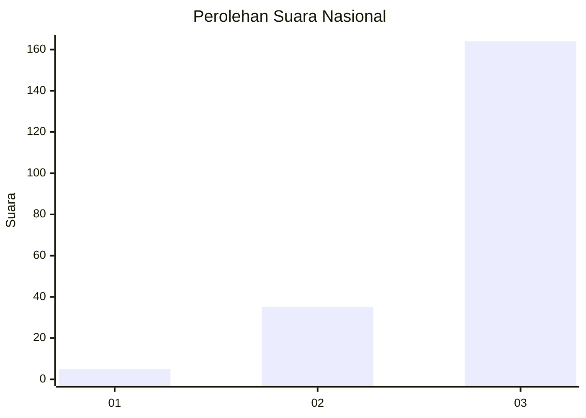
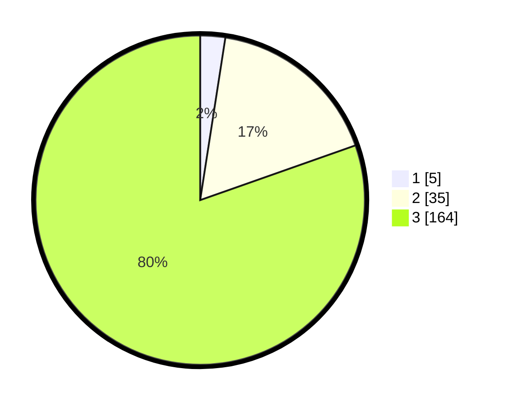

# Hasil

## Grafik

## Tabel

| No. | Nama Paslon    | Suara | Suara (raw) | Persentase |
|:--- |:-------------- | -----:| -----------:| ----------:|
| 1   | ANIES MUHAIMIN | 5     | [5][p-1]    | 2,45       |
| 2   | PRABOWO GIBRAN | 35    | [35][p-2]   | 17,16      |
| 3   | GANJAR MAHFUD  | 164   | [164][p-3]  | 80,39      |

[p-1]: https://github.com/gigit-pemilu/pemilu-2024/blob/main/pilpres/hitung-suara/sub/51-bali/sub/02-tabanan/sub/10-pupuan/sub/2008-bantiran/sub/010-tps/sub/paslon-1.txt
[p-2]: https://github.com/gigit-pemilu/pemilu-2024/blob/main/pilpres/hitung-suara/sub/51-bali/sub/02-tabanan/sub/10-pupuan/sub/2008-bantiran/sub/010-tps/sub/paslon-2.txt
[p-3]: https://github.com/gigit-pemilu/pemilu-2024/blob/main/pilpres/hitung-suara/sub/51-bali/sub/02-tabanan/sub/10-pupuan/sub/2008-bantiran/sub/010-tps/sub/paslon-3.txt

## Foto C Plano

https://sirekap-obj-formc.kpu.go.id/981e/pemilu/ppwp/51/02/10/20/08/5102102008010-20240214-233213--85f6ccdb-2755-4dd0-a24b-063ce32c64a3.jpg

https://sirekap-obj-formc.kpu.go.id/981e/pemilu/ppwp/51/02/10/20/08/5102102008010-20240214-233346--37661dd2-3961-4614-b2ae-204638ebc5c9.jpg

https://sirekap-obj-formc.kpu.go.id/981e/pemilu/ppwp/51/02/10/20/08/5102102008010-20240214-233539--1c0abda9-7631-4828-9d2b-95db679a661a.jpg

## Metadata

| Key        | Value               |
| ---------- | ------------------- |
| Time Stamp | 2024-02-16 10:30:29 |

