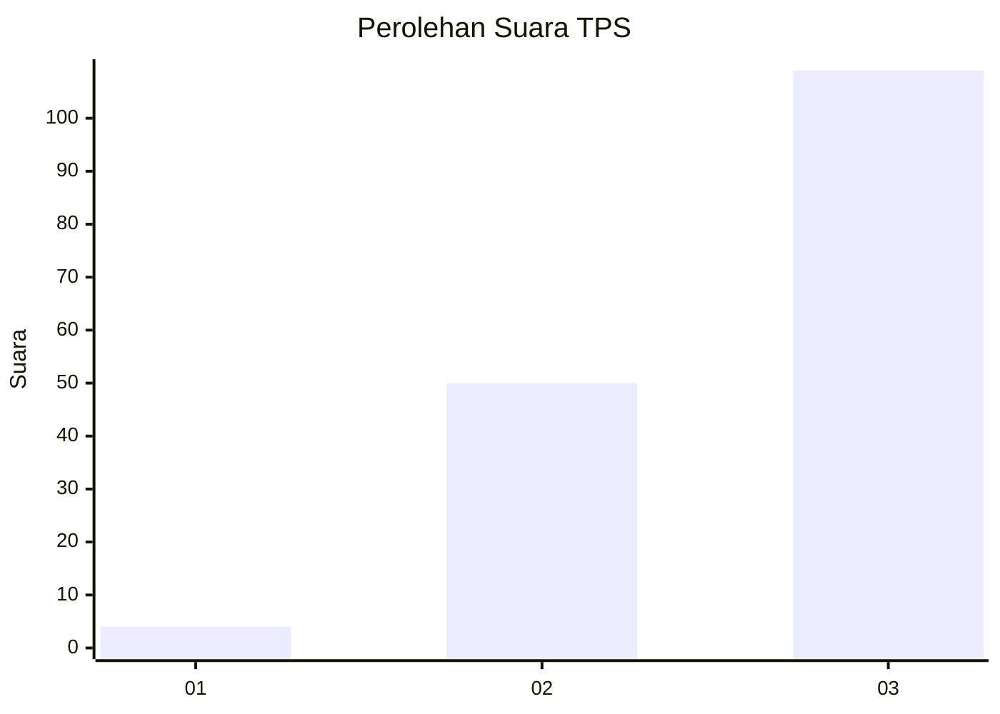
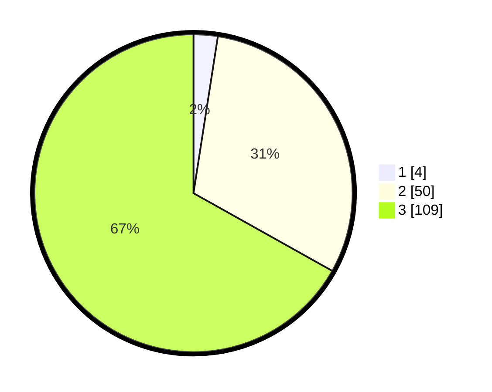

# Hasil

## Grafik

## Tabel

| No. | Nama Paslon    | Suara | Suara (raw) | Persentase |
|:--- |:-------------- | -----:| -----------:| ----------:|
| 1   | ANIES MUHAIMIN | 4     | [4][p-1]    | 2,45       |
| 2   | PRABOWO GIBRAN | 50    | [50][p-2]   | 30,67      |
| 3   | GANJAR MAHFUD  | 109   | [109][p-3]  | 66,87      |

[p-1]: https://github.com/gigit-pemilu/pemilu-2024-51-bali/blob/main/pilpres/hitung-suara/sub/51-bali/sub/02-tabanan/sub/10-pupuan/sub/2008-bantiran/sub/011-tps/sub/paslon-1.txt
[p-2]: https://github.com/gigit-pemilu/pemilu-2024-51-bali/blob/main/pilpres/hitung-suara/sub/51-bali/sub/02-tabanan/sub/10-pupuan/sub/2008-bantiran/sub/011-tps/sub/paslon-2.txt
[p-3]: https://github.com/gigit-pemilu/pemilu-2024-51-bali/blob/main/pilpres/hitung-suara/sub/51-bali/sub/02-tabanan/sub/10-pupuan/sub/2008-bantiran/sub/011-tps/sub/paslon-3.txt

## Foto C Plano

https://sirekap-obj-formc.kpu.go.id/8824/pemilu/ppwp/51/02/10/20/08/5102102008011-20240214-132647--491b4e8c-5923-49d8-981e-c2243581a390.jpg

https://sirekap-obj-formc.kpu.go.id/8824/pemilu/ppwp/51/02/10/20/08/5102102008011-20240214-133011--5806559e-6f47-4f7f-b7b8-d96f63fe06e7.jpg

https://sirekap-obj-formc.kpu.go.id/8824/pemilu/ppwp/51/02/10/20/08/5102102008011-20240214-222817--be87f771-e6d9-42a6-9245-1e4af8ee8d34.jpg

## Metadata

| Key        | Value               |
| ---------- | ------------------- |
| Time Stamp | 2024-02-15 02:10:27 |

