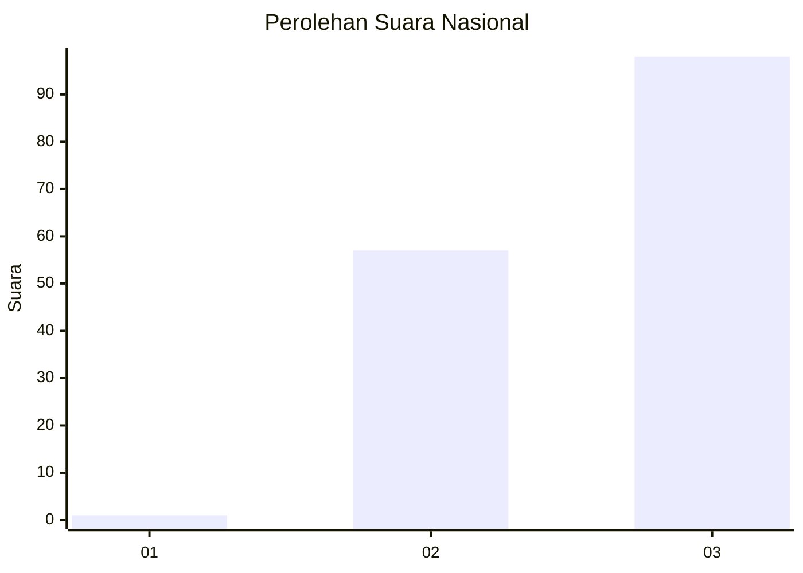
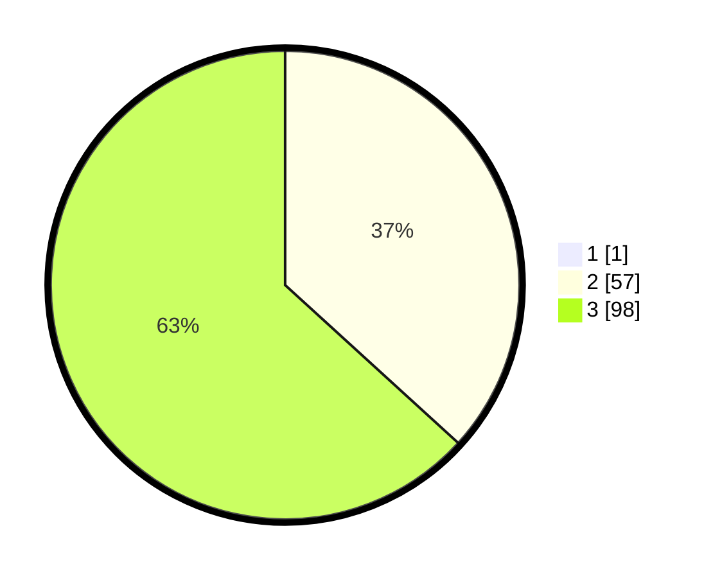

# Hasil

## Grafik

## Tabel

| No. | Nama Paslon    | Suara | Suara (raw) | Persentase |
|:--- |:-------------- | -----:| -----------:| ----------:|
| 1   | ANIES MUHAIMIN | 1     | [1][p-1]    | 0,64       |
| 2   | PRABOWO GIBRAN | 57    | [57][p-2]   | 36,54      |
| 3   | GANJAR MAHFUD  | 98    | [98][p-3]   | 62,82      |

[p-1]: https://github.com/gigit-pemilu/pemilu-2024/blob/main/pilpres/hitung-suara/sub/51-bali/sub/02-tabanan/sub/10-pupuan/sub/2008-bantiran/sub/014-tps/sub/paslon-1.txt
[p-2]: https://github.com/gigit-pemilu/pemilu-2024/blob/main/pilpres/hitung-suara/sub/51-bali/sub/02-tabanan/sub/10-pupuan/sub/2008-bantiran/sub/014-tps/sub/paslon-2.txt
[p-3]: https://github.com/gigit-pemilu/pemilu-2024/blob/main/pilpres/hitung-suara/sub/51-bali/sub/02-tabanan/sub/10-pupuan/sub/2008-bantiran/sub/014-tps/sub/paslon-3.txt

## Foto C Plano

https://sirekap-obj-formc.kpu.go.id/9988/pemilu/ppwp/51/02/10/20/08/5102102008014-20240214-201401--38272a24-25d1-4e95-8584-a462fe830b37.jpg

https://sirekap-obj-formc.kpu.go.id/9988/pemilu/ppwp/51/02/10/20/08/5102102008014-20240214-194415--d449bf76-c29a-4d96-adfd-615d51e0490d.jpg

https://sirekap-obj-formc.kpu.go.id/9988/pemilu/ppwp/51/02/10/20/08/5102102008014-20240214-194426--aabc915e-d4f8-436f-8528-0f3abfd410d9.jpg

## Metadata

| Key        | Value               |
| ---------- | ------------------- |
| Time Stamp | 2024-02-15 00:41:44 |

## DATA PEMILIH TETAP

Jumlah pemilih dalam DPT: **197**.
 * L: **94**.
 * P: **103**.

## DATA PENGGUNA HAK PILIH

Jumlah pengguna hak pilih dalam DPT: **157**.
 * L: **77**.
 * P: **80**.

Jumlah pengguna hak pilih dalam DPTb: **0**.
 * L: **0**.
 * P: **0**.

Jumlah pengguna hak pilih dalam DPK: **0**.
 * L: **0**.
 * P: **0**.

Jumlah pengguna hak pilih: **157**.
 * L: **77**.
 * P: **80**.

## JUMLAH SUARA SAH DAN TIDAK SAH

JUMLAH SELURUH SUARA SAH: **156**.

JUMLAH SUARA TIDAK SAH: **1**.

JUMLAH SELURUH SUARA SAH DAN SUARA TIDAK SAH: **157**.

