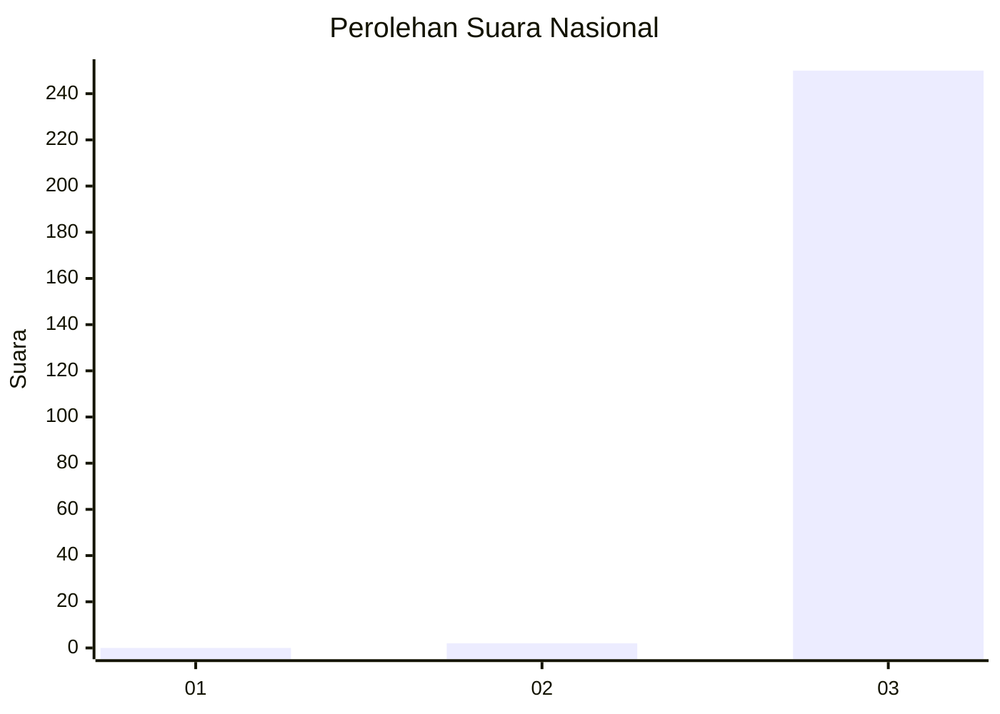
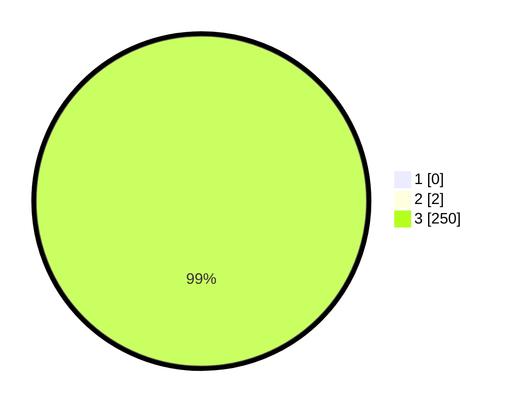

# Hasil

## Grafik

## Tabel

| No. | Nama Paslon    | Suara | Suara (raw) | Persentase |
|:--- |:-------------- | -----:| -----------:| ----------:|
| 1   | ANIES MUHAIMIN | 0     | [0][p-1]    | 0,00       |
| 2   | PRABOWO GIBRAN | 2     | [2][p-2]    | 0,79       |
| 3   | GANJAR MAHFUD  | 250   | [250][p-3]  | 99,21      |

[p-1]: https://github.com/gigit-pemilu/pemilu-2024/blob/main/pilpres/hitung-suara/sub/51-bali/sub/02-tabanan/sub/10-pupuan/sub/2009-padangan/sub/002-tps/sub/paslon-1.txt
[p-2]: https://github.com/gigit-pemilu/pemilu-2024/blob/main/pilpres/hitung-suara/sub/51-bali/sub/02-tabanan/sub/10-pupuan/sub/2009-padangan/sub/002-tps/sub/paslon-2.txt
[p-3]: https://github.com/gigit-pemilu/pemilu-2024/blob/main/pilpres/hitung-suara/sub/51-bali/sub/02-tabanan/sub/10-pupuan/sub/2009-padangan/sub/002-tps/sub/paslon-3.txt

## Foto C Plano

https://sirekap-obj-formc.kpu.go.id/ce61/pemilu/ppwp/51/02/10/20/09/5102102009002-20240216-011512--f5ddaa03-d66e-4740-a375-8c29634fae0d.jpg

https://sirekap-obj-formc.kpu.go.id/ce61/pemilu/ppwp/51/02/10/20/09/5102102009002-20240214-185837--ff55f5ee-cd86-4a07-80e2-9eea801ed337.jpg

https://sirekap-obj-formc.kpu.go.id/ce61/pemilu/ppwp/51/02/10/20/09/5102102009002-20240216-011517--c1fa4dcb-4d24-4506-aa99-5ceb53589dad.jpg

## Metadata

| Key        | Value               |
| ---------- | ------------------- |
| Time Stamp | 2024-02-16 01:30:27 |

## DATA PEMILIH TETAP

Jumlah pemilih dalam DPT: **261**.
 * L: **130**.
 * P: **131**.

## DATA PENGGUNA HAK PILIH

Jumlah pengguna hak pilih dalam DPT: **252**.
 * L: **126**.
 * P: **126**.

Jumlah pengguna hak pilih dalam DPTb: **0**.
 * L: **0**.
 * P: **0**.

Jumlah pengguna hak pilih dalam DPK: **0**.
 * L: **0**.
 * P: **0**.

Jumlah pengguna hak pilih: **252**.
 * L: **126**.
 * P: **126**.

## JUMLAH SUARA SAH DAN TIDAK SAH

JUMLAH SELURUH SUARA SAH: **252**.

JUMLAH SUARA TIDAK SAH: **0**.

JUMLAH SELURUH SUARA SAH DAN SUARA TIDAK SAH: **252**.

