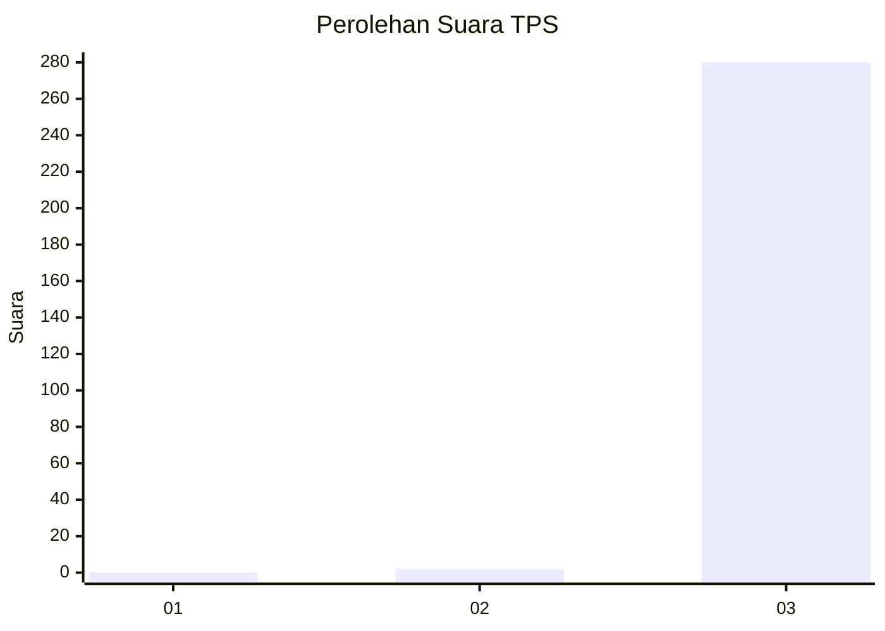
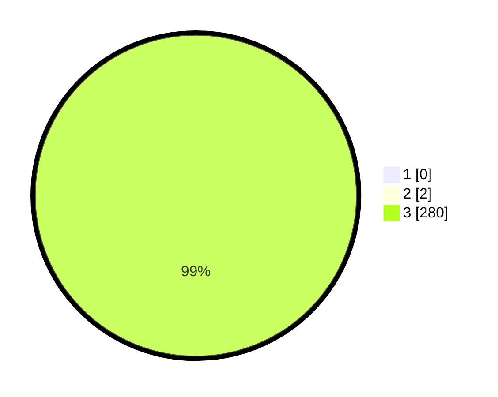

# Hasil

## Grafik

## Tabel

| No. | Nama Paslon    | Suara | Suara (raw) | Persentase |
|:--- |:-------------- | -----:| -----------:| ----------:|
| 1   | ANIES MUHAIMIN | 0     | [0][p-1]    | 0,00       |
| 2   | PRABOWO GIBRAN | 2     | [2][p-2]    | 0,71       |
| 3   | GANJAR MAHFUD  | 280   | [280][p-3]  | 99,29      |

[p-1]: https://github.com/gigit-pemilu/pemilu-2024-51-bali/blob/main/pilpres/hitung-suara/sub/51-bali/sub/02-tabanan/sub/10-pupuan/sub/2009-padangan/sub/005-tps/sub/paslon-1.txt
[p-2]: https://github.com/gigit-pemilu/pemilu-2024-51-bali/blob/main/pilpres/hitung-suara/sub/51-bali/sub/02-tabanan/sub/10-pupuan/sub/2009-padangan/sub/005-tps/sub/paslon-2.txt
[p-3]: https://github.com/gigit-pemilu/pemilu-2024-51-bali/blob/main/pilpres/hitung-suara/sub/51-bali/sub/02-tabanan/sub/10-pupuan/sub/2009-padangan/sub/005-tps/sub/paslon-3.txt

## Foto C Plano

https://sirekap-obj-formc.kpu.go.id/5fd5/pemilu/ppwp/51/02/10/20/09/5102102009005-20240214-130858--7f155215-f28a-4140-b702-832f079d95e7.jpg

https://sirekap-obj-formc.kpu.go.id/5fd5/pemilu/ppwp/51/02/10/20/09/5102102009005-20240214-131707--4a0d562e-eb2c-4c17-82e2-2fa8134f172b.jpg

https://sirekap-obj-formc.kpu.go.id/5fd5/pemilu/ppwp/51/02/10/20/09/5102102009005-20240214-131543--bea1b88e-e1b6-497c-96ff-a9a621c401f0.jpg

## Metadata

| Key        | Value               |
| ---------- | ------------------- |
| Time Stamp | 2024-02-22 11:00:00 |

## DATA PEMILIH TETAP

Jumlah pemilih dalam DPT: **290**.
 * L: **150**.
 * P: **140**.

## DATA PENGGUNA HAK PILIH

Jumlah pengguna hak pilih dalam DPT: **284**.
 * L: **148**.
 * P: **136**.

Jumlah pengguna hak pilih dalam DPTb: **0**.
 * L: **0**.
 * P: **0**.

Jumlah pengguna hak pilih dalam DPK: **0**.
 * L: **0**.
 * P: **0**.

Jumlah pengguna hak pilih: **284**.
 * L: **148**.
 * P: **136**.

## JUMLAH SUARA SAH DAN TIDAK SAH

JUMLAH SELURUH SUARA SAH: **282**.

JUMLAH SUARA TIDAK SAH: **2**.

JUMLAH SELURUH SUARA SAH DAN SUARA TIDAK SAH: **284**.

