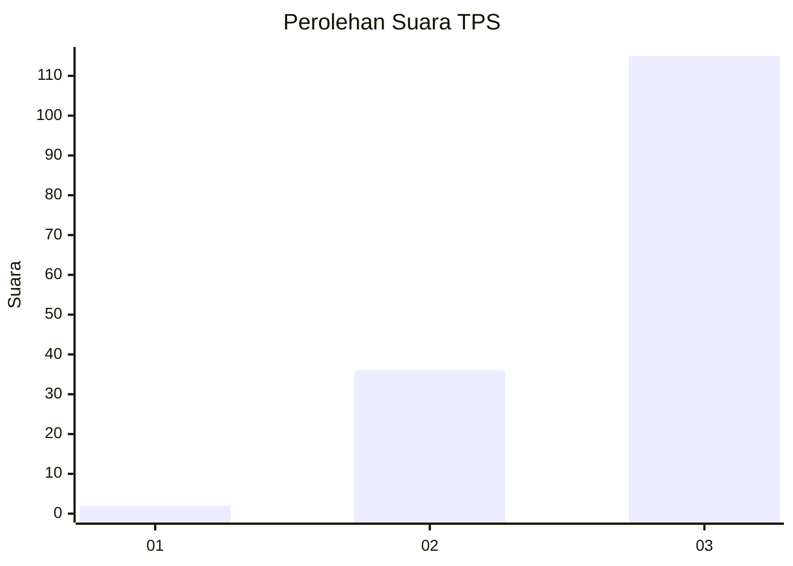
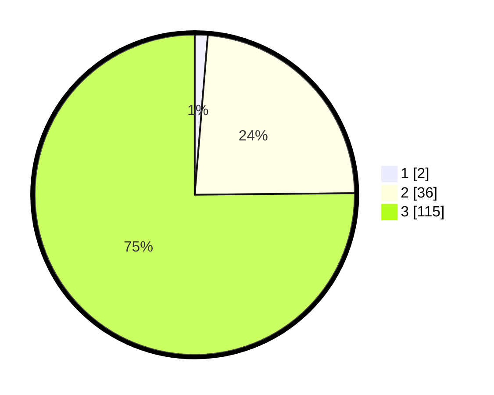

# Hasil

## Grafik

## Tabel

| No. | Nama Paslon    | Suara | Suara (raw) | Persentase |
|:--- |:-------------- | -----:| -----------:| ----------:|
| 1   | ANIES MUHAIMIN | 2     | [2][p-1]    | 1,31       |
| 2   | PRABOWO GIBRAN | 36    | [36][p-2]   | 23,53      |
| 3   | GANJAR MAHFUD  | 115   | [115][p-3]  | 75,16      |

[p-1]: https://github.com/gigit-pemilu/pemilu-2024-51-bali/blob/main/pilpres/hitung-suara/sub/51-bali/sub/02-tabanan/sub/10-pupuan/sub/2010-jelijih-punggang/sub/001-tps/sub/paslon-1.txt
[p-2]: https://github.com/gigit-pemilu/pemilu-2024-51-bali/blob/main/pilpres/hitung-suara/sub/51-bali/sub/02-tabanan/sub/10-pupuan/sub/2010-jelijih-punggang/sub/001-tps/sub/paslon-2.txt
[p-3]: https://github.com/gigit-pemilu/pemilu-2024-51-bali/blob/main/pilpres/hitung-suara/sub/51-bali/sub/02-tabanan/sub/10-pupuan/sub/2010-jelijih-punggang/sub/001-tps/sub/paslon-3.txt

## Foto C Plano

https://sirekap-obj-formc.kpu.go.id/cd9b/pemilu/ppwp/51/02/10/20/10/5102102010001-20240214-202538--8643f69d-4966-4c4e-81d6-49d7d9a93e16.jpg

https://sirekap-obj-formc.kpu.go.id/cd9b/pemilu/ppwp/51/02/10/20/10/5102102010001-20240214-203024--ba144e03-d90c-49b1-ba42-45a2eebb06a2.jpg

https://sirekap-obj-formc.kpu.go.id/cd9b/pemilu/ppwp/51/02/10/20/10/5102102010001-20240216-035509--266f8f38-8e81-440d-a937-1a6abebfaf7e.jpg

## Metadata

| Key        | Value               |
| ---------- | ------------------- |
| Time Stamp | 2024-02-16 04:00:27 |

## DATA PEMILIH TETAP

Jumlah pemilih dalam DPT: **164**.
 * L: **83**.
 * P: **81**.

## DATA PENGGUNA HAK PILIH

Jumlah pengguna hak pilih dalam DPT: **153**.
 * L: **78**.
 * P: **75**.

Jumlah pengguna hak pilih dalam DPTb: **0**.
 * L: **0**.
 * P: **0**.

Jumlah pengguna hak pilih dalam DPK: **0**.
 * L: **0**.
 * P: **0**.

Jumlah pengguna hak pilih: **153**.
 * L: **78**.
 * P: **75**.

## JUMLAH SUARA SAH DAN TIDAK SAH

JUMLAH SELURUH SUARA SAH: **153**.

JUMLAH SUARA TIDAK SAH: **0**.

JUMLAH SELURUH SUARA SAH DAN SUARA TIDAK SAH: **153**.

