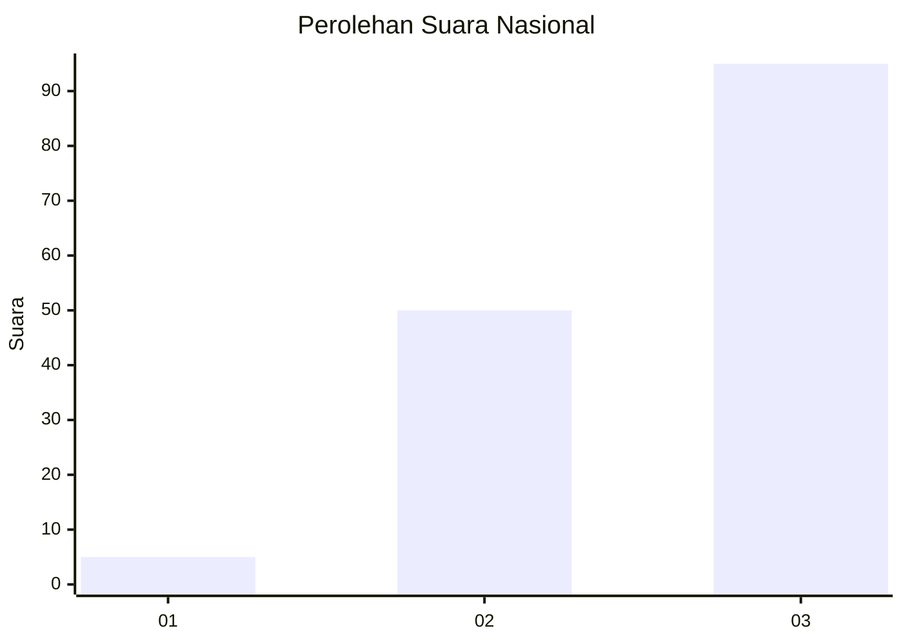
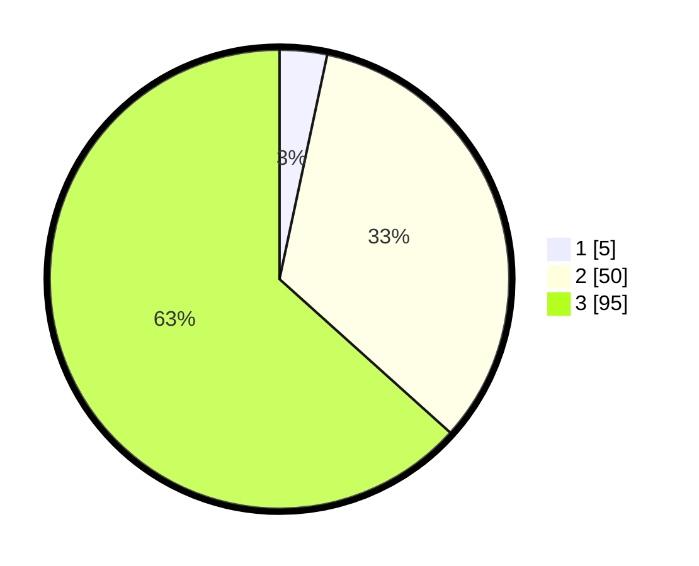

# Hasil

## Grafik

## Tabel

| No. | Nama Paslon    | Suara | Suara (raw) | Persentase |
|:--- |:-------------- | -----:| -----------:| ----------:|
| 1   | ANIES MUHAIMIN | 5     | [5][p-1]    | 3,33       |
| 2   | PRABOWO GIBRAN | 50    | [50][p-2]   | 33,33      |
| 3   | GANJAR MAHFUD  | 95    | [95][p-3]   | 63,33      |

[p-1]: https://github.com/gigit-pemilu/pemilu-2024/blob/main/pilpres/hitung-suara/sub/51-bali/sub/02-tabanan/sub/10-pupuan/sub/2010-jelijih-punggang/sub/002-tps/sub/paslon-1.txt
[p-2]: https://github.com/gigit-pemilu/pemilu-2024/blob/main/pilpres/hitung-suara/sub/51-bali/sub/02-tabanan/sub/10-pupuan/sub/2010-jelijih-punggang/sub/002-tps/sub/paslon-2.txt
[p-3]: https://github.com/gigit-pemilu/pemilu-2024/blob/main/pilpres/hitung-suara/sub/51-bali/sub/02-tabanan/sub/10-pupuan/sub/2010-jelijih-punggang/sub/002-tps/sub/paslon-3.txt

## Foto C Plano

https://sirekap-obj-formc.kpu.go.id/78e6/pemilu/ppwp/51/02/10/20/10/5102102010002-20240216-144011--e61f5f0e-b593-466a-918c-4e6a8f7f9c60.jpg

https://sirekap-obj-formc.kpu.go.id/78e6/pemilu/ppwp/51/02/10/20/10/5102102010002-20240216-144013--66f2c7f4-7f57-44d2-86e2-2d03336f1b53.jpg

https://sirekap-obj-formc.kpu.go.id/78e6/pemilu/ppwp/51/02/10/20/10/5102102010002-20240216-144012--2017e0a2-ef7a-413f-8752-b37e849f1bb8.jpg

## Metadata

| Key        | Value               |
| ---------- | ------------------- |
| Time Stamp | 2024-02-21 19:00:00 |

## DATA PEMILIH TETAP

Jumlah pemilih dalam DPT: **162**.
 * L: **85**.
 * P: **77**.

## DATA PENGGUNA HAK PILIH

Jumlah pengguna hak pilih dalam DPT: **150**.
 * L: **76**.
 * P: **74**.

Jumlah pengguna hak pilih dalam DPTb: **1**.
 * L: **1**.
 * P: **0**.

Jumlah pengguna hak pilih dalam DPK: **1**.
 * L: **0**.
 * P: **1**.

Jumlah pengguna hak pilih: **152**.
 * L: **77**.
 * P: **75**.

## JUMLAH SUARA SAH DAN TIDAK SAH

JUMLAH SELURUH SUARA SAH: **150**.

JUMLAH SUARA TIDAK SAH: **2**.

JUMLAH SELURUH SUARA SAH DAN SUARA TIDAK SAH: **152**.

