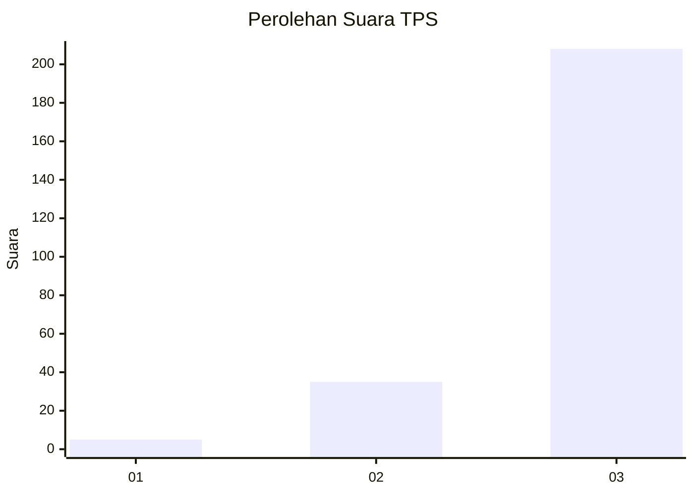
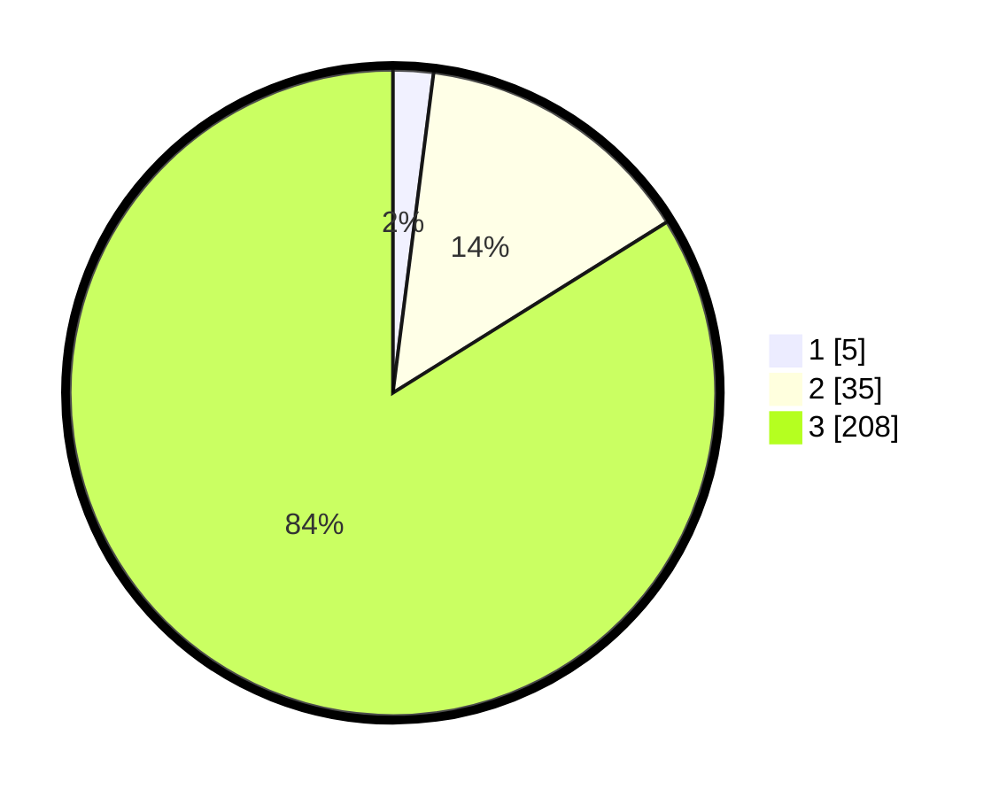

# Hasil

## Grafik

## Tabel

| No. | Nama Paslon    | Suara | Suara (raw) | Persentase |
|:--- |:-------------- | -----:| -----------:| ----------:|
| 1   | ANIES MUHAIMIN | 5     | [5][p-1]    | 2,02       |
| 2   | PRABOWO GIBRAN | 35    | [35][p-2]   | 14,11      |
| 3   | GANJAR MAHFUD  | 208   | [208][p-3]  | 83,87      |

[p-1]: https://github.com/gigit-pemilu/pemilu-2024-51-bali/blob/main/pilpres/hitung-suara/sub/51-bali/sub/02-tabanan/sub/10-pupuan/sub/2010-jelijih-punggang/sub/003-tps/sub/paslon-1.txt
[p-2]: https://github.com/gigit-pemilu/pemilu-2024-51-bali/blob/main/pilpres/hitung-suara/sub/51-bali/sub/02-tabanan/sub/10-pupuan/sub/2010-jelijih-punggang/sub/003-tps/sub/paslon-2.txt
[p-3]: https://github.com/gigit-pemilu/pemilu-2024-51-bali/blob/main/pilpres/hitung-suara/sub/51-bali/sub/02-tabanan/sub/10-pupuan/sub/2010-jelijih-punggang/sub/003-tps/sub/paslon-3.txt

## Foto C Plano

https://sirekap-obj-formc.kpu.go.id/4980/pemilu/ppwp/51/02/10/20/10/5102102010003-20240216-075228--9ccc4e81-486c-43ae-9d32-350fc3836aa0.jpg

https://sirekap-obj-formc.kpu.go.id/4980/pemilu/ppwp/51/02/10/20/10/5102102010003-20240216-075248--3a54a6cd-bda3-43c2-86e7-8ca84b1a4f1b.jpg

https://sirekap-obj-formc.kpu.go.id/4980/pemilu/ppwp/51/02/10/20/10/5102102010003-20240216-081719--9cc5f14a-9e2c-48ae-bac5-01bedba260ff.jpg

## Metadata

| Key        | Value               |
| ---------- | ------------------- |
| Time Stamp | 2024-02-21 21:00:04 |

## DATA PEMILIH TETAP

Jumlah pemilih dalam DPT: **282**.
 * L: **140**.
 * P: **142**.

## DATA PENGGUNA HAK PILIH

Jumlah pengguna hak pilih dalam DPT: **248**.
 * L: **122**.
 * P: **126**.

Jumlah pengguna hak pilih dalam DPTb: **0**.
 * L: **0**.
 * P: **0**.

Jumlah pengguna hak pilih dalam DPK: **0**.
 * L: **0**.
 * P: **0**.

Jumlah pengguna hak pilih: **248**.
 * L: **122**.
 * P: **126**.

## JUMLAH SUARA SAH DAN TIDAK SAH

JUMLAH SELURUH SUARA SAH: **248**.

JUMLAH SUARA TIDAK SAH: **0**.

JUMLAH SELURUH SUARA SAH DAN SUARA TIDAK SAH: **248**.

