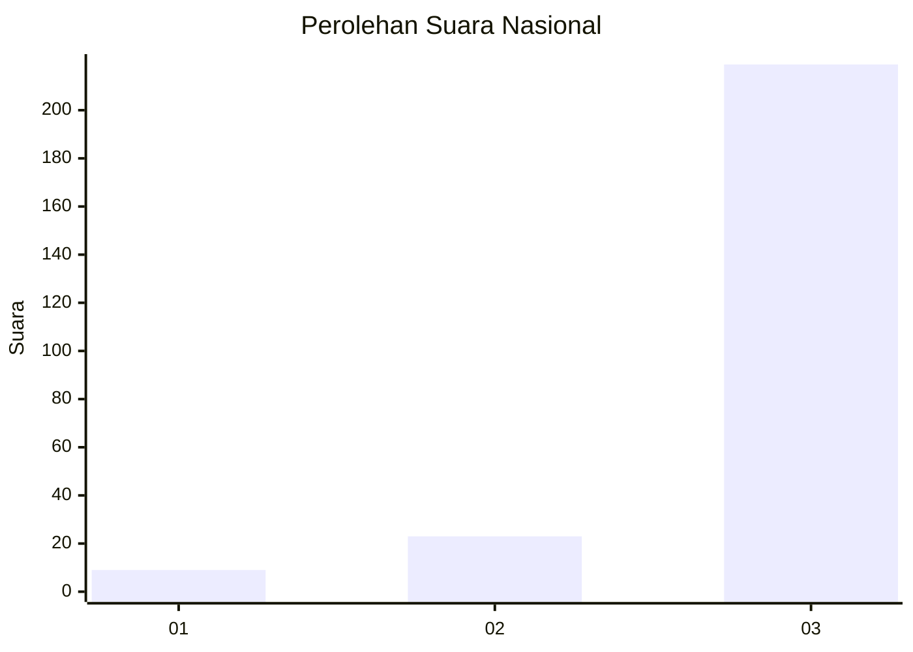
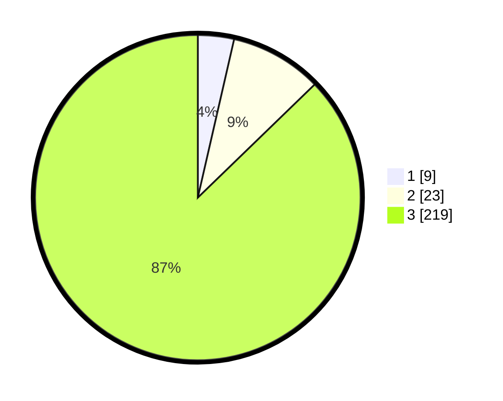

# Hasil

## Grafik

## Tabel

| No. | Nama Paslon    | Suara | Suara (raw) | Persentase |
|:--- |:-------------- | -----:| -----------:| ----------:|
| 1   | ANIES MUHAIMIN | 9     | [9][p-1]    | 3,59       |
| 2   | PRABOWO GIBRAN | 23    | [23][p-2]   | 9,16       |
| 3   | GANJAR MAHFUD  | 219   | [219][p-3]  | 87,25      |

[p-1]: https://github.com/gigit-pemilu/pemilu-2024/blob/main/pilpres/hitung-suara/sub/51-bali/sub/02-tabanan/sub/10-pupuan/sub/2010-jelijih-punggang/sub/005-tps/sub/paslon-1.txt
[p-2]: https://github.com/gigit-pemilu/pemilu-2024/blob/main/pilpres/hitung-suara/sub/51-bali/sub/02-tabanan/sub/10-pupuan/sub/2010-jelijih-punggang/sub/005-tps/sub/paslon-2.txt
[p-3]: https://github.com/gigit-pemilu/pemilu-2024/blob/main/pilpres/hitung-suara/sub/51-bali/sub/02-tabanan/sub/10-pupuan/sub/2010-jelijih-punggang/sub/005-tps/sub/paslon-3.txt

## Foto C Plano

https://sirekap-obj-formc.kpu.go.id/5789/pemilu/ppwp/51/02/10/20/10/5102102010005-20240218-002549--e25a26f4-86a0-4ace-b3d6-8daf7a003170.jpg

https://sirekap-obj-formc.kpu.go.id/5789/pemilu/ppwp/51/02/10/20/10/5102102010005-20240218-002550--60a2fae6-eb78-40f6-af86-6973003b2d3f.jpg

https://sirekap-obj-formc.kpu.go.id/5789/pemilu/ppwp/51/02/10/20/10/5102102010005-20240218-002549--d21feb0d-ab70-4676-9a60-45f8bca05b30.jpg

## Metadata

| Key        | Value               |
| ---------- | ------------------- |
| Time Stamp | 2024-02-21 11:00:00 |

## DATA PEMILIH TETAP

Jumlah pemilih dalam DPT: **289**.
 * L: **146**.
 * P: **143**.

## DATA PENGGUNA HAK PILIH

Jumlah pengguna hak pilih dalam DPT: **252**.
 * L: **131**.
 * P: **121**.

Jumlah pengguna hak pilih dalam DPTb: **1**.
 * L: **1**.
 * P: **0**.

Jumlah pengguna hak pilih dalam DPK: **0**.
 * L: **0**.
 * P: **0**.

Jumlah pengguna hak pilih: **253**.
 * L: **132**.
 * P: **121**.

## JUMLAH SUARA SAH DAN TIDAK SAH

JUMLAH SELURUH SUARA SAH: **251**.

JUMLAH SUARA TIDAK SAH: **2**.

JUMLAH SELURUH SUARA SAH DAN SUARA TIDAK SAH: **253**.

