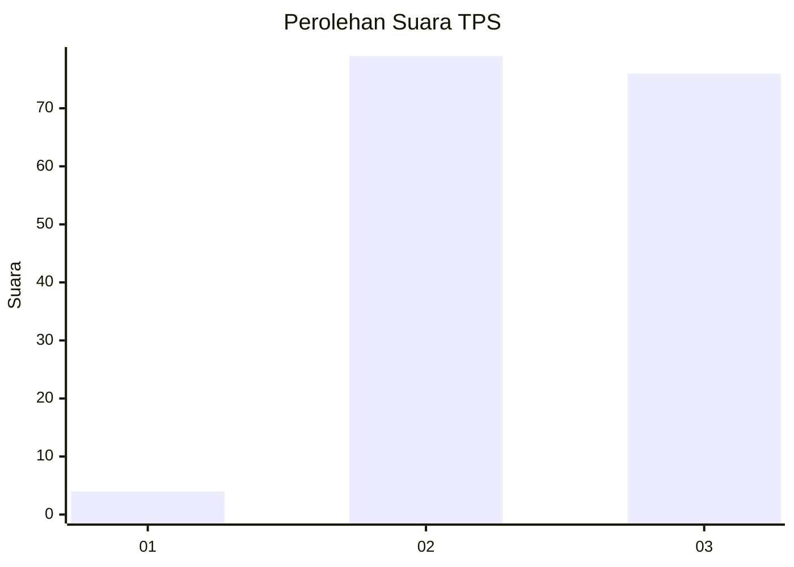
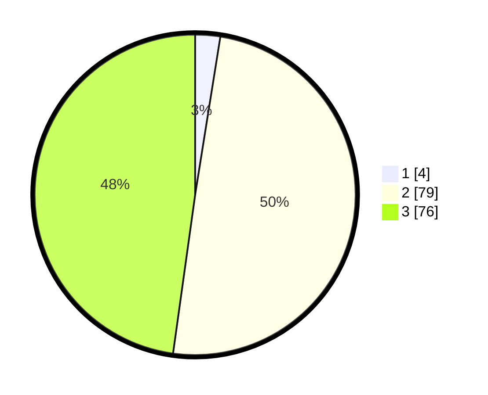

# Hasil

## Grafik

## Tabel

| No. | Nama Paslon    | Suara | Suara (raw) | Persentase |
|:--- |:-------------- | -----:| -----------:| ----------:|
| 1   | ANIES MUHAIMIN | 4     | [4][p-1]    | 2,52       |
| 2   | PRABOWO GIBRAN | 79    | [79][p-2]   | 49,69      |
| 3   | GANJAR MAHFUD  | 76    | [76][p-3]   | 47,80      |

[p-1]: https://github.com/gigit-pemilu/pemilu-2024-51-bali/blob/main/pilpres/hitung-suara/sub/51-bali/sub/02-tabanan/sub/10-pupuan/sub/2011-belatungan/sub/001-tps/sub/paslon-1.txt
[p-2]: https://github.com/gigit-pemilu/pemilu-2024-51-bali/blob/main/pilpres/hitung-suara/sub/51-bali/sub/02-tabanan/sub/10-pupuan/sub/2011-belatungan/sub/001-tps/sub/paslon-2.txt
[p-3]: https://github.com/gigit-pemilu/pemilu-2024-51-bali/blob/main/pilpres/hitung-suara/sub/51-bali/sub/02-tabanan/sub/10-pupuan/sub/2011-belatungan/sub/001-tps/sub/paslon-3.txt

## Foto C Plano

https://sirekap-obj-formc.kpu.go.id/a68b/pemilu/ppwp/51/02/10/20/11/5102102011001-20240214-223150--5519e02c-1d80-4d3b-9826-1c3f1368f9f1.jpg

https://sirekap-obj-formc.kpu.go.id/a68b/pemilu/ppwp/51/02/10/20/11/5102102011001-20240214-223234--5cc84e41-3830-495e-bb4d-a7ba4b6c9555.jpg

https://sirekap-obj-formc.kpu.go.id/a68b/pemilu/ppwp/51/02/10/20/11/5102102011001-20240214-223438--bd9ede83-e9eb-4811-b823-59c1d07cc350.jpg

## Metadata

| Key        | Value               |
| ---------- | ------------------- |
| Time Stamp | 2024-02-16 06:30:27 |

