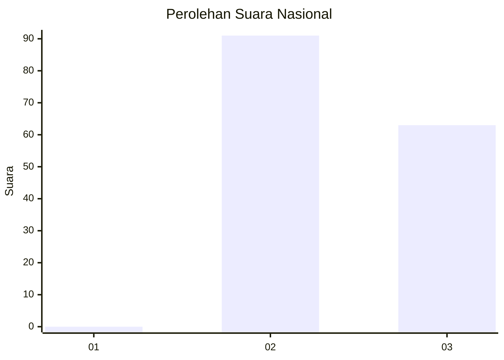
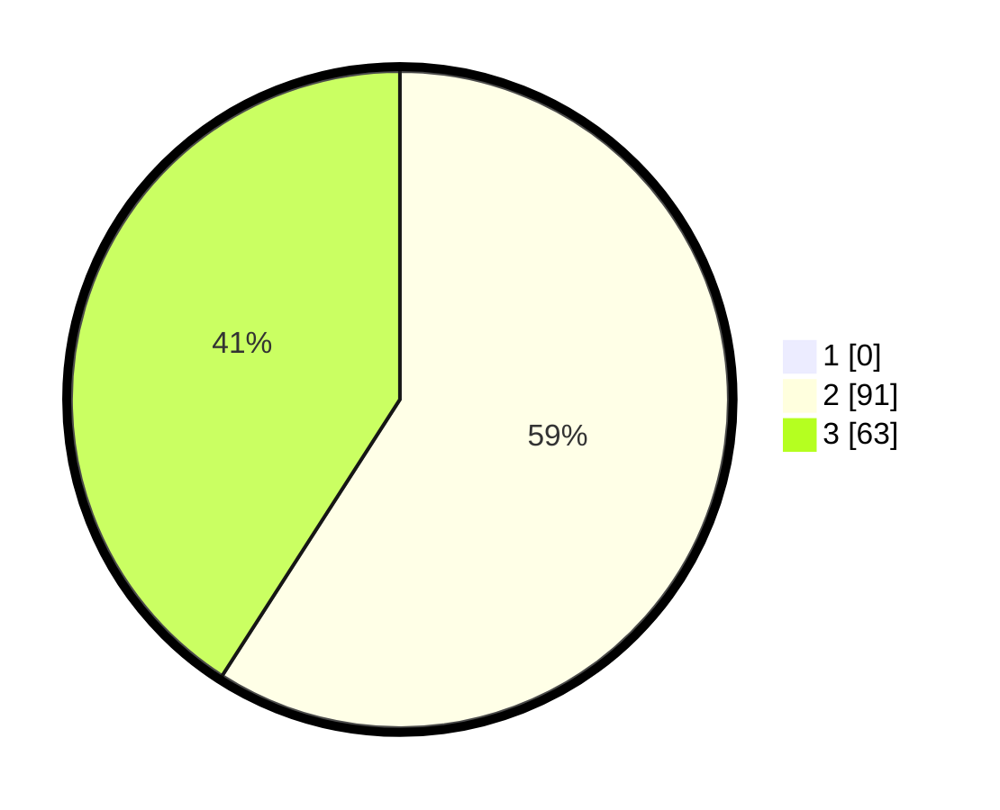

# Hasil

## Grafik

## Tabel

| No. | Nama Paslon    | Suara | Suara (raw) | Persentase |
|:--- |:-------------- | -----:| -----------:| ----------:|
| 1   | ANIES MUHAIMIN | 0     | [0][p-1]    | 0,00       |
| 2   | PRABOWO GIBRAN | 91    | [91][p-2]   | 59,09      |
| 3   | GANJAR MAHFUD  | 63    | [63][p-3]   | 40,91      |

[p-1]: https://github.com/gigit-pemilu/pemilu-2024/blob/main/pilpres/hitung-suara/sub/51-bali/sub/02-tabanan/sub/10-pupuan/sub/2011-belatungan/sub/002-tps/sub/paslon-1.txt
[p-2]: https://github.com/gigit-pemilu/pemilu-2024/blob/main/pilpres/hitung-suara/sub/51-bali/sub/02-tabanan/sub/10-pupuan/sub/2011-belatungan/sub/002-tps/sub/paslon-2.txt
[p-3]: https://github.com/gigit-pemilu/pemilu-2024/blob/main/pilpres/hitung-suara/sub/51-bali/sub/02-tabanan/sub/10-pupuan/sub/2011-belatungan/sub/002-tps/sub/paslon-3.txt

## Foto C Plano

https://sirekap-obj-formc.kpu.go.id/52bf/pemilu/ppwp/51/02/10/20/11/5102102011002-20240214-210921--f7d2c999-98db-4c60-a994-12a14aa6a2cd.jpg

https://sirekap-obj-formc.kpu.go.id/52bf/pemilu/ppwp/51/02/10/20/11/5102102011002-20240214-210948--6b726b16-2f3a-48cd-8b3a-da488abed7b1.jpg

https://sirekap-obj-formc.kpu.go.id/52bf/pemilu/ppwp/51/02/10/20/11/5102102011002-20240214-211005--69a25314-d2fe-452e-abf0-cb86ce40b823.jpg

## Metadata

| Key        | Value               |
| ---------- | ------------------- |
| Time Stamp | 2024-02-15 03:06:03 |

## DATA PEMILIH TETAP

Jumlah pemilih dalam DPT: **192**.
 * L: **99**.
 * P: **93**.

## DATA PENGGUNA HAK PILIH

Jumlah pengguna hak pilih dalam DPT: **152**.
 * L: **78**.
 * P: **74**.

Jumlah pengguna hak pilih dalam DPTb: **2**.
 * L: **1**.
 * P: **1**.

Jumlah pengguna hak pilih dalam DPK: **0**.
 * L: **0**.
 * P: **0**.

Jumlah pengguna hak pilih: **154**.
 * L: **79**.
 * P: **75**.

## JUMLAH SUARA SAH DAN TIDAK SAH

JUMLAH SELURUH SUARA SAH: **154**.

JUMLAH SUARA TIDAK SAH: **0**.

JUMLAH SELURUH SUARA SAH DAN SUARA TIDAK SAH: **154**.

