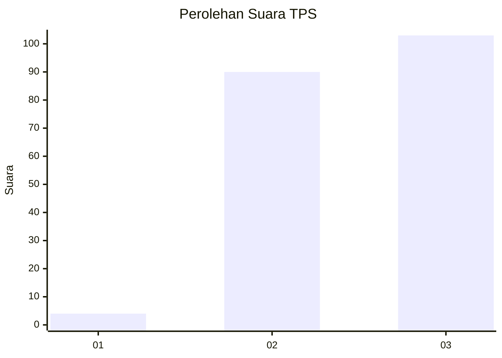
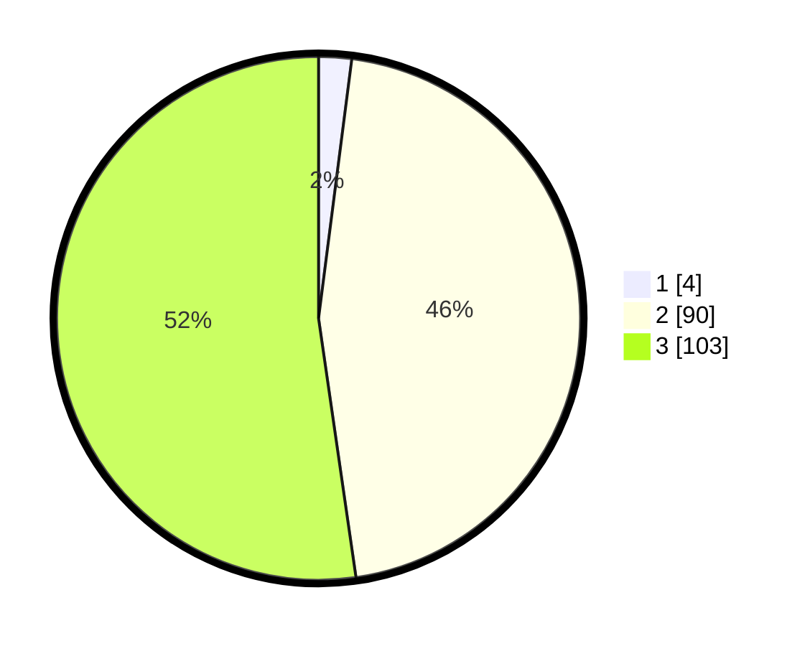

# Hasil

## Grafik

## Tabel

| No. | Nama Paslon    | Suara | Suara (raw) | Persentase |
|:--- |:-------------- | -----:| -----------:| ----------:|
| 1   | ANIES MUHAIMIN | 4     | [4][p-1]    | 2,03       |
| 2   | PRABOWO GIBRAN | 90    | [90][p-2]   | 45,69      |
| 3   | GANJAR MAHFUD  | 103   | [103][p-3]  | 52,28      |

[p-1]: https://github.com/gigit-pemilu/pemilu-2024-51-bali/blob/main/pilpres/hitung-suara/sub/51-bali/sub/02-tabanan/sub/10-pupuan/sub/2011-belatungan/sub/003-tps/sub/paslon-1.txt
[p-2]: https://github.com/gigit-pemilu/pemilu-2024-51-bali/blob/main/pilpres/hitung-suara/sub/51-bali/sub/02-tabanan/sub/10-pupuan/sub/2011-belatungan/sub/003-tps/sub/paslon-2.txt
[p-3]: https://github.com/gigit-pemilu/pemilu-2024-51-bali/blob/main/pilpres/hitung-suara/sub/51-bali/sub/02-tabanan/sub/10-pupuan/sub/2011-belatungan/sub/003-tps/sub/paslon-3.txt

## Foto C Plano

https://sirekap-obj-formc.kpu.go.id/02fa/pemilu/ppwp/51/02/10/20/11/5102102011003-20240214-155355--0bdb3436-fc14-48c0-ad31-299edc7b6780.jpg

https://sirekap-obj-formc.kpu.go.id/02fa/pemilu/ppwp/51/02/10/20/11/5102102011003-20240214-155414--2e455ceb-84e0-44a0-849b-cc5b8905970c.jpg

https://sirekap-obj-formc.kpu.go.id/02fa/pemilu/ppwp/51/02/10/20/11/5102102011003-20240214-210224--d72fcdce-04d1-4f3b-9355-2a1fa1f0b7f2.jpg

## Metadata

| Key        | Value               |
| ---------- | ------------------- |
| Time Stamp | 2024-02-15 00:41:44 |

## DATA PEMILIH TETAP

Jumlah pemilih dalam DPT: **224**.
 * L: **111**.
 * P: **113**.

## DATA PENGGUNA HAK PILIH

Jumlah pengguna hak pilih dalam DPT: **197**.
 * L: **101**.
 * P: **96**.

Jumlah pengguna hak pilih dalam DPTb: **1**.
 * L: **1**.
 * P: **0**.

Jumlah pengguna hak pilih dalam DPK: **0**.
 * L: **0**.
 * P: **0**.

Jumlah pengguna hak pilih: **198**.
 * L: **102**.
 * P: **96**.

## JUMLAH SUARA SAH DAN TIDAK SAH

JUMLAH SELURUH SUARA SAH: **197**.

JUMLAH SUARA TIDAK SAH: **1**.

JUMLAH SELURUH SUARA SAH DAN SUARA TIDAK SAH: **198**.

