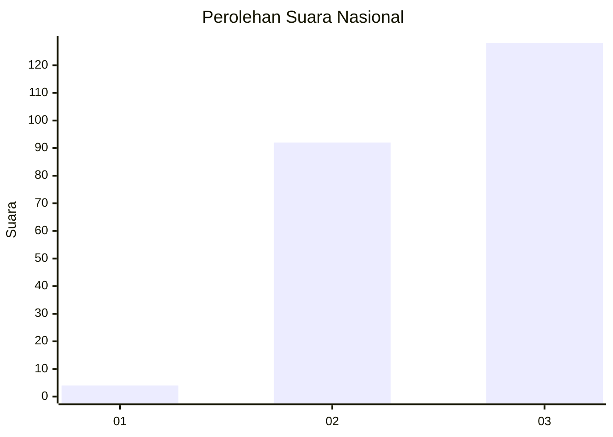
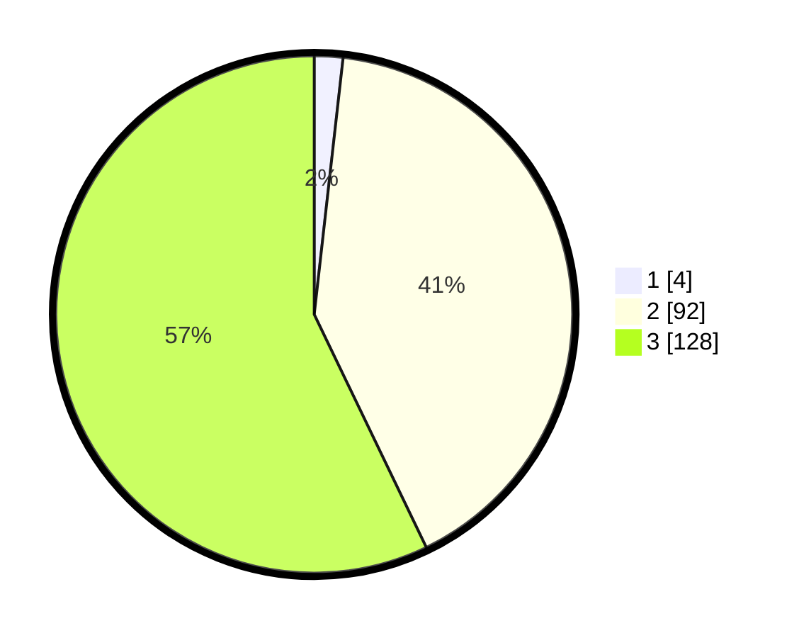

# Hasil

## Grafik

## Tabel

| No. | Nama Paslon    | Suara | Suara (raw) | Persentase |
|:--- |:-------------- | -----:| -----------:| ----------:|
| 1   | ANIES MUHAIMIN | 4     | [4][p-1]    | 1,79       |
| 2   | PRABOWO GIBRAN | 92    | [92][p-2]   | 41,07      |
| 3   | GANJAR MAHFUD  | 128   | [128][p-3]  | 57,14      |

[p-1]: https://github.com/gigit-pemilu/pemilu-2024/blob/main/pilpres/hitung-suara/sub/51-bali/sub/02-tabanan/sub/10-pupuan/sub/2011-belatungan/sub/004-tps/sub/paslon-1.txt
[p-2]: https://github.com/gigit-pemilu/pemilu-2024/blob/main/pilpres/hitung-suara/sub/51-bali/sub/02-tabanan/sub/10-pupuan/sub/2011-belatungan/sub/004-tps/sub/paslon-2.txt
[p-3]: https://github.com/gigit-pemilu/pemilu-2024/blob/main/pilpres/hitung-suara/sub/51-bali/sub/02-tabanan/sub/10-pupuan/sub/2011-belatungan/sub/004-tps/sub/paslon-3.txt

## Foto C Plano

https://sirekap-obj-formc.kpu.go.id/147e/pemilu/ppwp/51/02/10/20/11/5102102011004-20240216-122255--1eba2f79-d9c1-46a1-babd-4af3130c5fe8.jpg

https://sirekap-obj-formc.kpu.go.id/147e/pemilu/ppwp/51/02/10/20/11/5102102011004-20240215-020706--b2eabe7d-80db-454a-921d-0148cbeba242.jpg

https://sirekap-obj-formc.kpu.go.id/147e/pemilu/ppwp/51/02/10/20/11/5102102011004-20240215-020810--58127ba0-8b26-4e46-99f4-efb48ace1af1.jpg

## Metadata

| Key        | Value               |
| ---------- | ------------------- |
| Time Stamp | 2024-02-16 12:51:22 |

