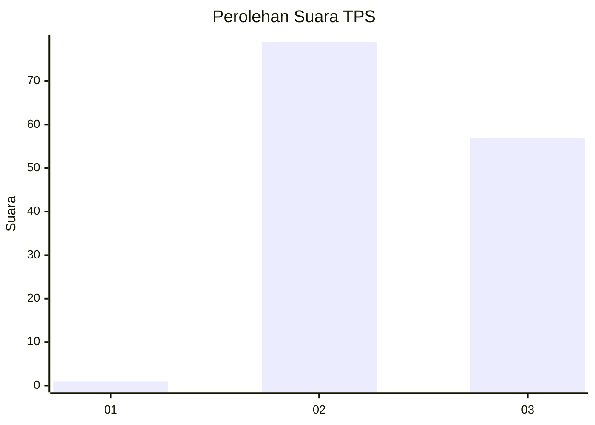
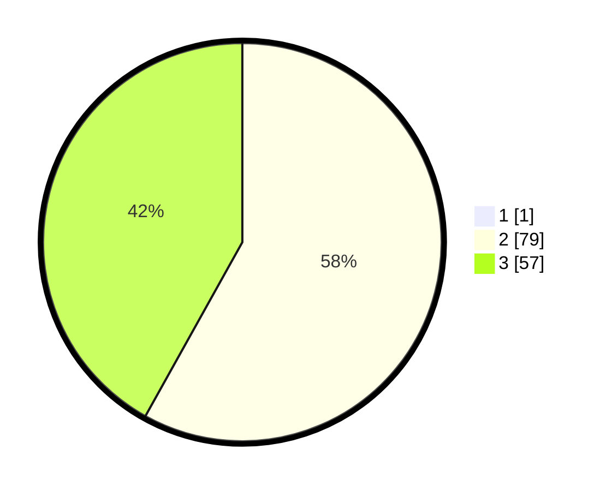

# Hasil

## Grafik

## Tabel

| No. | Nama Paslon    | Suara | Suara (raw) | Persentase |
|:--- |:-------------- | -----:| -----------:| ----------:|
| 1   | ANIES MUHAIMIN | 1     | [1][p-1]    | 0,73       |
| 2   | PRABOWO GIBRAN | 79    | [79][p-2]   | 57,66      |
| 3   | GANJAR MAHFUD  | 57    | [57][p-3]   | 41,61      |

[p-1]: https://github.com/gigit-pemilu/pemilu-2024-51-bali/blob/main/pilpres/hitung-suara/sub/51-bali/sub/02-tabanan/sub/10-pupuan/sub/2011-belatungan/sub/005-tps/sub/paslon-1.txt
[p-2]: https://github.com/gigit-pemilu/pemilu-2024-51-bali/blob/main/pilpres/hitung-suara/sub/51-bali/sub/02-tabanan/sub/10-pupuan/sub/2011-belatungan/sub/005-tps/sub/paslon-2.txt
[p-3]: https://github.com/gigit-pemilu/pemilu-2024-51-bali/blob/main/pilpres/hitung-suara/sub/51-bali/sub/02-tabanan/sub/10-pupuan/sub/2011-belatungan/sub/005-tps/sub/paslon-3.txt

## Foto C Plano

https://sirekap-obj-formc.kpu.go.id/9d61/pemilu/ppwp/51/02/10/20/11/5102102011005-20240214-184518--e0307223-abbc-4cfd-85a2-07e972ba2bbe.jpg

https://sirekap-obj-formc.kpu.go.id/9d61/pemilu/ppwp/51/02/10/20/11/5102102011005-20240214-184741--5d202139-fb24-4178-8252-6a378e4ad6c8.jpg

## Metadata

| Key        | Value               |
| ---------- | ------------------- |
| Time Stamp | 2024-02-25 12:00:00 |

