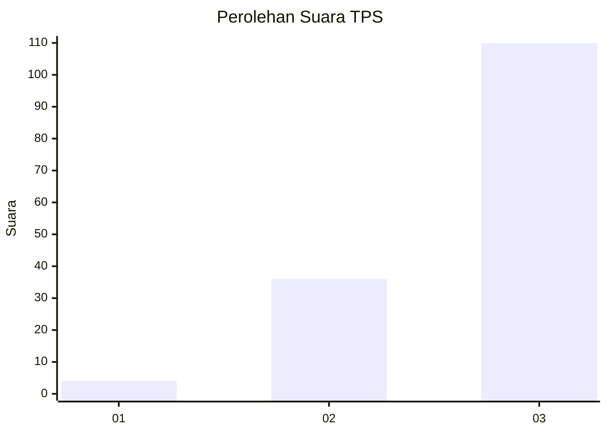
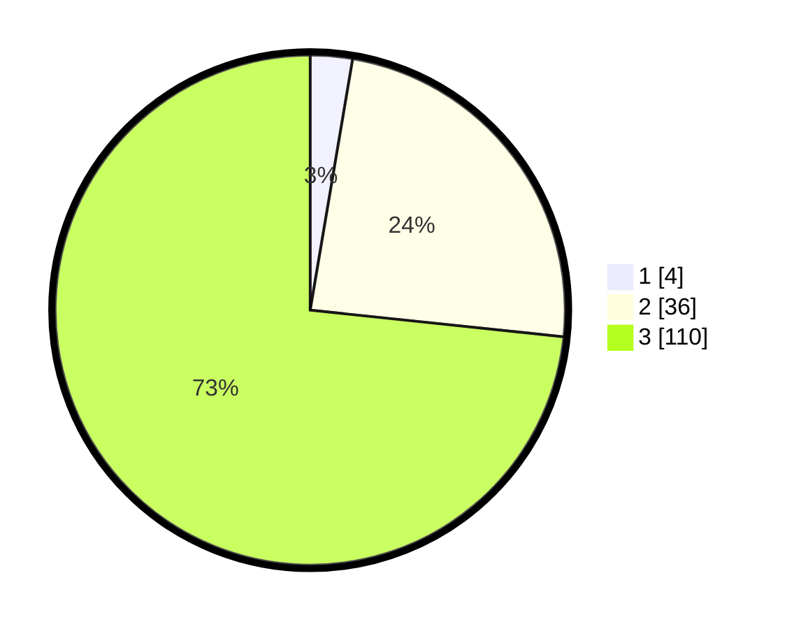

# Hasil

## Grafik

## Tabel

| No. | Nama Paslon    | Suara | Suara (raw) | Persentase |
|:--- |:-------------- | -----:| -----------:| ----------:|
| 1   | ANIES MUHAIMIN | 4     | [4][p-1]    | 2,67       |
| 2   | PRABOWO GIBRAN | 36    | [36][p-2]   | 24,00      |
| 3   | GANJAR MAHFUD  | 110   | [110][p-3]  | 73,33      |

[p-1]: https://github.com/gigit-pemilu/pemilu-2024-51-bali/blob/main/pilpres/hitung-suara/sub/51-bali/sub/02-tabanan/sub/10-pupuan/sub/2011-belatungan/sub/008-tps/sub/paslon-1.txt
[p-2]: https://github.com/gigit-pemilu/pemilu-2024-51-bali/blob/main/pilpres/hitung-suara/sub/51-bali/sub/02-tabanan/sub/10-pupuan/sub/2011-belatungan/sub/008-tps/sub/paslon-2.txt
[p-3]: https://github.com/gigit-pemilu/pemilu-2024-51-bali/blob/main/pilpres/hitung-suara/sub/51-bali/sub/02-tabanan/sub/10-pupuan/sub/2011-belatungan/sub/008-tps/sub/paslon-3.txt

## Foto C Plano

https://sirekap-obj-formc.kpu.go.id/ad18/pemilu/ppwp/51/02/10/20/11/5102102011008-20240215-014412--c4adb3ab-f4a5-410b-a25f-3bb9cccac414.jpg

https://sirekap-obj-formc.kpu.go.id/ad18/pemilu/ppwp/51/02/10/20/11/5102102011008-20240215-014122--2febcc9b-6b3d-4bc1-aa71-ccd1e1b54697.jpg

https://sirekap-obj-formc.kpu.go.id/ad18/pemilu/ppwp/51/02/10/20/11/5102102011008-20240215-014459--33d51ed6-aba7-43f5-90b9-5abd8642128f.jpg

## Metadata

| Key        | Value               |
| ---------- | ------------------- |
| Time Stamp | 2024-02-16 10:30:29 |

