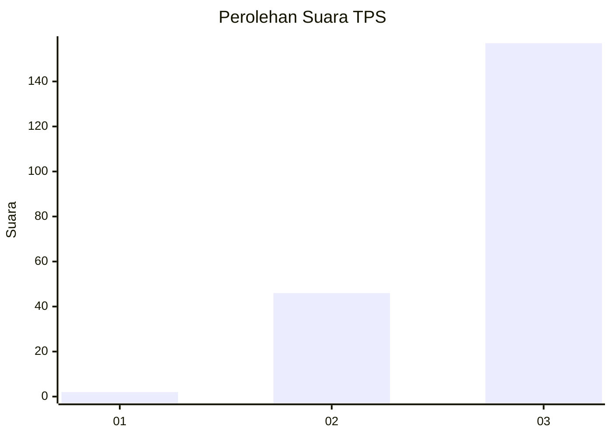
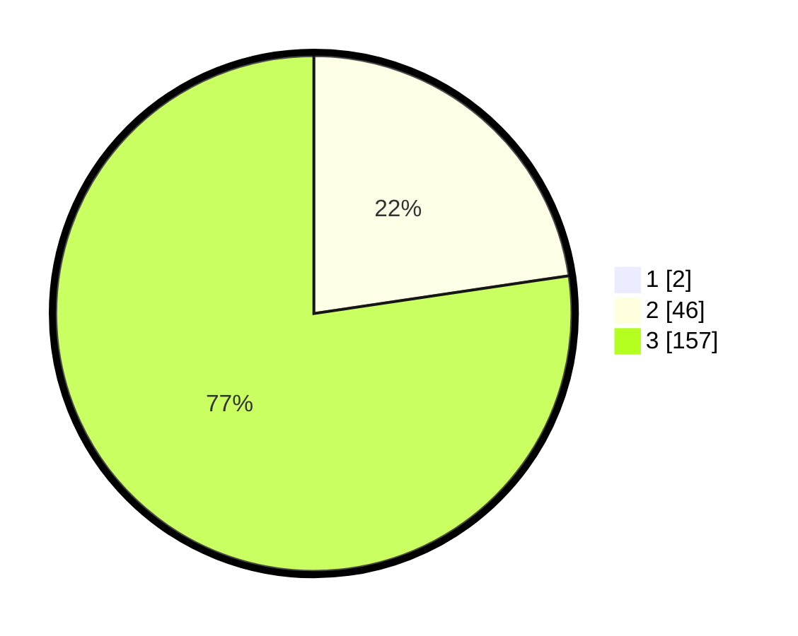

# Hasil

## Grafik

## Tabel

| No. | Nama Paslon    | Suara | Suara (raw) | Persentase |
|:--- |:-------------- | -----:| -----------:| ----------:|
| 1   | ANIES MUHAIMIN | 2     | [2][p-1]    | 0,98       |
| 2   | PRABOWO GIBRAN | 46    | [46][p-2]   | 22,44      |
| 3   | GANJAR MAHFUD  | 157   | [157][p-3]  | 76,59      |

[p-1]: https://github.com/gigit-pemilu/pemilu-2024-51-bali/blob/main/pilpres/hitung-suara/sub/51-bali/sub/02-tabanan/sub/10-pupuan/sub/2012-pajahan/sub/001-tps/sub/paslon-1.txt
[p-2]: https://github.com/gigit-pemilu/pemilu-2024-51-bali/blob/main/pilpres/hitung-suara/sub/51-bali/sub/02-tabanan/sub/10-pupuan/sub/2012-pajahan/sub/001-tps/sub/paslon-2.txt
[p-3]: https://github.com/gigit-pemilu/pemilu-2024-51-bali/blob/main/pilpres/hitung-suara/sub/51-bali/sub/02-tabanan/sub/10-pupuan/sub/2012-pajahan/sub/001-tps/sub/paslon-3.txt

## Foto C Plano

https://sirekap-obj-formc.kpu.go.id/360a/pemilu/ppwp/51/02/10/20/12/5102102012001-20240216-150046--5c9afcdc-5cb9-41d8-b437-923ca9e14622.jpg

https://sirekap-obj-formc.kpu.go.id/360a/pemilu/ppwp/51/02/10/20/12/5102102012001-20240216-150048--40c330d1-cb37-437c-98dc-515c2a1fdc75.jpg

https://sirekap-obj-formc.kpu.go.id/360a/pemilu/ppwp/51/02/10/20/12/5102102012001-20240216-150047--ead5b1a4-469a-4d73-8f9e-1e852cd38f24.jpg

## Metadata

| Key        | Value               |
| ---------- | ------------------- |
| Time Stamp | 2024-02-21 22:00:00 |

## DATA PEMILIH TETAP

Jumlah pemilih dalam DPT: **251**.
 * L: **123**.
 * P: **128**.

## DATA PENGGUNA HAK PILIH

Jumlah pengguna hak pilih dalam DPT: **210**.
 * L: **113**.
 * P: **97**.

Jumlah pengguna hak pilih dalam DPTb: **0**.
 * L: **0**.
 * P: **1**.

Jumlah pengguna hak pilih dalam DPK: **0**.
 * L: **0**.
 * P: **0**.

Jumlah pengguna hak pilih: **211**.
 * L: **113**.
 * P: **98**.

## JUMLAH SUARA SAH DAN TIDAK SAH

JUMLAH SELURUH SUARA SAH: **205**.

JUMLAH SUARA TIDAK SAH: **6**.

JUMLAH SELURUH SUARA SAH DAN SUARA TIDAK SAH: **211**.

