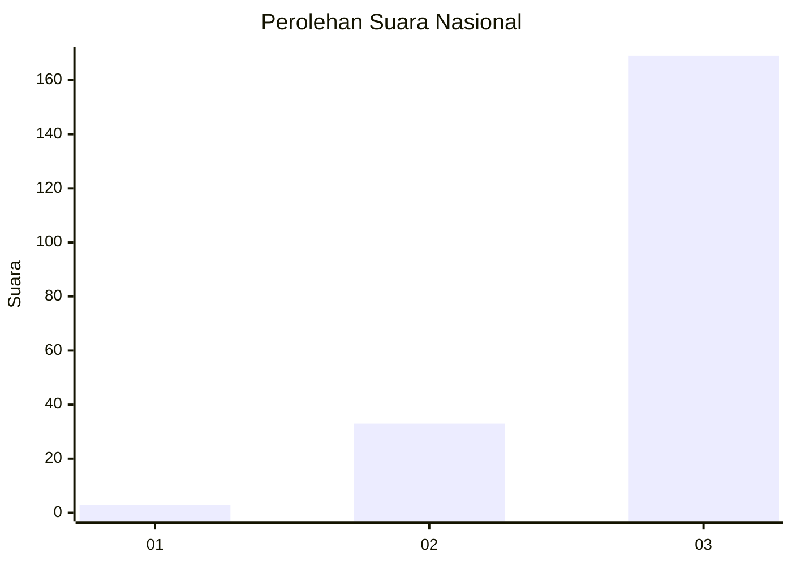
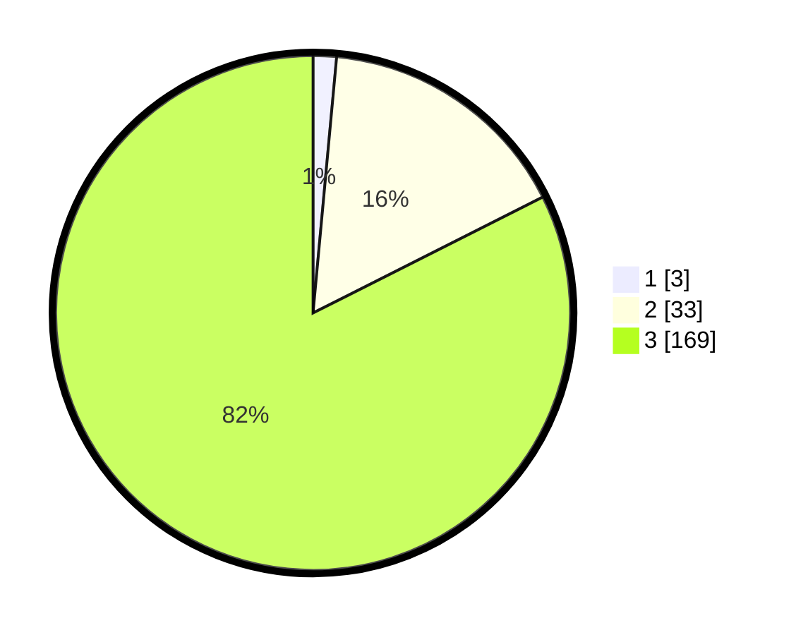

# Hasil

## Grafik

## Tabel

| No. | Nama Paslon    | Suara | Suara (raw) | Persentase |
|:--- |:-------------- | -----:| -----------:| ----------:|
| 1   | ANIES MUHAIMIN | 3     | [3][p-1]    | 1,46       |
| 2   | PRABOWO GIBRAN | 33    | [33][p-2]   | 16,10      |
| 3   | GANJAR MAHFUD  | 169   | [169][p-3]  | 82,44      |

[p-1]: https://github.com/gigit-pemilu/pemilu-2024/blob/main/pilpres/hitung-suara/sub/51-bali/sub/02-tabanan/sub/10-pupuan/sub/2012-pajahan/sub/002-tps/sub/paslon-1.txt
[p-2]: https://github.com/gigit-pemilu/pemilu-2024/blob/main/pilpres/hitung-suara/sub/51-bali/sub/02-tabanan/sub/10-pupuan/sub/2012-pajahan/sub/002-tps/sub/paslon-2.txt
[p-3]: https://github.com/gigit-pemilu/pemilu-2024/blob/main/pilpres/hitung-suara/sub/51-bali/sub/02-tabanan/sub/10-pupuan/sub/2012-pajahan/sub/002-tps/sub/paslon-3.txt

## Foto C Plano

https://sirekap-obj-formc.kpu.go.id/6111/pemilu/ppwp/51/02/10/20/12/5102102012002-20240216-003506--26ec7807-57ad-49b8-9a12-d8016d1561ab.jpg

https://sirekap-obj-formc.kpu.go.id/6111/pemilu/ppwp/51/02/10/20/12/5102102012002-20240216-003518--f9fb4576-4134-45c1-9efb-dde5741ca930.jpg

https://sirekap-obj-formc.kpu.go.id/6111/pemilu/ppwp/51/02/10/20/12/5102102012002-20240216-003512--f946732e-a258-49e6-bb12-c57b0d5333e4.jpg

## Metadata

| Key        | Value               |
| ---------- | ------------------- |
| Time Stamp | 2024-02-21 21:00:04 |

## DATA PEMILIH TETAP

Jumlah pemilih dalam DPT: **258**.
 * L: **128**.
 * P: **130**.

## DATA PENGGUNA HAK PILIH

Jumlah pengguna hak pilih dalam DPT: **209**.
 * L: **105**.
 * P: **104**.

Jumlah pengguna hak pilih dalam DPTb: **1**.
 * L: **0**.
 * P: **1**.

Jumlah pengguna hak pilih dalam DPK: **0**.
 * L: **0**.
 * P: **0**.

Jumlah pengguna hak pilih: **210**.
 * L: **105**.
 * P: **105**.

## JUMLAH SUARA SAH DAN TIDAK SAH

JUMLAH SELURUH SUARA SAH: **205**.

JUMLAH SUARA TIDAK SAH: **5**.

JUMLAH SELURUH SUARA SAH DAN SUARA TIDAK SAH: **210**.

