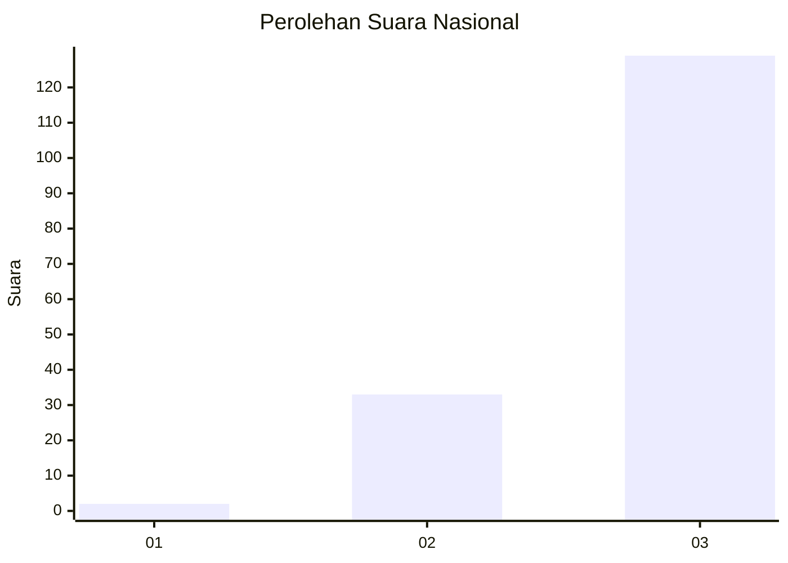
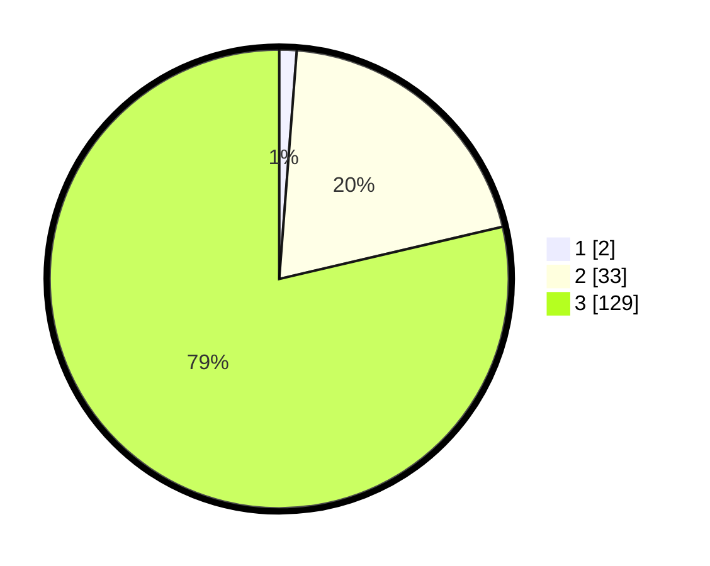

# Hasil

## Grafik

## Tabel

| No. | Nama Paslon    | Suara | Suara (raw) | Persentase |
|:--- |:-------------- | -----:| -----------:| ----------:|
| 1   | ANIES MUHAIMIN | 2     | [2][p-1]    | 1,22       |
| 2   | PRABOWO GIBRAN | 33    | [33][p-2]   | 20,12      |
| 3   | GANJAR MAHFUD  | 129   | [129][p-3]  | 78,66      |

[p-1]: https://github.com/gigit-pemilu/pemilu-2024/blob/main/pilpres/hitung-suara/sub/51-bali/sub/02-tabanan/sub/10-pupuan/sub/2012-pajahan/sub/005-tps/sub/paslon-1.txt
[p-2]: https://github.com/gigit-pemilu/pemilu-2024/blob/main/pilpres/hitung-suara/sub/51-bali/sub/02-tabanan/sub/10-pupuan/sub/2012-pajahan/sub/005-tps/sub/paslon-2.txt
[p-3]: https://github.com/gigit-pemilu/pemilu-2024/blob/main/pilpres/hitung-suara/sub/51-bali/sub/02-tabanan/sub/10-pupuan/sub/2012-pajahan/sub/005-tps/sub/paslon-3.txt

## Foto C Plano

https://sirekap-obj-formc.kpu.go.id/11e7/pemilu/ppwp/51/02/10/20/12/5102102012005-20240216-061604--dd8831ef-829a-461d-a2a6-9368e2c17d73.jpg

https://sirekap-obj-formc.kpu.go.id/11e7/pemilu/ppwp/51/02/10/20/12/5102102012005-20240214-131420--6783e963-2787-408c-a8c7-244c46a55e2e.jpg

https://sirekap-obj-formc.kpu.go.id/11e7/pemilu/ppwp/51/02/10/20/12/5102102012005-20240216-061733--0ec0e70d-b481-4e42-b7ba-5f2ad5631e33.jpg

## Metadata

| Key        | Value               |
| ---------- | ------------------- |
| Time Stamp | 2024-02-16 06:30:27 |

