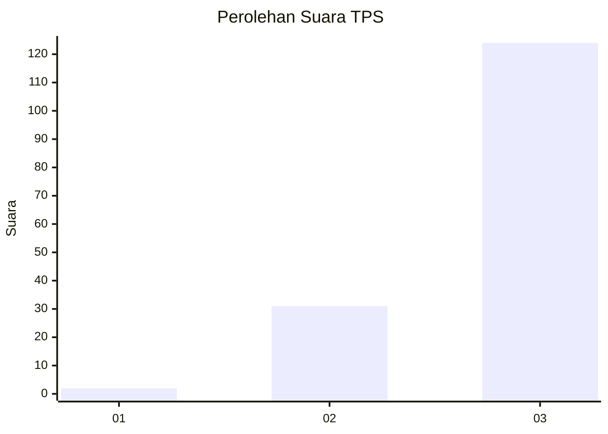
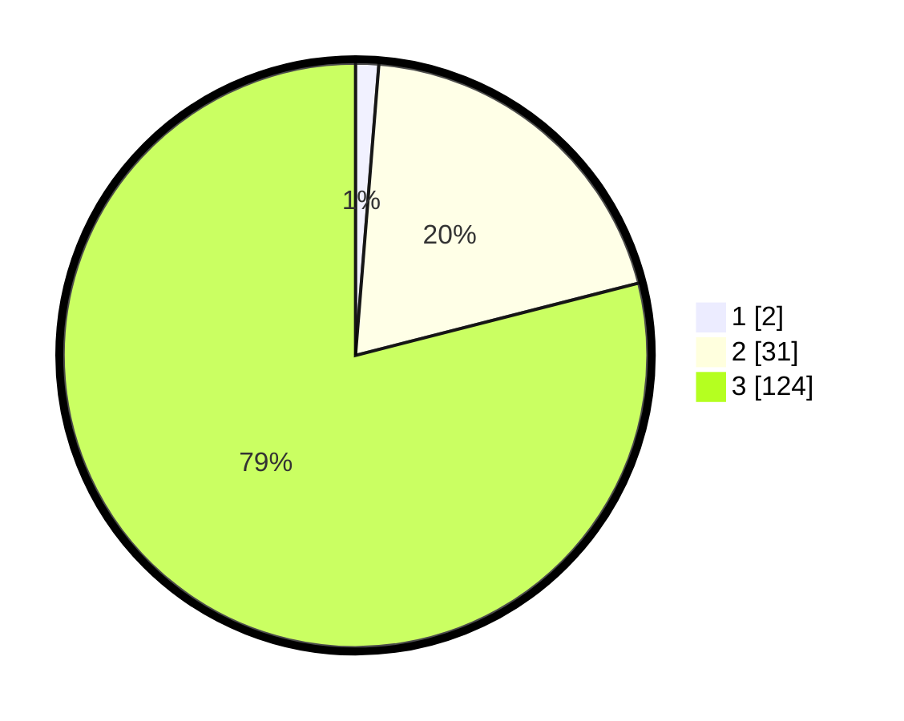

# Hasil

## Grafik

## Tabel

| No. | Nama Paslon    | Suara | Suara (raw) | Persentase |
|:--- |:-------------- | -----:| -----------:| ----------:|
| 1   | ANIES MUHAIMIN | 2     | [2][p-1]    | 1,27       |
| 2   | PRABOWO GIBRAN | 31    | [31][p-2]   | 19,75      |
| 3   | GANJAR MAHFUD  | 124   | [124][p-3]  | 78,98      |

[p-1]: https://github.com/gigit-pemilu/pemilu-2024-51-bali/blob/main/pilpres/hitung-suara/sub/51-bali/sub/02-tabanan/sub/10-pupuan/sub/2012-pajahan/sub/006-tps/sub/paslon-1.txt
[p-2]: https://github.com/gigit-pemilu/pemilu-2024-51-bali/blob/main/pilpres/hitung-suara/sub/51-bali/sub/02-tabanan/sub/10-pupuan/sub/2012-pajahan/sub/006-tps/sub/paslon-2.txt
[p-3]: https://github.com/gigit-pemilu/pemilu-2024-51-bali/blob/main/pilpres/hitung-suara/sub/51-bali/sub/02-tabanan/sub/10-pupuan/sub/2012-pajahan/sub/006-tps/sub/paslon-3.txt

## Foto C Plano

https://sirekap-obj-formc.kpu.go.id/5723/pemilu/ppwp/51/02/10/20/12/5102102012006-20240214-132838--7a36b1be-7686-46c9-9899-c8726d0717b9.jpg

https://sirekap-obj-formc.kpu.go.id/5723/pemilu/ppwp/51/02/10/20/12/5102102012006-20240214-133037--ddf3c995-eff4-4802-a5c9-78b6f2d1cc08.jpg

https://sirekap-obj-formc.kpu.go.id/5723/pemilu/ppwp/51/02/10/20/12/5102102012006-20240216-043633--63d6bf38-382d-400c-bf81-a39223e3ba1c.jpg

## Metadata

| Key        | Value               |
| ---------- | ------------------- |
| Time Stamp | 2024-02-24 22:31:28 |

## DATA PEMILIH TETAP

Jumlah pemilih dalam DPT: **184**.
 * L: **97**.
 * P: **87**.

## DATA PENGGUNA HAK PILIH

Jumlah pengguna hak pilih dalam DPT: **160**.
 * L: **90**.
 * P: **70**.

Jumlah pengguna hak pilih dalam DPTb: **0**.
 * L: **0**.
 * P: **0**.

Jumlah pengguna hak pilih dalam DPK: **1**.
 * L: **0**.
 * P: **1**.

Jumlah pengguna hak pilih: **161**.
 * L: **90**.
 * P: **71**.

## JUMLAH SUARA SAH DAN TIDAK SAH

JUMLAH SELURUH SUARA SAH: **157**.

JUMLAH SUARA TIDAK SAH: **4**.

JUMLAH SELURUH SUARA SAH DAN SUARA TIDAK SAH: **161**.

