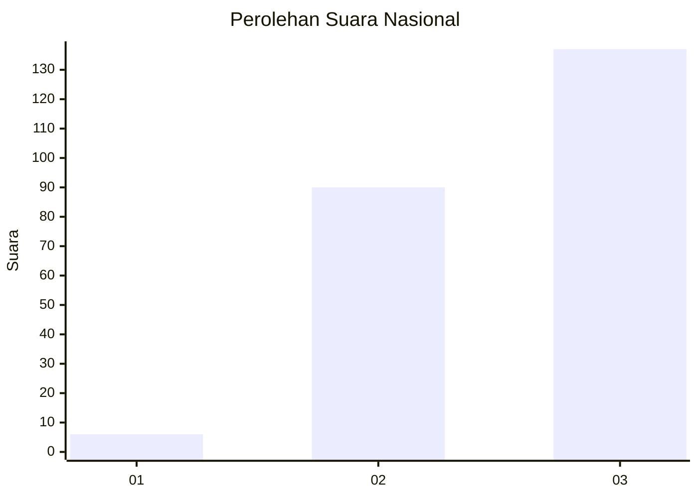
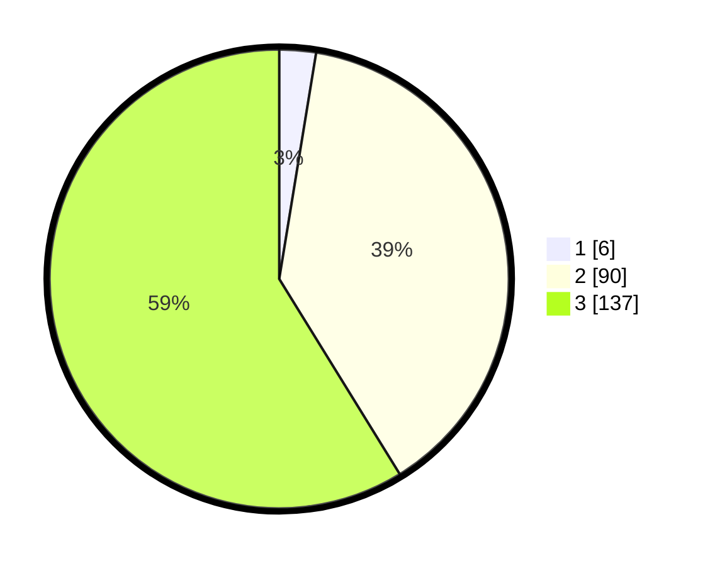

# Hasil

## Grafik

## Tabel

| No. | Nama Paslon    | Suara | Suara (raw) | Persentase |
|:--- |:-------------- | -----:| -----------:| ----------:|
| 1   | ANIES MUHAIMIN | 6     | [6][p-1]    | 2,58       |
| 2   | PRABOWO GIBRAN | 90    | [90][p-2]   | 38,63      |
| 3   | GANJAR MAHFUD  | 137   | [137][p-3]  | 58,80      |

[p-1]: https://github.com/gigit-pemilu/pemilu-2024/blob/main/pilpres/hitung-suara/sub/51-bali/sub/02-tabanan/sub/10-pupuan/sub/2013-karyasari/sub/001-tps/sub/paslon-1.txt
[p-2]: https://github.com/gigit-pemilu/pemilu-2024/blob/main/pilpres/hitung-suara/sub/51-bali/sub/02-tabanan/sub/10-pupuan/sub/2013-karyasari/sub/001-tps/sub/paslon-2.txt
[p-3]: https://github.com/gigit-pemilu/pemilu-2024/blob/main/pilpres/hitung-suara/sub/51-bali/sub/02-tabanan/sub/10-pupuan/sub/2013-karyasari/sub/001-tps/sub/paslon-3.txt

## Foto C Plano

https://sirekap-obj-formc.kpu.go.id/9fb5/pemilu/ppwp/51/02/10/20/13/5102102013001-20240217-184039--fe912783-36b6-4070-84e8-ec56ea094028.jpg

https://sirekap-obj-formc.kpu.go.id/9fb5/pemilu/ppwp/51/02/10/20/13/5102102013001-20240217-184040--4ada25d8-fcab-4c62-b3ae-5d016d80ca16.jpg

https://sirekap-obj-formc.kpu.go.id/9fb5/pemilu/ppwp/51/02/10/20/13/5102102013001-20240217-184039--20d52411-31b8-4dbf-a7e3-ad48b6a4ab6a.jpg

## Metadata

| Key        | Value               |
| ---------- | ------------------- |
| Time Stamp | 2024-02-21 01:00:00 |

## DATA PEMILIH TETAP

Jumlah pemilih dalam DPT: **281**.
 * L: **152**.
 * P: **129**.

## DATA PENGGUNA HAK PILIH

Jumlah pengguna hak pilih dalam DPT: **238**.
 * L: **125**.
 * P: **113**.

Jumlah pengguna hak pilih dalam DPTb: **1**.
 * L: **0**.
 * P: **1**.

Jumlah pengguna hak pilih dalam DPK: **0**.
 * L: **0**.
 * P: **0**.

Jumlah pengguna hak pilih: **239**.
 * L: **125**.
 * P: **114**.

## JUMLAH SUARA SAH DAN TIDAK SAH

JUMLAH SELURUH SUARA SAH: **0**.

JUMLAH SUARA TIDAK SAH: **0**.

JUMLAH SELURUH SUARA SAH DAN SUARA TIDAK SAH: **0**.

