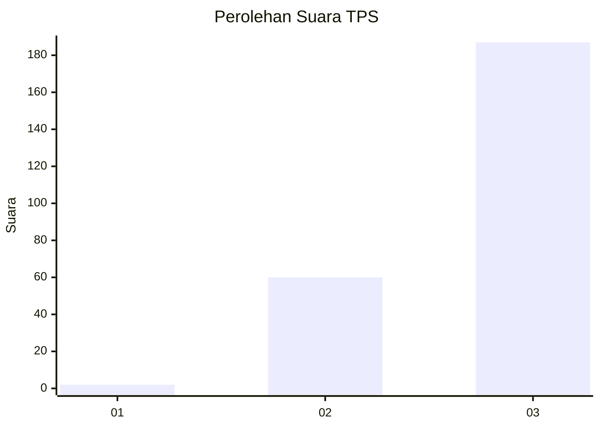
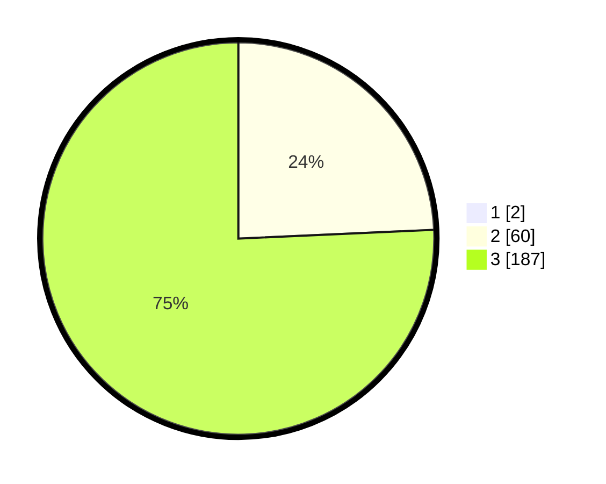

# Hasil

## Grafik

## Tabel

| No. | Nama Paslon    | Suara | Suara (raw) | Persentase |
|:--- |:-------------- | -----:| -----------:| ----------:|
| 1   | ANIES MUHAIMIN | 2     | [2][p-1]    | 0,80       |
| 2   | PRABOWO GIBRAN | 60    | [60][p-2]   | 24,10      |
| 3   | GANJAR MAHFUD  | 187   | [187][p-3]  | 75,10      |

[p-1]: https://github.com/gigit-pemilu/pemilu-2024-51-bali/blob/main/pilpres/hitung-suara/sub/51-bali/sub/02-tabanan/sub/10-pupuan/sub/2013-karyasari/sub/003-tps/sub/paslon-1.txt
[p-2]: https://github.com/gigit-pemilu/pemilu-2024-51-bali/blob/main/pilpres/hitung-suara/sub/51-bali/sub/02-tabanan/sub/10-pupuan/sub/2013-karyasari/sub/003-tps/sub/paslon-2.txt
[p-3]: https://github.com/gigit-pemilu/pemilu-2024-51-bali/blob/main/pilpres/hitung-suara/sub/51-bali/sub/02-tabanan/sub/10-pupuan/sub/2013-karyasari/sub/003-tps/sub/paslon-3.txt

## Foto C Plano

https://sirekap-obj-formc.kpu.go.id/2107/pemilu/ppwp/51/02/10/20/13/5102102013003-20240217-114558--d920be90-ff86-450e-8725-c4d30c854de8.jpg

https://sirekap-obj-formc.kpu.go.id/2107/pemilu/ppwp/51/02/10/20/13/5102102013003-20240217-114559--3ecb674d-678c-4c68-99b2-54f336e0a363.jpg

https://sirekap-obj-formc.kpu.go.id/2107/pemilu/ppwp/51/02/10/20/13/5102102013003-20240217-114558--da8e4774-9cde-499c-a799-f878ae7a7ef0.jpg

## Metadata

| Key        | Value               |
| ---------- | ------------------- |
| Time Stamp | 2024-02-21 01:00:00 |

## DATA PEMILIH TETAP

Jumlah pemilih dalam DPT: **293**.
 * L: **143**.
 * P: **150**.

## DATA PENGGUNA HAK PILIH

Jumlah pengguna hak pilih dalam DPT: **252**.
 * L: **121**.
 * P: **131**.

Jumlah pengguna hak pilih dalam DPTb: **0**.
 * L: **0**.
 * P: **0**.

Jumlah pengguna hak pilih dalam DPK: **0**.
 * L: **0**.
 * P: **0**.

Jumlah pengguna hak pilih: **252**.
 * L: **121**.
 * P: **131**.

## JUMLAH SUARA SAH DAN TIDAK SAH

JUMLAH SELURUH SUARA SAH: **249**.

JUMLAH SUARA TIDAK SAH: **3**.

JUMLAH SELURUH SUARA SAH DAN SUARA TIDAK SAH: **252**.

