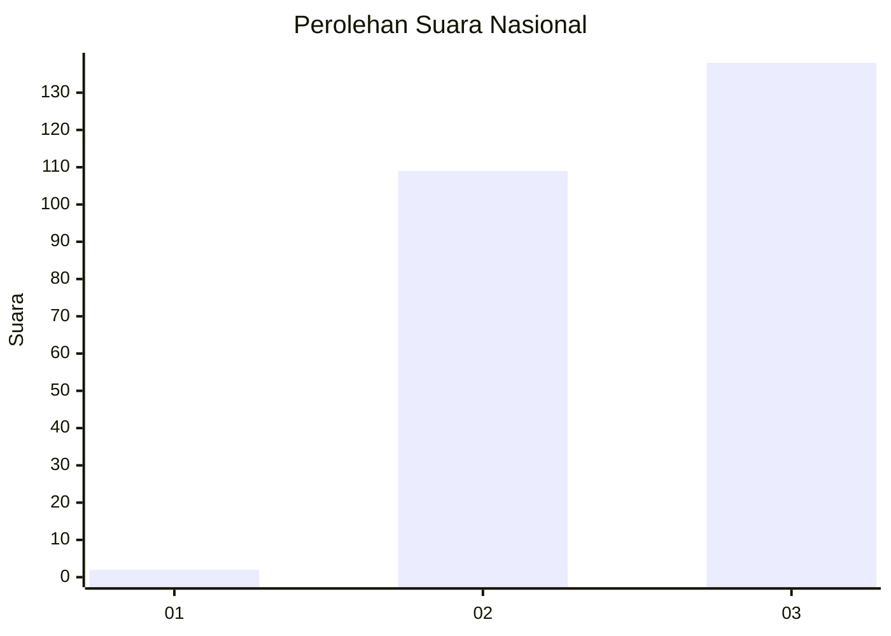
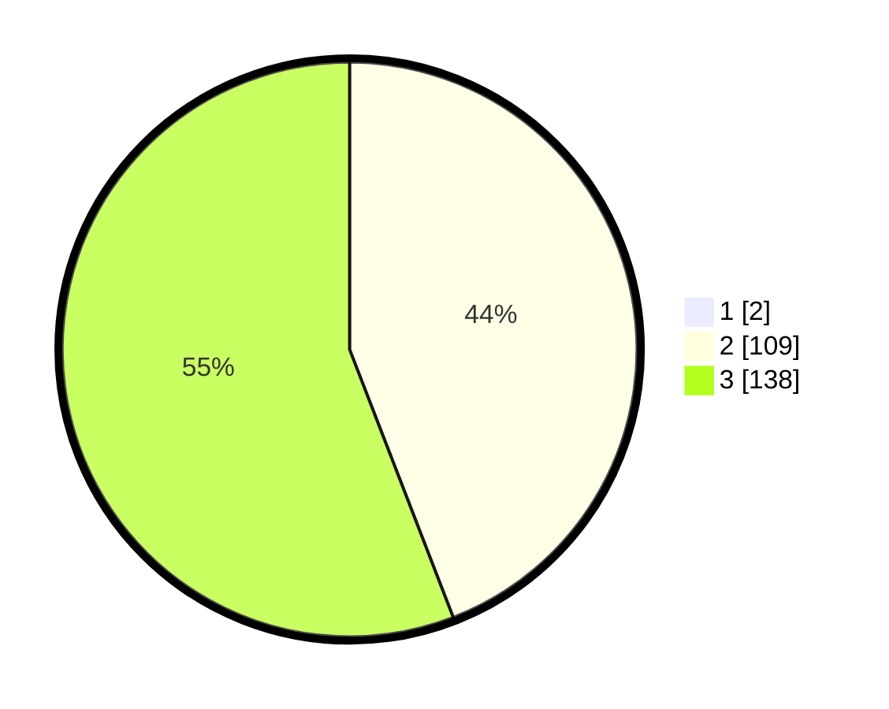

# Hasil

## Grafik

## Tabel

| No. | Nama Paslon    | Suara | Suara (raw) | Persentase |
|:--- |:-------------- | -----:| -----------:| ----------:|
| 1   | ANIES MUHAIMIN | 2     | [2][p-1]    | 0,80       |
| 2   | PRABOWO GIBRAN | 109   | [109][p-2]  | 43,78      |
| 3   | GANJAR MAHFUD  | 138   | [138][p-3]  | 55,42      |

[p-1]: https://github.com/gigit-pemilu/pemilu-2024/blob/main/pilpres/hitung-suara/sub/51-bali/sub/02-tabanan/sub/10-pupuan/sub/2013-karyasari/sub/004-tps/sub/paslon-1.txt
[p-2]: https://github.com/gigit-pemilu/pemilu-2024/blob/main/pilpres/hitung-suara/sub/51-bali/sub/02-tabanan/sub/10-pupuan/sub/2013-karyasari/sub/004-tps/sub/paslon-2.txt
[p-3]: https://github.com/gigit-pemilu/pemilu-2024/blob/main/pilpres/hitung-suara/sub/51-bali/sub/02-tabanan/sub/10-pupuan/sub/2013-karyasari/sub/004-tps/sub/paslon-3.txt

## Foto C Plano

https://sirekap-obj-formc.kpu.go.id/16b2/pemilu/ppwp/51/02/10/20/13/5102102013004-20240216-153117--6b29a842-64a5-4d81-a054-79cad1eabc41.jpg

https://sirekap-obj-formc.kpu.go.id/16b2/pemilu/ppwp/51/02/10/20/13/5102102013004-20240216-153118--a8ffc42b-a483-42f2-b9d7-92a4e3561eee.jpg

https://sirekap-obj-formc.kpu.go.id/16b2/pemilu/ppwp/51/02/10/20/13/5102102013004-20240216-153117--8504280c-6bd2-4d58-bd05-f1f645b4a619.jpg

## Metadata

| Key        | Value               |
| ---------- | ------------------- |
| Time Stamp | 2024-02-21 13:00:00 |

## DATA PEMILIH TETAP

Jumlah pemilih dalam DPT: **290**.
 * L: **142**.
 * P: **148**.

## DATA PENGGUNA HAK PILIH

Jumlah pengguna hak pilih dalam DPT: **249**.
 * L: **123**.
 * P: **126**.

Jumlah pengguna hak pilih dalam DPTb: **1**.
 * L: **1**.
 * P: **0**.

Jumlah pengguna hak pilih dalam DPK: **0**.
 * L: **0**.
 * P: **0**.

Jumlah pengguna hak pilih: **250**.
 * L: **124**.
 * P: **126**.

## JUMLAH SUARA SAH DAN TIDAK SAH

JUMLAH SELURUH SUARA SAH: **249**.

JUMLAH SUARA TIDAK SAH: **1**.

JUMLAH SELURUH SUARA SAH DAN SUARA TIDAK SAH: **250**.

