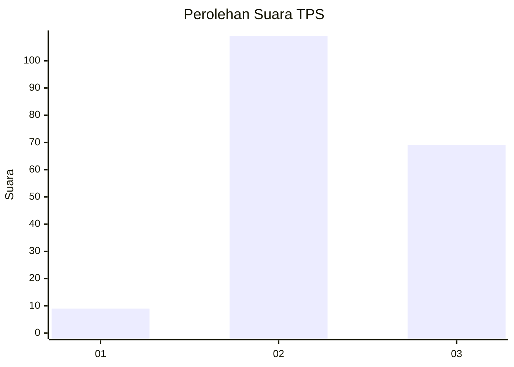
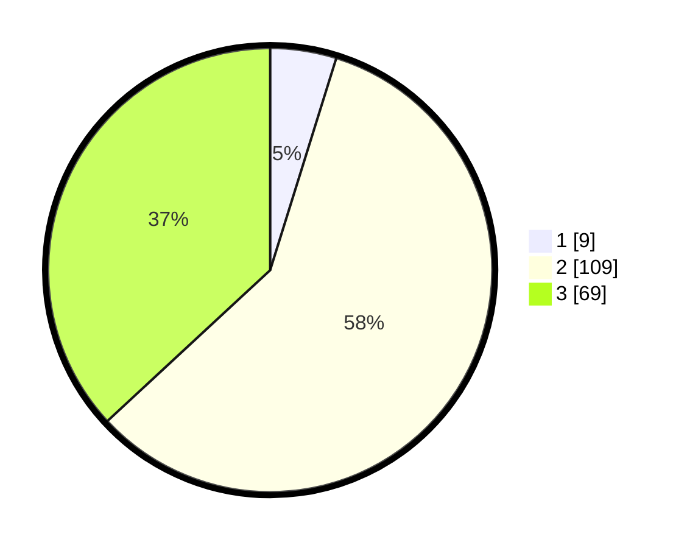

# Hasil

## Grafik

## Tabel

| No. | Nama Paslon    | Suara | Suara (raw) | Persentase |
|:--- |:-------------- | -----:| -----------:| ----------:|
| 1   | ANIES MUHAIMIN | 9     | [9][p-1]    | 4,81       |
| 2   | PRABOWO GIBRAN | 109   | [109][p-2]  | 58,29      |
| 3   | GANJAR MAHFUD  | 69    | [69][p-3]   | 36,90      |

[p-1]: https://github.com/gigit-pemilu/pemilu-2024-51-bali/blob/main/pilpres/hitung-suara/sub/51-bali/sub/02-tabanan/sub/10-pupuan/sub/2014-sai/sub/001-tps/sub/paslon-1.txt
[p-2]: https://github.com/gigit-pemilu/pemilu-2024-51-bali/blob/main/pilpres/hitung-suara/sub/51-bali/sub/02-tabanan/sub/10-pupuan/sub/2014-sai/sub/001-tps/sub/paslon-2.txt
[p-3]: https://github.com/gigit-pemilu/pemilu-2024-51-bali/blob/main/pilpres/hitung-suara/sub/51-bali/sub/02-tabanan/sub/10-pupuan/sub/2014-sai/sub/001-tps/sub/paslon-3.txt

## Foto C Plano

https://sirekap-obj-formc.kpu.go.id/c109/pemilu/ppwp/51/02/10/20/14/5102102014001-20240216-150247--edc97198-653e-4e10-a10c-4ee814f91971.jpg

https://sirekap-obj-formc.kpu.go.id/c109/pemilu/ppwp/51/02/10/20/14/5102102014001-20240216-150248--a4dda727-4c97-462e-a24e-8669745d343e.jpg

https://sirekap-obj-formc.kpu.go.id/c109/pemilu/ppwp/51/02/10/20/14/5102102014001-20240216-150248--f8ac0f9a-019d-4bd7-9bd5-f5887069a3d7.jpg

## Metadata

| Key        | Value               |
| ---------- | ------------------- |
| Time Stamp | 2024-02-24 22:31:28 |

## DATA PEMILIH TETAP

Jumlah pemilih dalam DPT: **239**.
 * L: **123**.
 * P: **116**.

## DATA PENGGUNA HAK PILIH

Jumlah pengguna hak pilih dalam DPT: **202**.
 * L: **102**.
 * P: **100**.

Jumlah pengguna hak pilih dalam DPTb: **0**.
 * L: **0**.
 * P: **0**.

Jumlah pengguna hak pilih dalam DPK: **1**.
 * L: **0**.
 * P: **1**.

Jumlah pengguna hak pilih: **203**.
 * L: **102**.
 * P: **101**.

## JUMLAH SUARA SAH DAN TIDAK SAH

JUMLAH SELURUH SUARA SAH: **187**.

JUMLAH SUARA TIDAK SAH: **16**.

JUMLAH SELURUH SUARA SAH DAN SUARA TIDAK SAH: **203**.

