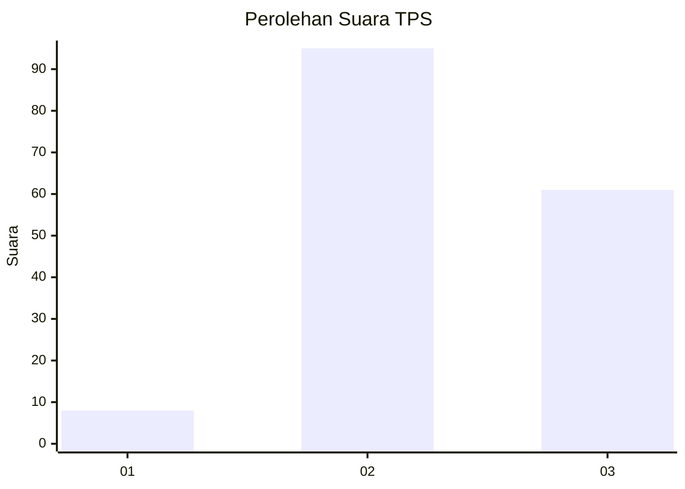
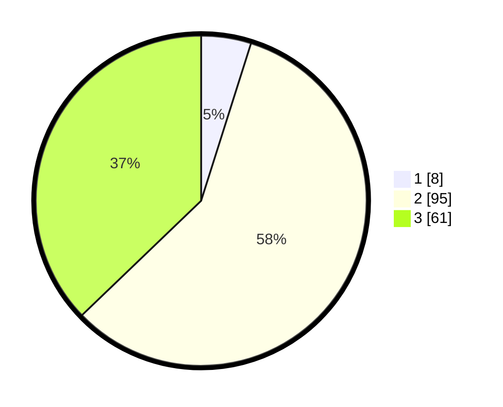

# Hasil

## Grafik

## Tabel

| No. | Nama Paslon    | Suara | Suara (raw) | Persentase |
|:--- |:-------------- | -----:| -----------:| ----------:|
| 1   | ANIES MUHAIMIN | 8     | [8][p-1]    | 4,88       |
| 2   | PRABOWO GIBRAN | 95    | [95][p-2]   | 57,93      |
| 3   | GANJAR MAHFUD  | 61    | [61][p-3]   | 37,20      |

[p-1]: https://github.com/gigit-pemilu/pemilu-2024-51-bali/blob/main/pilpres/hitung-suara/sub/51-bali/sub/02-tabanan/sub/10-pupuan/sub/2014-sai/sub/002-tps/sub/paslon-1.txt
[p-2]: https://github.com/gigit-pemilu/pemilu-2024-51-bali/blob/main/pilpres/hitung-suara/sub/51-bali/sub/02-tabanan/sub/10-pupuan/sub/2014-sai/sub/002-tps/sub/paslon-2.txt
[p-3]: https://github.com/gigit-pemilu/pemilu-2024-51-bali/blob/main/pilpres/hitung-suara/sub/51-bali/sub/02-tabanan/sub/10-pupuan/sub/2014-sai/sub/002-tps/sub/paslon-3.txt

## Foto C Plano

https://sirekap-obj-formc.kpu.go.id/cc8b/pemilu/ppwp/51/02/10/20/14/5102102014002-20240216-145625--a16584f3-6952-41e2-81b2-bc2dec7c5425.jpg

https://sirekap-obj-formc.kpu.go.id/cc8b/pemilu/ppwp/51/02/10/20/14/5102102014002-20240216-145626--c784fb35-aa0a-4b17-b11a-999228ecb159.jpg

https://sirekap-obj-formc.kpu.go.id/cc8b/pemilu/ppwp/51/02/10/20/14/5102102014002-20240216-145625--24c985b3-d594-4f93-b75a-948946e703b2.jpg

## Metadata

| Key        | Value               |
| ---------- | ------------------- |
| Time Stamp | 2024-02-24 22:31:28 |

## DATA PEMILIH TETAP

Jumlah pemilih dalam DPT: **203**.
 * L: **102**.
 * P: **101**.

## DATA PENGGUNA HAK PILIH

Jumlah pengguna hak pilih dalam DPT: **176**.
 * L: **95**.
 * P: **81**.

Jumlah pengguna hak pilih dalam DPTb: **0**.
 * L: **0**.
 * P: **0**.

Jumlah pengguna hak pilih dalam DPK: **0**.
 * L: **0**.
 * P: **0**.

Jumlah pengguna hak pilih: **176**.
 * L: **95**.
 * P: **81**.

## JUMLAH SUARA SAH DAN TIDAK SAH

JUMLAH SELURUH SUARA SAH: **164**.

JUMLAH SUARA TIDAK SAH: **12**.

JUMLAH SELURUH SUARA SAH DAN SUARA TIDAK SAH: **176**.

