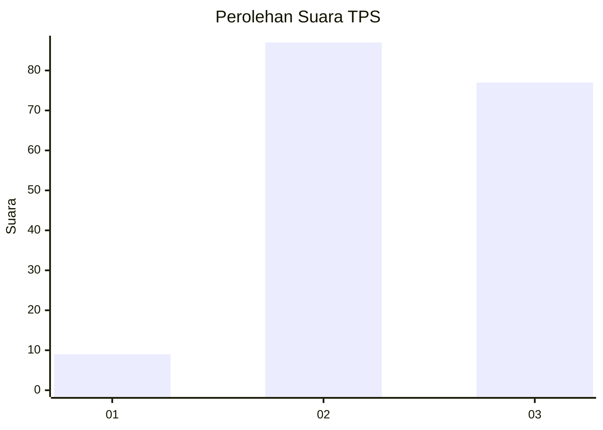
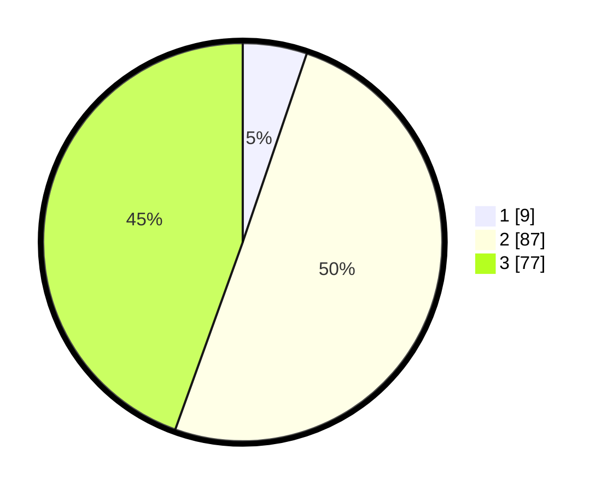

# Hasil

## Grafik

## Tabel

| No. | Nama Paslon    | Suara | Suara (raw) | Persentase |
|:--- |:-------------- | -----:| -----------:| ----------:|
| 1   | ANIES MUHAIMIN | 9     | [9][p-1]    | 5,20       |
| 2   | PRABOWO GIBRAN | 87    | [87][p-2]   | 50,29      |
| 3   | GANJAR MAHFUD  | 77    | [77][p-3]   | 44,51      |

[p-1]: https://github.com/gigit-pemilu/pemilu-2024-51-bali/blob/main/pilpres/hitung-suara/sub/51-bali/sub/02-tabanan/sub/10-pupuan/sub/2014-sai/sub/004-tps/sub/paslon-1.txt
[p-2]: https://github.com/gigit-pemilu/pemilu-2024-51-bali/blob/main/pilpres/hitung-suara/sub/51-bali/sub/02-tabanan/sub/10-pupuan/sub/2014-sai/sub/004-tps/sub/paslon-2.txt
[p-3]: https://github.com/gigit-pemilu/pemilu-2024-51-bali/blob/main/pilpres/hitung-suara/sub/51-bali/sub/02-tabanan/sub/10-pupuan/sub/2014-sai/sub/004-tps/sub/paslon-3.txt

## Foto C Plano

https://sirekap-obj-formc.kpu.go.id/d5d1/pemilu/ppwp/51/02/10/20/14/5102102014004-20240214-214448--35e5e3ee-c93a-4c27-89da-47efbf0749f4.jpg

https://sirekap-obj-formc.kpu.go.id/d5d1/pemilu/ppwp/51/02/10/20/14/5102102014004-20240216-093638--de8f6206-47c2-4b8e-830d-e74952af05ad.jpg

https://sirekap-obj-formc.kpu.go.id/d5d1/pemilu/ppwp/51/02/10/20/14/5102102014004-20240216-093635--0dd54c7e-c96c-4819-b33b-888b45c3b84c.jpg

## Metadata

| Key        | Value               |
| ---------- | ------------------- |
| Time Stamp | 2024-02-21 12:00:00 |

