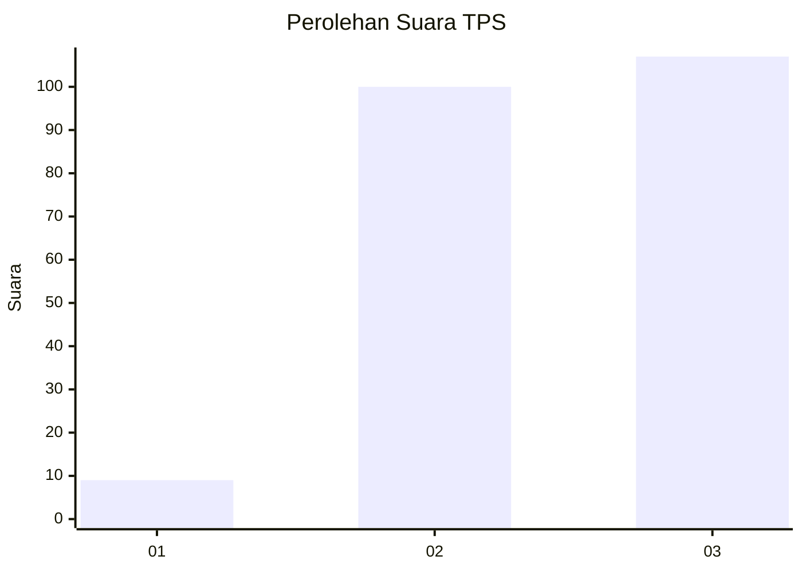
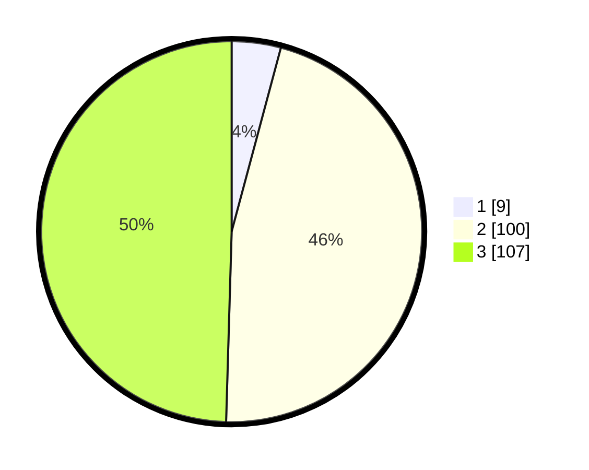

# Hasil

## Grafik

## Tabel

| No. | Nama Paslon    | Suara | Suara (raw) | Persentase |
|:--- |:-------------- | -----:| -----------:| ----------:|
| 1   | ANIES MUHAIMIN | 9     | [9][p-1]    | 4,17       |
| 2   | PRABOWO GIBRAN | 100   | [100][p-2]  | 46,30      |
| 3   | GANJAR MAHFUD  | 107   | [107][p-3]  | 49,54      |

[p-1]: https://github.com/gigit-pemilu/pemilu-2024-51-bali/blob/main/pilpres/hitung-suara/sub/51-bali/sub/02-tabanan/sub/10-pupuan/sub/2014-sai/sub/005-tps/sub/paslon-1.txt
[p-2]: https://github.com/gigit-pemilu/pemilu-2024-51-bali/blob/main/pilpres/hitung-suara/sub/51-bali/sub/02-tabanan/sub/10-pupuan/sub/2014-sai/sub/005-tps/sub/paslon-2.txt
[p-3]: https://github.com/gigit-pemilu/pemilu-2024-51-bali/blob/main/pilpres/hitung-suara/sub/51-bali/sub/02-tabanan/sub/10-pupuan/sub/2014-sai/sub/005-tps/sub/paslon-3.txt

## Foto C Plano

https://sirekap-obj-formc.kpu.go.id/88c9/pemilu/ppwp/51/02/10/20/14/5102102014005-20240216-123733--631a6cd9-30d7-4311-8695-2f4ebd832b6a.jpg

https://sirekap-obj-formc.kpu.go.id/88c9/pemilu/ppwp/51/02/10/20/14/5102102014005-20240216-102859--1348e312-66a0-458c-bf55-5bbcfec13c96.jpg

https://sirekap-obj-formc.kpu.go.id/88c9/pemilu/ppwp/51/02/10/20/14/5102102014005-20240216-102848--27cd5b3c-1286-4286-8cd7-749443d4a696.jpg

## Metadata

| Key        | Value               |
| ---------- | ------------------- |
| Time Stamp | 2024-02-24 22:31:28 |

## DATA PEMILIH TETAP

Jumlah pemilih dalam DPT: **269**.
 * L: **139**.
 * P: **130**.

## DATA PENGGUNA HAK PILIH

Jumlah pengguna hak pilih dalam DPT: **233**.
 * L: **125**.
 * P: **108**.

Jumlah pengguna hak pilih dalam DPTb: **0**.
 * L: **0**.
 * P: **0**.

Jumlah pengguna hak pilih dalam DPK: **0**.
 * L: **0**.
 * P: **0**.

Jumlah pengguna hak pilih: **233**.
 * L: **125**.
 * P: **108**.

## JUMLAH SUARA SAH DAN TIDAK SAH

JUMLAH SELURUH SUARA SAH: **216**.

JUMLAH SUARA TIDAK SAH: **17**.

JUMLAH SELURUH SUARA SAH DAN SUARA TIDAK SAH: **233**.

