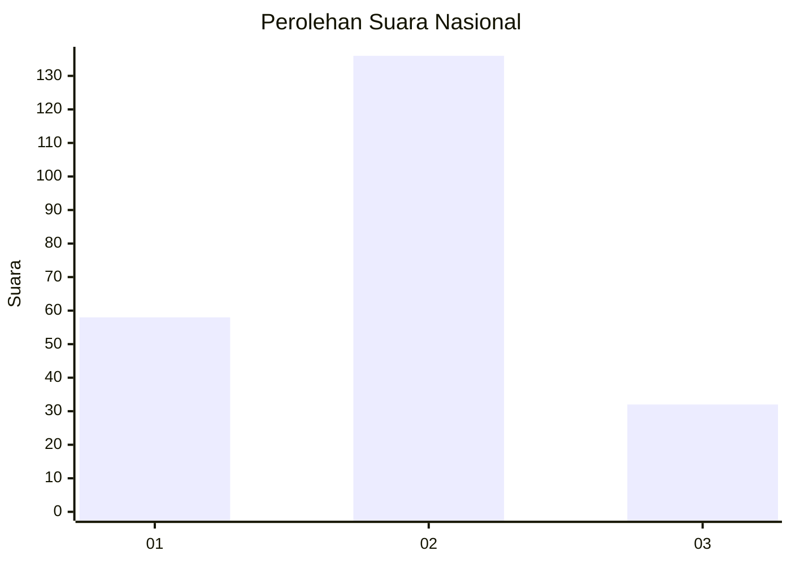
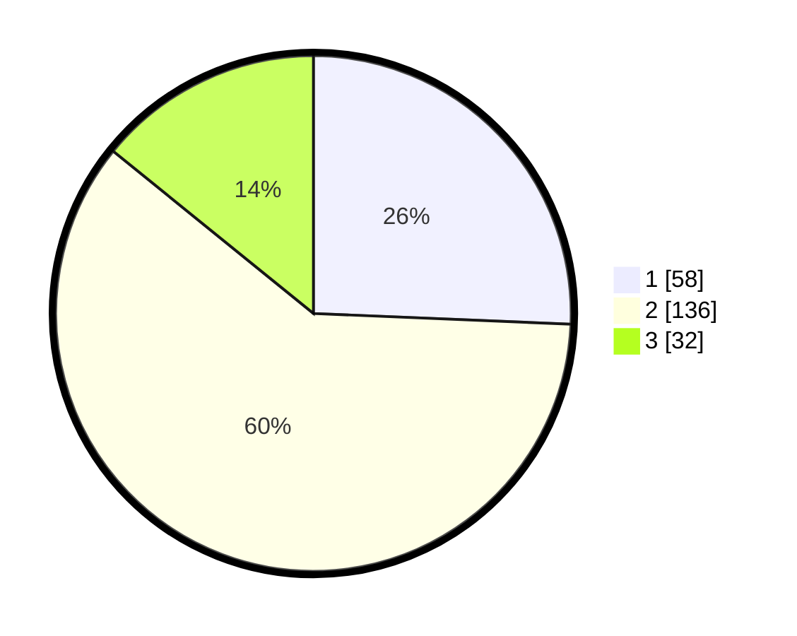

# Hasil

## Grafik

## Tabel

| No. | Nama Paslon    | Suara | Suara (raw) | Persentase |
|:--- |:-------------- | -----:| -----------:| ----------:|
| 1   | ANIES MUHAIMIN | 58    | [58][p-1]   | 25,66      |
| 2   | PRABOWO GIBRAN | 136   | [136][p-2]  | 60,18      |
| 3   | GANJAR MAHFUD  | 32    | [32][p-3]   | 14,16      |

[p-1]: https://github.com/gigit-pemilu/pemilu-2024/blob/main/pilpres/hitung-suara/sub/51-bali/sub/03-badung/sub/01-kuta/sub/1001-tuban/sub/003-tps/sub/paslon-1.txt
[p-2]: https://github.com/gigit-pemilu/pemilu-2024/blob/main/pilpres/hitung-suara/sub/51-bali/sub/03-badung/sub/01-kuta/sub/1001-tuban/sub/003-tps/sub/paslon-2.txt
[p-3]: https://github.com/gigit-pemilu/pemilu-2024/blob/main/pilpres/hitung-suara/sub/51-bali/sub/03-badung/sub/01-kuta/sub/1001-tuban/sub/003-tps/sub/paslon-3.txt

## Foto C Plano

https://sirekap-obj-formc.kpu.go.id/6fe2/pemilu/ppwp/51/03/01/10/01/5103011001003-20240214-141655--84efdeae-5e86-4065-acb6-b6a42c906dc5.jpg

https://sirekap-obj-formc.kpu.go.id/6fe2/pemilu/ppwp/51/03/01/10/01/5103011001003-20240214-141542--45a66c49-dd9c-4f74-b5c2-8fc619cde592.jpg

https://sirekap-obj-formc.kpu.go.id/6fe2/pemilu/ppwp/51/03/01/10/01/5103011001003-20240214-141607--ef2f3c79-b880-476f-9f9e-ac0b872e8b6f.jpg

## Metadata

| Key        | Value               |
| ---------- | ------------------- |
| Time Stamp | 2024-02-24 22:31:28 |

