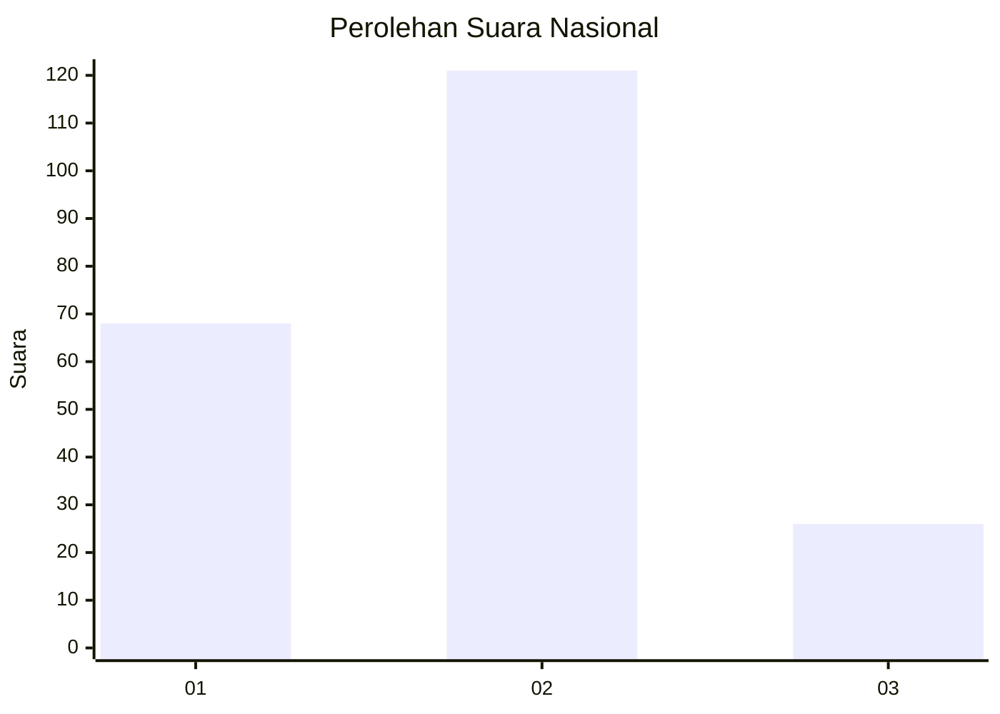
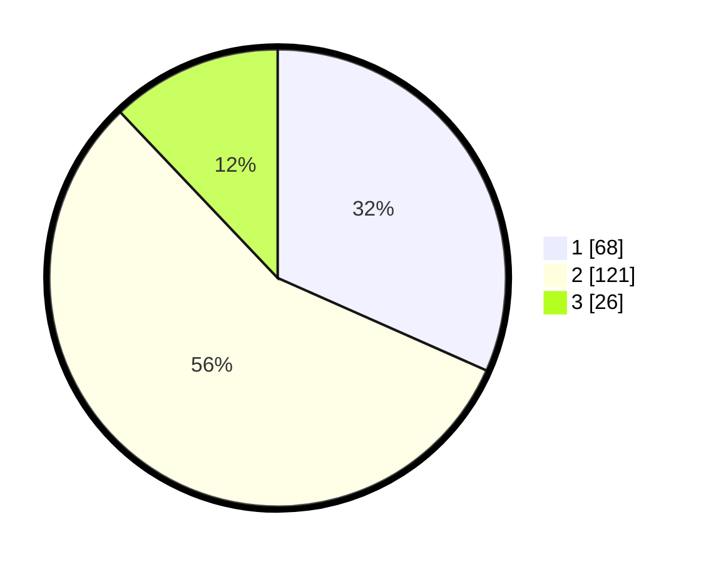

# Hasil

## Grafik

## Tabel

| No. | Nama Paslon    | Suara | Suara (raw) | Persentase |
|:--- |:-------------- | -----:| -----------:| ----------:|
| 1   | ANIES MUHAIMIN | 68    | [68][p-1]   | 31,63      |
| 2   | PRABOWO GIBRAN | 121   | [121][p-2]  | 56,28      |
| 3   | GANJAR MAHFUD  | 26    | [26][p-3]   | 12,09      |

[p-1]: https://github.com/gigit-pemilu/pemilu-2024/blob/main/pilpres/hitung-suara/sub/51-bali/sub/03-badung/sub/01-kuta/sub/1001-tuban/sub/021-tps/sub/paslon-1.txt
[p-2]: https://github.com/gigit-pemilu/pemilu-2024/blob/main/pilpres/hitung-suara/sub/51-bali/sub/03-badung/sub/01-kuta/sub/1001-tuban/sub/021-tps/sub/paslon-2.txt
[p-3]: https://github.com/gigit-pemilu/pemilu-2024/blob/main/pilpres/hitung-suara/sub/51-bali/sub/03-badung/sub/01-kuta/sub/1001-tuban/sub/021-tps/sub/paslon-3.txt

## Foto C Plano

https://sirekap-obj-formc.kpu.go.id/9730/pemilu/ppwp/51/03/01/10/01/5103011001021-20240214-162212--e06d5ded-5422-4963-b07d-83884ed33ab8.jpg

https://sirekap-obj-formc.kpu.go.id/9730/pemilu/ppwp/51/03/01/10/01/5103011001021-20240214-162219--c91baad2-949f-4247-89ca-35a43e07b22c.jpg

## Metadata

| Key        | Value               |
| ---------- | ------------------- |
| Time Stamp | 2024-02-24 22:31:28 |

