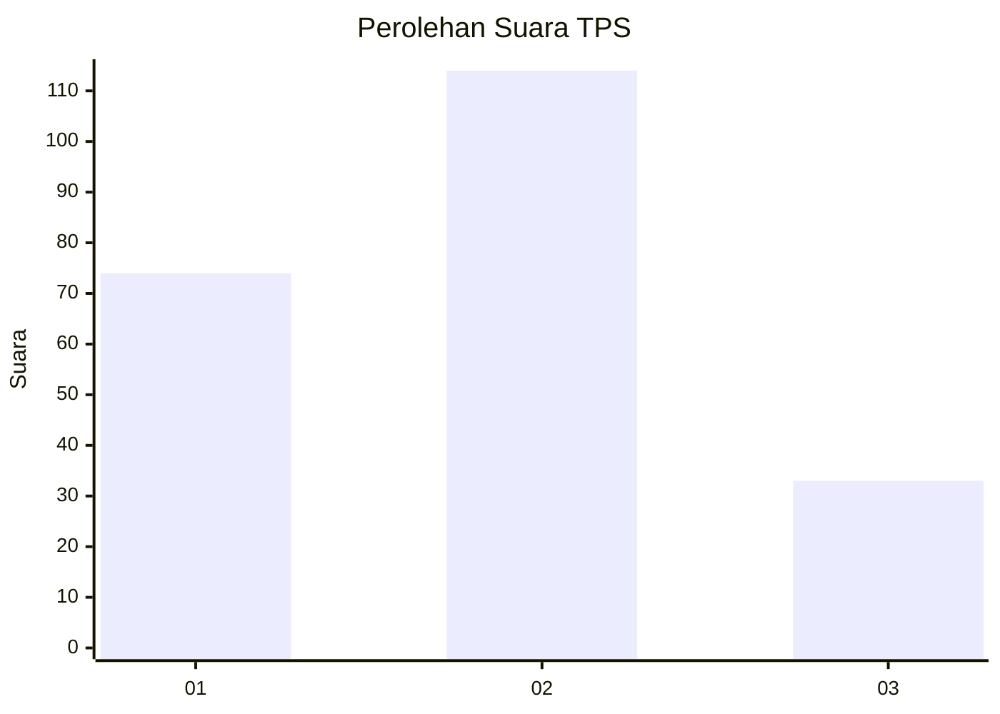
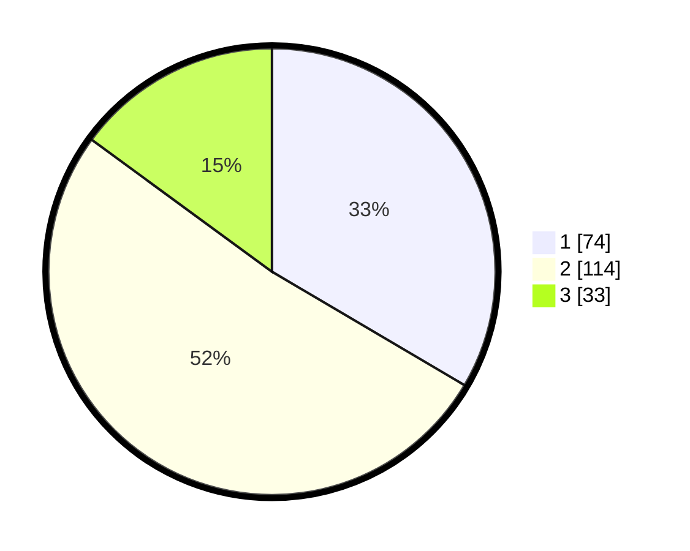

# Hasil

## Grafik

## Tabel

| No. | Nama Paslon    | Suara | Suara (raw) | Persentase |
|:--- |:-------------- | -----:| -----------:| ----------:|
| 1   | ANIES MUHAIMIN | 74    | [74][p-1]   | 33,48      |
| 2   | PRABOWO GIBRAN | 114   | [114][p-2]  | 51,58      |
| 3   | GANJAR MAHFUD  | 33    | [33][p-3]   | 14,93      |

[p-1]: https://github.com/gigit-pemilu/pemilu-2024-51-bali/blob/main/pilpres/hitung-suara/sub/51-bali/sub/03-badung/sub/01-kuta/sub/1001-tuban/sub/022-tps/sub/paslon-1.txt
[p-2]: https://github.com/gigit-pemilu/pemilu-2024-51-bali/blob/main/pilpres/hitung-suara/sub/51-bali/sub/03-badung/sub/01-kuta/sub/1001-tuban/sub/022-tps/sub/paslon-2.txt
[p-3]: https://github.com/gigit-pemilu/pemilu-2024-51-bali/blob/main/pilpres/hitung-suara/sub/51-bali/sub/03-badung/sub/01-kuta/sub/1001-tuban/sub/022-tps/sub/paslon-3.txt

## Foto C Plano

https://sirekap-obj-formc.kpu.go.id/df23/pemilu/ppwp/51/03/01/10/01/5103011001022-20240214-215747--d4f2f03c-dd1b-4510-a60d-2727103df16b.jpg

## Metadata

| Key        | Value               |
| ---------- | ------------------- |
| Time Stamp | 2024-02-24 22:31:28 |

